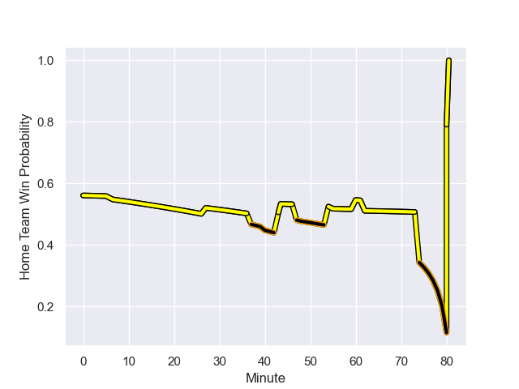

---  
layout: page  
title: Chambery at Carcassonne; 16.0-20.0  
date: 2023-09-08 18:00:00 -0500  
categories: match review  
---
# Chambery at Carcassonne; 16.0-20.0

# Club Level Predictions

The first set of predictions treats a club as the smallest object, as the club develops its members, organizes a gameplan, and deploys its players as needed for each match. This club model has a prediction of 0.748, which translates to predicting Carcassonne to win by 9.7.

Each club has a rating and a rating deviation (simiar to a Glicko system), and expected performances can be generated. This allows for simulated matches and spreads like the ones below.
## Projected Performances

## Projected Spreads

## Projected Results

# Player Level Predictions - Version 2

Treating teams instead as an entity made up of the currently active players, I have ratings for each player in an altogether different system. These can be combined to form team ratings once teamsheets are announced, weighting starters a bit higher than the reserves. After the match is played, players can be weighted by their minutes on the field, allowing for an accurate measure of the team's composition. With these compiled team ratings, we can make predictions, measure inaccuracy, and update the individual player ratings.
## Prediction with Player Minutes: Carcassonne by 2.7

Chambery by 1.5 on a neutral field
## Prediction without Player Minutes: Carcassonne by 2.9

Chambery by 1.3 on a neutral pitch

## Scores over Time

## Win Probability over Time

There were 13 large changes in win probability in this match

|   Away Minutes | Away Player                  |   Away elo |   Number |   Home elo | Home Player         |   Home Minutes |
|---------------:|:-----------------------------|-----------:|---------:|-----------:|:--------------------|---------------:|
|             60 | Géraud Clermont              |      53.64 |        1 |      37.36 | Florent Lorenzon    |             79 |
|             47 | Luka Begic                   |      41.08 |        2 |      42.37 | Raphael Carbou      |             59 |
|             68 | Giorgi Pertaia               |      50.75 |        3 |      55.26 | Fabien Lorenzon     |             55 |
|             66 | Fabien Witz                  |      42.18 |        4 |      15.69 | Romain Manchia      |             80 |
|             80 | Taniela Matakaiongo          |      46.65 |        5 |      41.2  | Romain Guyot        |             40 |
|             80 | Jean-Baptiste Grenod         |      73.99 |        6 |      64.64 | Gary Graham         |             80 |
|             74 | Colin Lebian                 |      35.88 |        7 |      32.81 | Etienne Herjean     |             80 |
|             80 | Tui Uru                      |      56.81 |        8 |      48.79 | Carl Fearns         |             48 |
|             79 | Thibault Dufau               |      31.88 |        9 |      41.27 | Damien Añon         |             80 |
|             80 | Victor Pisano                |      34.87 |       10 |      51.22 | Gabin Michet        |             80 |
|             80 | Arthur Nennig                |      52.35 |       11 |      57.07 | Clement Egiziano    |             80 |
|             60 | Mickael Blanc                |      28.44 |       12 |      14.38 | Jordan Puletua      |             63 |
|             80 | Emmanuel Vaitulukina         |      46.06 |       13 |      46.65 | Mathys Barka        |             80 |
|             80 | Va'aufauese Apelu Maliko     |      43.51 |       14 |      65.52 | Léo Darrelatour     |             80 |
|             55 | Thibault Moreno              |      47.69 |       15 |      51.71 | Maxime Gianet       |             80 |
|             33 | Gauthier Brute de Remur      |      46.82 |       16 |      50.08 | Luka Petriashvili   |             21 |
|             14 | Ahmed Tidiane Kane           |      45.39 |       17 |      20.11 | Vakhtangi Akhobadze |             25 |
|              6 | Matheo Triki                 |      66.21 |       18 |      25.32 | Clément Fontaine    |             40 |
|             20 | Bastien Reymond              |      52.59 |       19 |      45.88 | Valentin Sese       |             14 |
|             25 | Paul Baptiste Florent Altier |      27.81 |       20 |      40.55 | Noe Bedou           |             18 |
|             20 | Enzo Segui                   |      45.22 |       21 |      39.92 | Tutuila Vaea        |             17 |
|             12 | Enzo Bailly                  |      49.34 |       22 |      46.65 | Nicolas Gogoladze   |              1 |
|              1 | Samuel Boissinot             |      37.65 |       23 |     nan    | nan                 |            nan |

