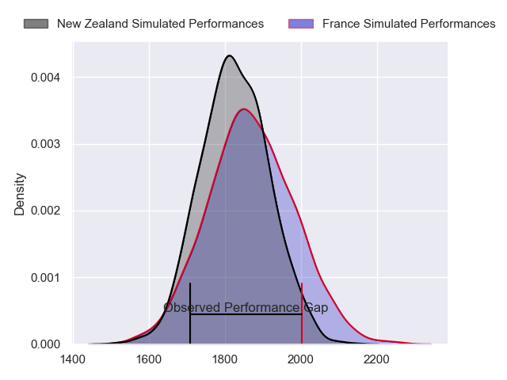
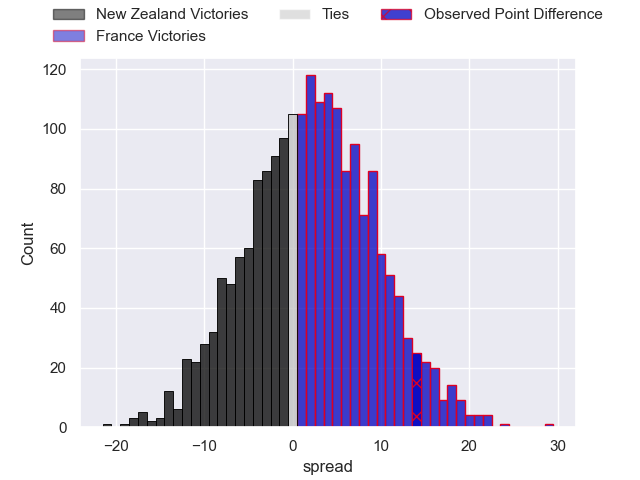
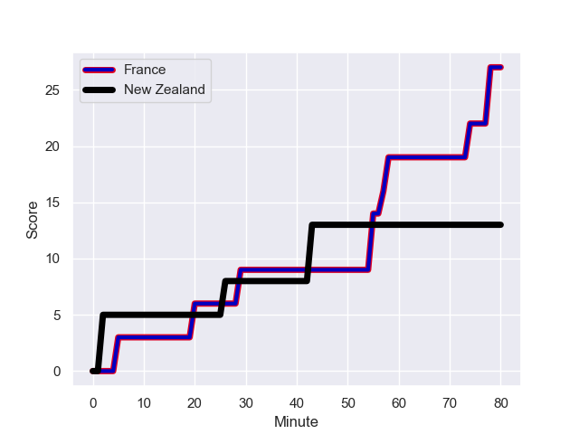
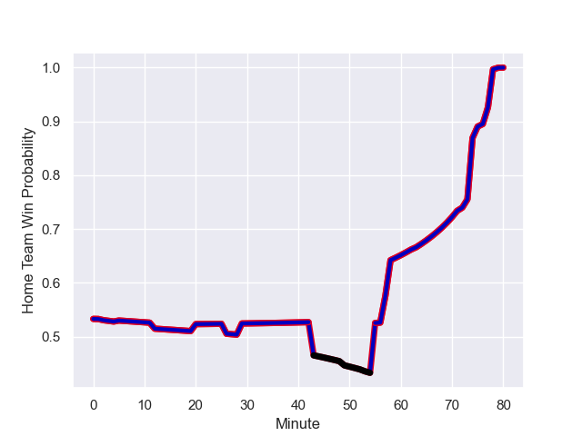

---  
layout: page  
title: New Zealand at France; 13.0-27.0  
date: 2023-09-08 18:00:00 -0500  
categories: match review  
---
# New Zealand at France; 13.0-27.0

# Club Level Predictions

The first set of predictions treats a club as the smallest object, as the club develops its members, organizes a gameplan, and deploys its players as needed for each match. This club model has a prediction of 0.565, which translates to predicting France to win by 2.4.

Each club has a rating and a rating deviation (simiar to a Glicko system), and expected performances can be generated. This allows for simulated matches and spreads like the ones below.
## Projected Performances

## Projected Spreads

## Projected Results

# Player Level Predictions - Version 2

Treating teams instead as an entity made up of the currently active players, I have ratings for each player in an altogether different system. These can be combined to form team ratings once teamsheets are announced, weighting starters a bit higher than the reserves. After the match is played, players can be weighted by their minutes on the field, allowing for an accurate measure of the team's composition. With these compiled team ratings, we can make predictions, measure inaccuracy, and update the individual player ratings.
## Prediction with Player Minutes: France by 1.5

New Zealand by 2.2 on a neutral field
## Prediction without Player Minutes: France by 2.2

New Zealand by 1.5 on a neutral pitch

## Scores over Time

## Win Probability over Time

There were 7 large changes in win probability in this match

|   Away Minutes | Away Player            |   Away elo |   Number |   Home elo | Home Player        |   Home Minutes |
|---------------:|:-----------------------|-----------:|---------:|-----------:|:-------------------|---------------:|
|             53 | Ethan de Groot         |      52.64 |        1 |      79.26 | Reda Wardi         |             53 |
|             57 | Codie Taylor           |     103.43 |        2 |     100.25 | Julien Marchand    |             12 |
|             53 | Nepo Laulala           |      84.7  |        3 |     122.86 | Uini Atonio        |             53 |
|             69 | Samuel Whitelock       |     141.69 |        4 |      60.89 | Cameron Woki       |             49 |
|             80 | Scott Barrett          |      97.95 |        5 |      76.66 | Thibaud Flament    |             80 |
|             57 | Tupou Vaa'i            |      74.24 |        6 |     118.68 | Francois Cros      |             63 |
|             80 | Dalton Papalii         |     109.7  |        7 |     107.8  | Charles Ollivon    |             80 |
|             80 | Ardie Savea            |     102.29 |        8 |     109.56 | Gregory Alldritt   |             80 |
|             63 | Aaron Smith            |     103.41 |        9 |     134.02 | Antoine Dupont     |             76 |
|             80 | Richie Mo'unga         |     118.97 |       10 |      93.14 | Matthieu Jalibert  |             80 |
|             72 | Mark Telea             |      95.49 |       11 |      73.03 | Gabin Villiere     |             80 |
|             63 | Anton Lienert-Brown    |      75.52 |       12 |      51.79 | Yoram Moefana      |             58 |
|             80 | Rieko Ioane            |      56.43 |       13 |      98.85 | Gael Fickou        |             80 |
|             80 | Will Jordan            |     101.26 |       14 |      78.28 | Damian Penaud      |             80 |
|             80 | Beauden Barrett        |     143.28 |       15 |     118.04 | Thomas Ramos       |             76 |
|             23 | Samisoni Taukei'aho    |      75.76 |       16 |      83.04 | Peato Mauvaka      |             68 |
|             27 | Ofa Tu'ungafasi        |      98.09 |       17 |      82.44 | Jean-Baptiste Gros |             27 |
|             27 | Fletcher Newell        |      22.49 |       18 |     100.43 | Dorian Aldegheri   |             27 |
|             11 | Brodie Retallick       |     135.1  |       19 |      47.58 | Romain Taofifenua  |             31 |
|             23 | Luke Jacobson          |      78.41 |       20 |      37.63 | Paul Boudehent     |             17 |
|             17 | Finlay Christie        |      56.34 |       21 |     108.59 | Maxime Lucu        |              4 |
|             17 | David Havili           |      46.65 |       22 |      57.59 | Arthur Vincent     |             22 |
|              8 | Leicester Fainga'anuku |      80.27 |       23 |      66.18 | Melvyn Jaminet     |              4 |

