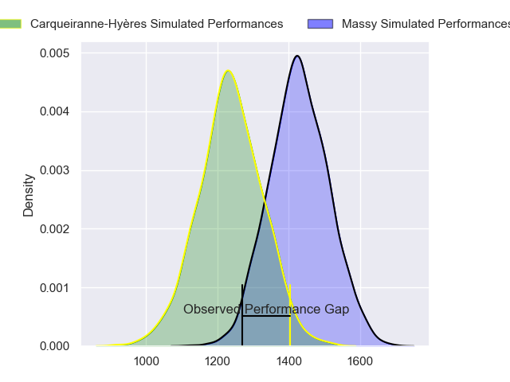
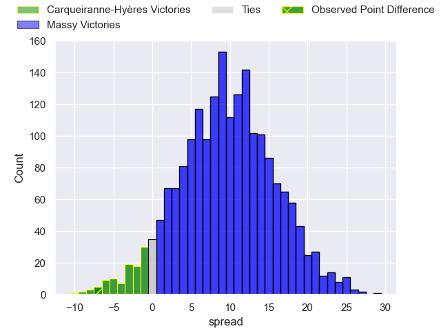
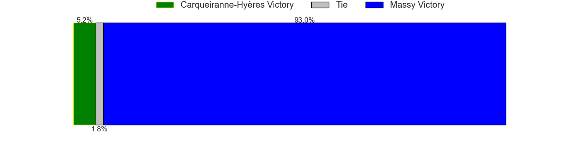
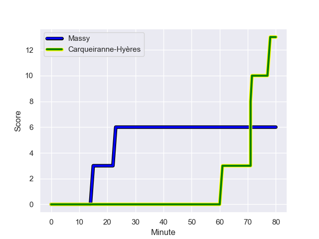
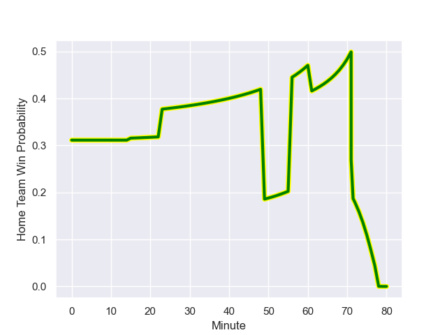

---  
layout: page  
title: Carqueiranne-Hyères at Massy; 13.0-6.0  
date: 2023-09-08 18:00:00 -0500  
categories: match review  
---
# Carqueiranne-Hyères at Massy; 13.0-6.0

# Club Level Predictions

The first set of predictions treats a club as the smallest object, as the club develops its members, organizes a gameplan, and deploys its players as needed for each match. This club model has a prediction of 0.746, which translates to predicting Massy to win by 9.7.

Each club has a rating and a rating deviation (simiar to a Glicko system), and expected performances can be generated. This allows for simulated matches and spreads like the ones below.
## Projected Performances

## Projected Spreads

## Projected Results

# Player Level Predictions - Version 1

Treating teams instead as an entity made up of the currently active players, I have ratings for each player in an altogether different system. These can be combined to form team ratings once teamsheets are announced, weighting starters a bit higher than the reserves. After the match is played, players can be weighted by their minutes on the field, allowing for an accurate measure of the team's composition. With these compiled team ratings, we can make predictions, measure inaccuracy, and update the individual player ratings.
## Prediction with Player Minutes: Carqueiranne-Hyères by 30.5

Carqueiranne-Hyères by 34.5 on a neutral field
## Prediction without Player Minutes: Carqueiranne-Hyères by 40.5

Carqueiranne-Hyères by 44.5 on a neutral pitch

## Scores over Time

## Win Probability over Time

There were 10 large changes in win probability in this match

|   Away Minutes | Away Player              |   Away elo |   Away Percentile |   Number |   Home Percentile |   Home elo | Home Player              |   Home Minutes |
|---------------:|:-------------------------|-----------:|------------------:|---------:|------------------:|-----------:|:-------------------------|---------------:|
|             23 | Ferdinand Changel        |     248.95 |  991023           |        1 |       1.00951e+06 |     266.8  | Robin Poipy              |             49 |
|             51 | Michael Tyumenev         |     300.6  |  777455           |        2 |       1.01057e+06 |     298.43 | Pierre-Alexandre Duclieu |             49 |
|             51 | Thomas Lithaud           |     177.88 |       1.03398e+06 |        3 |  896062           |     178.16 | Nicolas Ferrer           |             49 |
|             80 | Adam Peters              |     137.38 |  863920           |        4 |       1.01205e+06 |     256.56 | Saba Pesvianidze         |             80 |
|             56 | Lucas Cazac              |     164.38 |  896005           |        5 |       1.00733e+06 |     -64.92 | Koen Bloemen             |             49 |
|             66 | Florian Munoz Rivero     |     201.26 |  829534           |        6 |       1.02822e+06 |     225.2  | Tony Tissot              |             56 |
|             80 | Spike Salman             |     285.92 |       1.0161e+06  |        7 |       1.02911e+06 |     140.35 | Clément Vidoni           |             80 |
|             80 | Johann Afonso Grundlingh |     180.04 |       1.03409e+06 |        8 |  990207           |      63.7  | Samuel Nollet            |             49 |
|             51 | Rémi Dubié               |     151.48 |       1.02499e+06 |        9 |  670654           |      20.29 | Lucas Rubio              |             80 |
|             80 | Juan Kotze               |      76.74 |  644548           |       10 |       1.02424e+06 |     101.47 | Tom Deleuze              |             80 |
|             80 | Paul Gadea               |     128.28 |       1.03274e+06 |       11 |  980834           |     184.91 | Yanis Dit Robaglia       |             80 |
|             76 | Theo Moitrier            |     193.35 |       1.03413e+06 |       12 |       1.02422e+06 |     117.41 | Tom Cusson               |             66 |
|             65 | Dylan Sage               |     231.57 |  944897           |       13 |  980858           |     250.55 | Arthur Seigneuret        |             80 |
|             80 | Amaury Bobillon          |     194.26 |       1.03412e+06 |       14 |  990665           |     298.63 | Alex Preira              |             80 |
|             80 | Théo Defrance            |     140.4  |       1.0279e+06  |       15 |  972181           |     189.87 | Giorgi Gogoladze         |             80 |
|             57 | Miguel Mathieu           |     168.77 |       1.02504e+06 |       16 |  911720           |      93.18 | Fernandez Correa         |             31 |
|             29 | Yan Tabarot              |     310.31 |       1.00953e+06 |       17 |  984983           |     275.32 | Pierre Trassoudaine      |             31 |
|             29 | Jérémy Fleury            |     160.32 |     nan           |       18 |  789693           |     -28.41 | Andrei Mahu              |             31 |
|             24 | Nathan Gendre            |     369.67 |  985903           |       19 |  888327           |      62.22 | Abongile Nonkontwana     |             31 |
|             29 | Lasha Mchelidze          |     170.42 |       1.02721e+06 |       20 |       1.01189e+06 |     249.8  | Tijde Visser             |             31 |
|             15 | Vincent Alessi           |     366.09 |  981645           |       21 |  964837           |     217.53 | Hugo Boutin              |             24 |
|             14 | Marius Pellegrin         |     193.79 |     nan           |       22 |     nan           |     153.67 | Mathys Bigot             |             14 |
|              4 | Adrien Amans             |     119.15 |       1.02757e+06 |       23 |     nan           |     nan    | nan                      |            nan |

# Player Level Predictions - Version 2

Treating teams instead as an entity made up of the currently active players, I have ratings for each player in an altogether different system. These can be combined to form team ratings once teamsheets are announced, weighting starters a bit higher than the reserves. After the match is played, players can be weighted by their minutes on the field, allowing for an accurate measure of the team's composition. With these compiled team ratings, we can make predictions, measure inaccuracy, and update the individual player ratings.
## Prediction with Player Minutes: Massy by 3.7

Massy by 0.1 on a neutral field
## Prediction without Player Minutes: Massy by 3.9

Massy by 0.3 on a neutral pitch

|   Away Minutes | Away Player              |   Away elo |   Away variance |   Number |   Home variance |   Home elo | Home Player              |   Home Minutes |
|---------------:|:-------------------------|-----------:|----------------:|---------:|----------------:|-----------:|:-------------------------|---------------:|
|             23 | Ferdinand Changel        |      44.29 |           49.97 |        1 |           49.85 |      44.29 | Robin Poipy              |             49 |
|             51 | Michael Tyumenev         |      27.12 |           49.95 |        2 |           49.93 |      44.16 | Pierre-Alexandre Duclieu |             49 |
|             51 | Thomas Lithaud           |      46.97 |           49.95 |        3 |           49.85 |      46.01 | Nicolas Ferrer           |             49 |
|             80 | Adam Peters              |      25.21 |           50    |        4 |           49.79 |      60.25 | Saba Pesvianidze         |             80 |
|             56 | Lucas Cazac              |      13.73 |           49.83 |        5 |           49.92 |      14.28 | Koen Bloemen             |             49 |
|             66 | Florian Munoz Rivero     |      48.74 |           49.83 |        6 |           49.84 |      38.68 | Tony Tissot              |             56 |
|             80 | Spike Salman             |      32    |           49.95 |        7 |           49.87 |      46.42 | Clément Vidoni           |             80 |
|             80 | Johann Afonso Grundlingh |      46.65 |           50    |        8 |           50    |      18.35 | Samuel Nollet            |             49 |
|             51 | Rémi Dubié               |      32.04 |           49.95 |        9 |           49.87 |      23.63 | Lucas Rubio              |             80 |
|             80 | Juan Kotze               |      36.3  |           49.83 |       10 |           49.79 |      32.06 | Tom Deleuze              |             80 |
|             80 | Paul Gadea               |      46.06 |           49.83 |       11 |           49.79 |      30.44 | Yanis Dit Robaglia       |             80 |
|             76 | Theo Moitrier            |      46.65 |           50    |       12 |           49.95 |      37.95 | Tom Cusson               |             66 |
|             65 | Dylan Sage               |      33.55 |           49.87 |       13 |           49.84 |      47.48 | Arthur Seigneuret        |             80 |
|             80 | Amaury Bobillon          |      46.65 |           50    |       14 |           49.79 |      65.07 | Alex Preira              |             80 |
|             80 | Théo Defrance            |      37.65 |           49.98 |       15 |           49.79 |      40.54 | Giorgi Gogoladze         |             80 |
|             57 | Miguel Mathieu           |      39.39 |           50    |       16 |           49.93 |       4.25 | Fernandez Correa         |             31 |
|             29 | Yan Tabarot              |      40.59 |           49.88 |       17 |           49.85 |      69.32 | Pierre Trassoudaine      |             31 |
|             29 | Jérémy Fleury            |      44.39 |           50    |       18 |           49.88 |       0.44 | Andrei Mahu              |             31 |
|             24 | Nathan Gendre            |      26.21 |           49.88 |       19 |           49.79 |       1.37 | Abongile Nonkontwana     |             31 |
|             29 | Lasha Mchelidze          |      48.32 |           49.88 |       20 |           49.93 |      40.63 | Tijde Visser             |             31 |
|             15 | Vincent Alessi           |      25.37 |           49.83 |       21 |           49.92 |      44.75 | Hugo Boutin              |             24 |
|             14 | Marius Pellegrin         |      46.65 |           50    |       22 |           50    |      46.65 | Mathys Bigot             |             14 |
|              4 | Adrien Amans             |      29.32 |           50    |       23 |          nan    |     nan    | nan                      |            nan |

