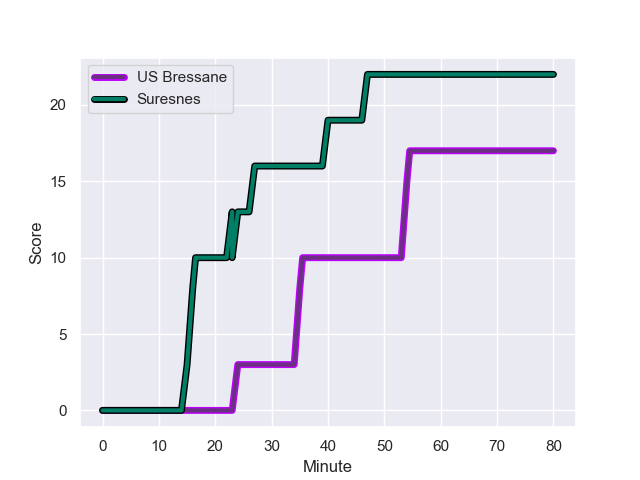
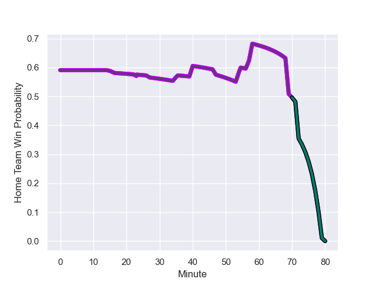

---  
layout: page  
title: Suresnes at US Bressane; 22.0-17.0  
date: 2023-09-08 18:00:00 -0500  
categories: match review  
---
# Suresnes at US Bressane; 22.0-17.0

# Club Level Predictions

The first set of predictions treats a club as the smallest object, as the club develops its members, organizes a gameplan, and deploys its players as needed for each match. This club model has a prediction of 0.801, which translates to predicting US Bressane to win by 12.4.

Each club has a rating and a rating deviation (simiar to a Glicko system), and expected performances can be generated. This allows for simulated matches and spreads like the ones below.
## Projected Performances

## Projected Spreads

## Projected Results

# Player Level Predictions - Version 1

Treating teams instead as an entity made up of the currently active players, I have ratings for each player in an altogether different system. These can be combined to form team ratings once teamsheets are announced, weighting starters a bit higher than the reserves. After the match is played, players can be weighted by their minutes on the field, allowing for an accurate measure of the team's composition. With these compiled team ratings, we can make predictions, measure inaccuracy, and update the individual player ratings.
## Prediction with Player Minutes: US Bressane by 20.0

US Bressane by 16.0 on a neutral field
## Prediction without Player Minutes: US Bressane by 16.3

US Bressane by 12.3 on a neutral pitch

## Scores over Time

## Win Probability over Time

There were 12 large changes in win probability in this match

|   Away Minutes | Away Player            |   Away elo |   Away Percentile |   Number |   Home Percentile |   Home elo | Home Player               |   Home Minutes |
|---------------:|:-----------------------|-----------:|------------------:|---------:|------------------:|-----------:|:--------------------------|---------------:|
|             62 | Sébastien Lafrancesca  |     125.1  |           1024700 |        1 |  946274           |     295.04 | Vazha Kapanadze           |             59 |
|             69 | Hayam El Bibouji       |     143.97 |           1024585 |        2 |  756909           |     138.62 | Clement Jullien           |             58 |
|             72 | Victor Damian Arias    |      69.59 |            659457 |        3 |  957763           |     141.82 | Erich de Jager            |             40 |
|             80 | Damien Bozic           |     184.97 |           1030562 |        4 |  983893           |      -7.79 | Louis Bruinsma            |             80 |
|             80 | Marvin Woki            |     246.01 |            986244 |        5 |  924421           |     285.53 | Josh Peters               |             80 |
|             80 | Louis-Mathieu Jazeix   |      81.23 |            794038 |        6 |       1.02783e+06 |     183.05 | Thomas Déliance           |             72 |
|             62 | Wian Vosloo            |      98.69 |            891475 |        7 |  924238           |     164.02 | Pierre Reynaud            |             80 |
|             58 | Lakisipone Lee         |     259.7  |           1007262 |        8 |  991282           |     263.08 | Joseph Penitito           |             80 |
|             58 | Peïo Etchebest         |     162.03 |           1034357 |        9 |  734049           |      51.92 | Nicolas Faure             |             63 |
|             80 | Victor Barnier         |     290.81 |           1007330 |       10 |  698310           |      91.71 | Fred Zeilinga             |             40 |
|             80 | Alexis Clement         |     192.15 |           1007315 |       11 |  994264           |     234.94 | Élie De Fleurian          |             80 |
|             80 | Petero Tuwai           |      48.93 |           1009684 |       12 |  859880           |      89.98 | Parataiso Silafai-Lea'ana |             80 |
|             80 | JJ Taulagi             |      40.24 |            736502 |       13 |  981481           |     231.97 | Alexandre Badet           |             80 |
|             57 | Faraj Fartass          |      53.59 |            869226 |       14 |       1.01306e+06 |     222.12 | Thibaut Perrette          |             80 |
|             80 | Thomas Baudy           |     334.13 |            983959 |       15 |  933025           |     174.72 | Florent Massip            |             79 |
|             23 | Lilan Savioz Fouillet  |     144.13 |           1031451 |       16 |  999532           |     267.11 | Atonio Ulutuipalelei      |             40 |
|             22 | Jean-Baptiste Lachaise |     111.32 |           1027988 |       17 |  990405           |      24.5  | Christian Lacombe         |             40 |
|             22 | Thomas Lacroix         |     314.35 |            981959 |       18 |       1.02832e+06 |     150.65 | Louis Dasalmartini        |             22 |
|             18 | Elias Coulibaly        |     150    |           1024861 |       19 |  916939           |     218.08 | Nicolas Lemaire           |             21 |
|             18 | Florian Desbordes      |     215.64 |            981190 |       20 |  862374           |     122.25 | Jeremy Valencot           |             17 |
|             11 | Anthony Bajart         |     329.61 |            982553 |       21 |       1.02832e+06 |     162.28 | Nail Ait Naceur           |              8 |
|              8 | Lucas Dycke            |     170.29 |           1013298 |       22 |     nan           |     158.59 | François Grange           |              1 |

# Player Level Predictions - Version 2

Treating teams instead as an entity made up of the currently active players, I have ratings for each player in an altogether different system. These can be combined to form team ratings once teamsheets are announced, weighting starters a bit higher than the reserves. After the match is played, players can be weighted by their minutes on the field, allowing for an accurate measure of the team's composition. With these compiled team ratings, we can make predictions, measure inaccuracy, and update the individual player ratings.
## Prediction with Player Minutes: US Bressane by 9.5

US Bressane by 6.0 on a neutral field
## Prediction without Player Minutes: US Bressane by 9.7

US Bressane by 6.2 on a neutral pitch

|   Away Minutes | Away Player            |   Away elo |   Away variance |   Number |   Home variance |   Home elo | Home Player               |   Home Minutes |
|---------------:|:-----------------------|-----------:|----------------:|---------:|----------------:|-----------:|:--------------------------|---------------:|
|             62 | Sébastien Lafrancesca  |      46.49 |           50    |        1 |           49.93 |      48.08 | Vazha Kapanadze           |             59 |
|             69 | Hayam El Bibouji       |      22.73 |           49.87 |        2 |           50    |      49.96 | Clement Jullien           |             58 |
|             72 | Victor Damian Arias    |      24.01 |           50    |        3 |           50    |      31.05 | Erich de Jager            |             40 |
|             80 | Damien Bozic           |      42.39 |           49.96 |        4 |           49.79 |      28.23 | Louis Bruinsma            |             80 |
|             80 | Marvin Woki            |      46.98 |           49.87 |        5 |           49.93 |      36.67 | Josh Peters               |             80 |
|             80 | Louis-Mathieu Jazeix   |      22.51 |           49.83 |        6 |           49.83 |      50.69 | Thomas Déliance           |             72 |
|             62 | Wian Vosloo            |       9.25 |           49.96 |        7 |           49.79 |      44.41 | Pierre Reynaud            |             80 |
|             58 | Lakisipone Lee         |      36.57 |           49.83 |        8 |           49.79 |      60.33 | Joseph Penitito           |             80 |
|             58 | Peïo Etchebest         |      46.65 |           50    |        9 |           49.96 |      -5.45 | Nicolas Faure             |             63 |
|             80 | Victor Barnier         |      42.98 |           50    |       10 |           49.79 |      60.38 | Fred Zeilinga             |             40 |
|             80 | Alexis Clement         |      -0.05 |           49.87 |       11 |           49.79 |      32.77 | Élie De Fleurian          |             80 |
|             80 | Petero Tuwai           |      30.2  |           49.96 |       12 |           50    |       4.83 | Parataiso Silafai-Lea'ana |             80 |
|             80 | JJ Taulagi             |     -16.62 |           49.83 |       13 |           49.79 |      28.86 | Alexandre Badet           |             80 |
|             57 | Faraj Fartass          |      51.84 |           49.96 |       14 |           49.79 |      33.84 | Thibaut Perrette          |             80 |
|             80 | Thomas Baudy           |       7.88 |           49.83 |       15 |           49.79 |      60.99 | Florent Massip            |             79 |
|             23 | Lilan Savioz Fouillet  |      36.9  |           49.87 |       16 |           49.86 |      27.27 | Atonio Ulutuipalelei      |             40 |
|             22 | Jean-Baptiste Lachaise |      45.44 |           49.83 |       17 |           50    |      20.05 | Christian Lacombe         |             40 |
|             22 | Thomas Lacroix         |      20.23 |           49.83 |       18 |           49.86 |      37.43 | Louis Dasalmartini        |             22 |
|             18 | Elias Coulibaly        |      43.13 |           49.96 |       19 |           49.86 |      46.39 | Nicolas Lemaire           |             21 |
|             18 | Florian Desbordes      |      12.84 |           49.87 |       20 |           49.83 |      43.32 | Jeremy Valencot           |             17 |
|             11 | Anthony Bajart         |      32.11 |           49.96 |       21 |           49.96 |      46.09 | Nail Ait Naceur           |              8 |
|              8 | Lucas Dycke            |      12.96 |           49.87 |       22 |           50    |      46.65 | François Grange           |              1 |

