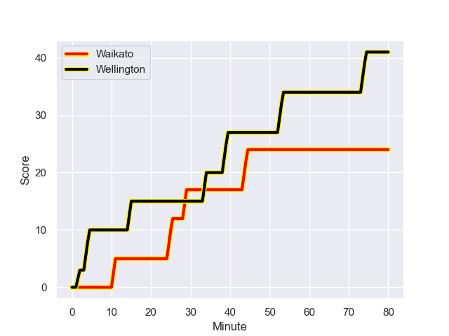
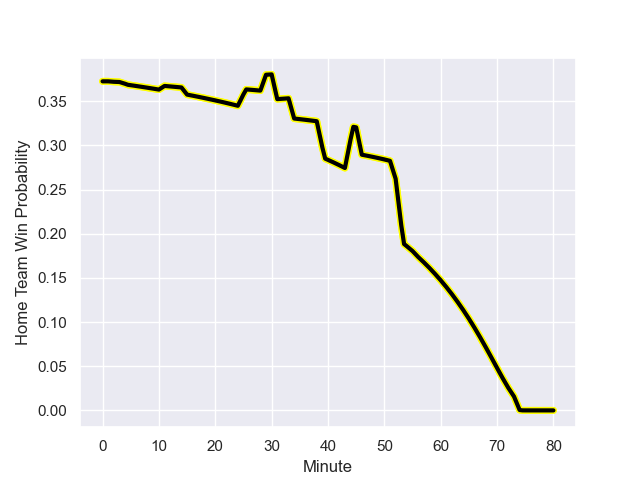

---  
layout: page  
title: Wellington at Waikato; 41.0-24.0  
date: 2023-09-08 18:00:00 -0500  
categories: match review  
---
# Wellington at Waikato; 41.0-24.0

# Club Level Predictions

The first set of predictions treats a club as the smallest object, as the club develops its members, organizes a gameplan, and deploys its players as needed for each match. This club model has a prediction of 0.342, which translates to predicting Wellington to win by 6.0.

Each club has a rating and a rating deviation (simiar to a Glicko system), and expected performances can be generated. This allows for simulated matches and spreads like the ones below.
## Projected Performances

## Projected Spreads

## Projected Results

# Player Level Predictions - Version 1

Treating teams instead as an entity made up of the currently active players, I have ratings for each player in an altogether different system. These can be combined to form team ratings once teamsheets are announced, weighting starters a bit higher than the reserves. After the match is played, players can be weighted by their minutes on the field, allowing for an accurate measure of the team's composition. With these compiled team ratings, we can make predictions, measure inaccuracy, and update the individual player ratings.
## Prediction with Player Minutes: Wellington by 18.6

Wellington by 22.6 on a neutral field
## Prediction without Player Minutes: Wellington by 9.6

Wellington by 13.6 on a neutral pitch

## Scores over Time

## Win Probability over Time

There were 5 large changes in win probability in this match

|   Away Minutes | Away Player            |   Away elo |   Away Percentile |   Number |   Home Percentile |   Home elo | Home Player            |   Home Minutes |
|---------------:|:-----------------------|-----------:|------------------:|---------:|------------------:|-----------:|:-----------------------|---------------:|
|             52 | Cameron Orr            |      81.97 |  815981           |        1 |  862818           |     110.1  | Ayden Johnstone        |             52 |
|             31 | James O'Reilly         |      73.45 |  709955           |        2 |       1.03408e+06 |     103.62 | Sean Ralph             |             56 |
|             68 | Siale Lauaki           |     111.23 |       1.03381e+06 |        3 |       1.00557e+06 |     107.67 | George Dyer            |             68 |
|             80 | Dominic Bird           |      91.05 |  649911           |        4 |  801112           |     103.51 | James Tucker           |             80 |
|             52 | Hugo Plummer           |     124.2  |       1.03379e+06 |        5 |  919823           |      88.22 | Hamilton Burr          |             80 |
|             46 | Keelan Whitman         |     100.1  |       1.0046e+06  |        6 |       1.03409e+06 |     103.11 | Xavier Saifoloi        |             56 |
|             80 | Du'Plessis Kirifi      |     189.3  |  895342           |        7 |  996075           |     129.5  | Joe Johnston           |             59 |
|             80 | Peter Lakai            |     120.52 |       1.02384e+06 |        8 |  962214           |      94.07 | Simon Parker           |             80 |
|             75 | Kemara Hauiti-Parapara |     101.1  |  890495           |        9 |  936687           |      78.23 | Xavier Roe             |             59 |
|             80 | Aidan Morgan           |     111.61 |       1.00794e+06 |       10 |       1.02404e+06 |     106.46 | Taha Kemara            |             77 |
|             46 | Isi Saumaki            |     106.97 |       1.03433e+06 |       11 |       1.01146e+06 |      73.64 | Daniel Sinkinson       |             80 |
|             80 | Riley Higgins          |     136.71 |       1.02217e+06 |       12 |       1.034e+06   |     101.19 | Austin Anderson        |             80 |
|             80 | Billy Proctor          |     127.55 |  907674           |       13 |       1.02391e+06 |     107.9  | Tana Tuhakaraina       |             80 |
|             80 | Losi Filipo            |      92.73 |  898641           |       14 |       1.03408e+06 |     107.41 | Cody Nordstrom         |             68 |
|             80 | Ruben Love             |     127.89 |  996763           |       15 |       1.00547e+06 |      96.94 | Tepaea Cook-Savage     |             80 |
|             49 | Penieli Poasa          |     116.34 |     nan           |       16 |  962337           |     102.88 | Ollie Norris           |             28 |
|             34 | Sam Clarke             |     113.84 |       1.02355e+06 |       17 |       1.02368e+06 |     114.66 | Pita Anae Ah-Sue       |             24 |
|             34 | Brad Shields           |     141.59 |  536377           |       18 |       1.03391e+06 |     100.83 | Malachi Wrampling-Alec |             24 |
|             28 | Dominic Ropeti         |     105.59 |       1.03382e+06 |       19 |       1.00552e+06 |     136.22 | Cortez Ratima          |             21 |
|             28 | Xavier Numia           |     132.56 |  934118           |       20 |       1.01143e+06 |     103.11 | Te Rama Reuben         |             21 |
|             12 | PJ Sheck               |     105.81 |       1.00464e+06 |       21 |       1.00561e+06 |     149.9  | Liam Coombes-Fabling   |             12 |
|              5 | Sam Howling            |     102.19 |     nan           |       22 |       1.01856e+06 |     115.02 | Solomone Tukuafu       |             12 |
|            nan | nan                    |     nan    |     nan           |       23 |     nan           |     103.67 | Zinzan Hansen          |              3 |

# Player Level Predictions - Version 2

Treating teams instead as an entity made up of the currently active players, I have ratings for each player in an altogether different system. These can be combined to form team ratings once teamsheets are announced, weighting starters a bit higher than the reserves. After the match is played, players can be weighted by their minutes on the field, allowing for an accurate measure of the team's composition. With these compiled team ratings, we can make predictions, measure inaccuracy, and update the individual player ratings.
## Prediction with Player Minutes: Wellington by 10.0

Wellington by 13.4 on a neutral field
## Prediction without Player Minutes: Wellington by 8.3

Wellington by 11.7 on a neutral pitch

|   Away Minutes | Away Player            |   Away elo |   Away variance |   Number |   Home variance |   Home elo | Home Player            |   Home Minutes |
|---------------:|:-----------------------|-----------:|----------------:|---------:|----------------:|-----------:|:-----------------------|---------------:|
|             52 | Cameron Orr            |      51.58 |           49.74 |        1 |           49.83 |      80.16 | Ayden Johnstone        |             52 |
|             31 | James O'Reilly         |      42.51 |           49.7  |        2 |           49.89 |      46.95 | Sean Ralph             |             56 |
|             68 | Siale Lauaki           |      48.88 |           49.71 |        3 |           49.39 |      55.5  | George Dyer            |             68 |
|             80 | Dominic Bird           |      91.02 |           49.8  |        4 |           49.23 |      62    | James Tucker           |             80 |
|             52 | Hugo Plummer           |      57.38 |           49.59 |        5 |           49.15 |      41.3  | Hamilton Burr          |             80 |
|             46 | Keelan Whitman         |      55.88 |           49.81 |        6 |           49.65 |      41.74 | Xavier Saifoloi        |             56 |
|             80 | Du'Plessis Kirifi      |      85.13 |           49.47 |        7 |           48.09 |      26.81 | Joe Johnston           |             59 |
|             80 | Peter Lakai            |      72.77 |           49.56 |        8 |           49.16 |      33.96 | Simon Parker           |             80 |
|             75 | Kemara Hauiti-Parapara |      71.95 |           49.57 |        9 |           49.58 |      29.73 | Xavier Roe             |             59 |
|             80 | Aidan Morgan           |      62.73 |           49.42 |       10 |           49.16 |      43.35 | Taha Kemara            |             77 |
|             46 | Isi Saumaki            |      48.54 |           49.96 |       11 |           49.29 |      48.3  | Daniel Sinkinson       |             80 |
|             80 | Riley Higgins          |      82.81 |           49.65 |       12 |           49.71 |      42.8  | Austin Anderson        |             80 |
|             80 | Billy Proctor          |      80.06 |           49.44 |       13 |           49.58 |      47.23 | Tana Tuhakaraina       |             80 |
|             80 | Losi Filipo            |      56.77 |           49.42 |       14 |           49.78 |      45.33 | Cody Nordstrom         |             68 |
|             80 | Ruben Love             |      87.52 |           49.44 |       15 |           49.33 |      38.93 | Tepaea Cook-Savage     |             80 |
|             49 | Penieli Poasa          |      49.79 |           49.93 |       16 |           49.31 |      60.86 | Ollie Norris           |             28 |
|             34 | Sam Clarke             |      52.83 |           49.86 |       17 |           49.43 |      56.19 | Pita Anae Ah-Sue       |             24 |
|             34 | Brad Shields           |      86.31 |           49.41 |       18 |           49.61 |      48.91 | Malachi Wrampling-Alec |             24 |
|             28 | Dominic Ropeti         |      50.67 |           49.71 |       19 |           49.45 |      63    | Cortez Ratima          |             21 |
|             28 | Xavier Numia           |      87.35 |           49.54 |       20 |           49.71 |      54.37 | Te Rama Reuben         |             21 |
|             12 | PJ Sheck               |      67.45 |           49.66 |       21 |           49.19 |      76.96 | Liam Coombes-Fabling   |             12 |
|              5 | Sam Howling            |      48.16 |           49.97 |       22 |           49.65 |      54.73 | Solomone Tukuafu       |             12 |
|            nan | nan                    |     nan    |          nan    |       23 |           49.87 |      45.84 | Zinzan Hansen          |              3 |

