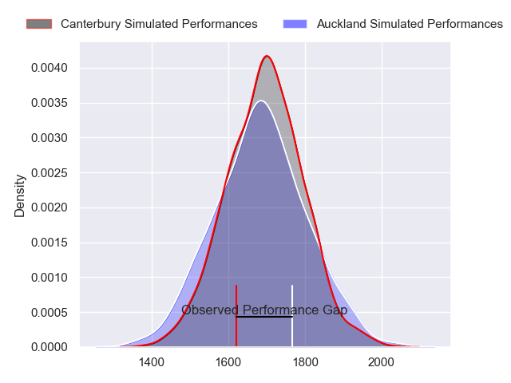
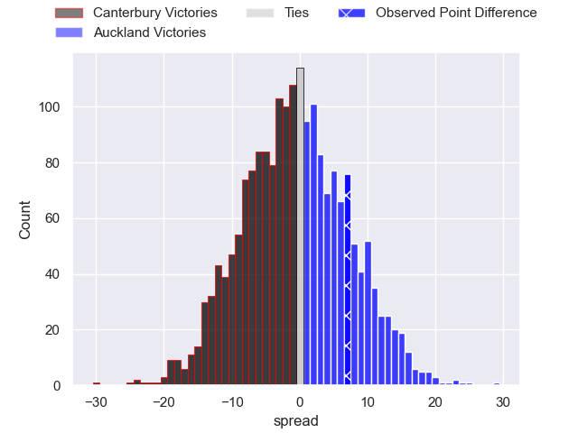
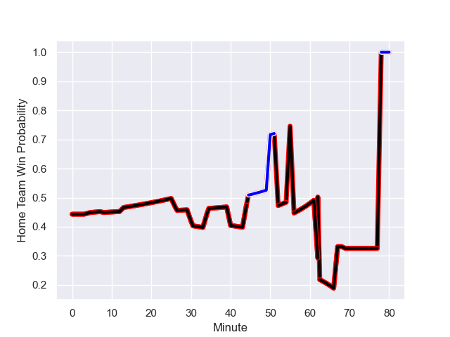

---  
layout: page  
title: Canterbury at Auckland; 29.0-36.0  
date: 2023-09-09 18:00:00 -0500  
categories: match review  
---
# Canterbury at Auckland; 29.0-36.0

# Club Level Predictions

The first set of predictions treats a club as the smallest object, as the club develops its members, organizes a gameplan, and deploys its players as needed for each match. This club model has a prediction of 0.488, which translates to predicting Canterbury to win by 0.4.

Each club has a rating and a rating deviation (simiar to a Glicko system), and expected performances can be generated. This allows for simulated matches and spreads like the ones below.
## Projected Performances

## Projected Spreads

## Projected Results

# Player Level Predictions - Version 1

Treating teams instead as an entity made up of the currently active players, I have ratings for each player in an altogether different system. These can be combined to form team ratings once teamsheets are announced, weighting starters a bit higher than the reserves. After the match is played, players can be weighted by their minutes on the field, allowing for an accurate measure of the team's composition. With these compiled team ratings, we can make predictions, measure inaccuracy, and update the individual player ratings.
## Prediction with Player Minutes: Canterbury by 5.9

Canterbury by 9.9 on a neutral field
## Prediction without Player Minutes: Canterbury by 6.0

Canterbury by 10.0 on a neutral pitch

## Scores over Time

## Win Probability over Time

There were 15 large changes in win probability in this match

|   Away Minutes | Away Player       |   Away elo |   Away Percentile |   Number |   Home Percentile |   Home elo | Home Player         |   Home Minutes |
|---------------:|:------------------|-----------:|------------------:|---------:|------------------:|-----------:|:--------------------|---------------:|
|             35 | Joe Moody         |      96.41 |  584345           |        1 |       1.01953e+06 |      93.32 | Josh Fusitua        |             52 |
|             55 | George Bell       |     124.99 |       1.02183e+06 |        2 |  998593           |     105.37 | Soane Vikena        |             69 |
|             50 | Oli Jager         |     115.17 |  845339           |        3 |  540717           |     145.5  | Angus Ta'avao       |             50 |
|             80 | Mitchell Dunshea  |     108.14 |  802205           |        4 |       1.01029e+06 |      89.68 | Edward Annandale    |             56 |
|             53 | Sam Darry         |     112.5  |  994813           |        5 |       1.02366e+06 |      98.33 | Josh Beehre         |             80 |
|             80 | Billy Harmon      |     127.03 |  845243           |        6 |  941308           |     114.47 | Adrian Choat        |             80 |
|             80 | Tom Christie      |     141.59 |  914606           |        7 |  750825           |     100.88 | Blake Gibson        |             80 |
|             55 | Cullen Grace      |     138.33 |  962462           |        8 |  788872           |     143.48 | Akira Ioane         |             48 |
|             50 | Mitchell Drummond |      97.64 |  716793           |        9 |  995423           |      93.89 | Kalani Thomas       |             50 |
|             80 | Fergus Burke      |     125.98 |  962532           |       10 |  998816           |     142.16 | Zarn Sullivan       |             80 |
|             55 | Isaiah Punivai    |      90.97 |       1.0056e+06  |       11 |       1.0341e+06  |     103.45 | Xavier TIto-Harris  |             80 |
|             80 | Rameka Poihipi    |      94.31 |  963493           |       12 |  509383           |     104.26 | Bryce Heem          |             69 |
|             80 | Dallas McLeod     |     111.89 |  962594           |       13 |       1.00551e+06 |     105.98 | Corey Evans         |             80 |
|             69 | Solomon Alaimalo  |     103.95 |  843772           |       14 |  964891           |      93.12 | AJ Lam              |             80 |
|             80 | Chay Fihaki       |     124.24 |  993265           |       15 |       1.01696e+06 |     137.04 | Roger Tuivasa-Sheck |             80 |
|             45 | Dan Lienert-Brown |     121.21 |  735622           |       16 |       1.03378e+06 |     114.06 | Sione Ahio          |             30 |
|             30 | Seb Calder        |     103.32 |       1.03361e+06 |       17 |       1.03377e+06 |     106.58 | Ben Ake             |             28 |
|             25 | Ben Funnell       |     115.51 |  590650           |       18 |     nan           |      79.04 | Joe Royal           |             11 |
|             27 | Zach Gallagher    |     120.35 |       1.00566e+06 |       19 |  865531           |     112.19 | Hamish Dalzell      |             24 |
|             25 | Reed Prinsep      |     150.17 |     nan           |       20 |       1.00554e+06 |     108.62 | Vaiolini Ekuasi     |             32 |
|             30 | Willi Heinz       |     109.97 |  466730           |       21 |       1.00557e+06 |      77.82 | Taufa Funaki        |             30 |
|             25 | Ryan Crotty       |     134.72 |  413346           |       22 |       1.03405e+06 |      98.02 | Payton Spencer      |             11 |
|             11 | Jone Rova         |     109.49 |     nan           |       23 |     nan           |     nan    | nan                 |            nan |

# Player Level Predictions - Version 2

Treating teams instead as an entity made up of the currently active players, I have ratings for each player in an altogether different system. These can be combined to form team ratings once teamsheets are announced, weighting starters a bit higher than the reserves. After the match is played, players can be weighted by their minutes on the field, allowing for an accurate measure of the team's composition. With these compiled team ratings, we can make predictions, measure inaccuracy, and update the individual player ratings.
## Prediction with Player Minutes: Canterbury by 6.9

Canterbury by 10.3 on a neutral field
## Prediction without Player Minutes: Canterbury by 6.4

Canterbury by 9.8 on a neutral pitch

|   Away Minutes | Away Player       |   Away elo |   Away variance |   Number |   Home variance |   Home elo | Home Player         |   Home Minutes |
|---------------:|:------------------|-----------:|----------------:|---------:|----------------:|-----------:|:--------------------|---------------:|
|             35 | Joe Moody         |      69.55 |           49.86 |        1 |           49.49 |      51.01 | Josh Fusitua        |             52 |
|             55 | George Bell       |      60.5  |           49.85 |        2 |           49.52 |      48.49 | Soane Vikena        |             69 |
|             50 | Oli Jager         |      82.95 |           49.92 |        3 |           49.24 |      85.58 | Angus Ta'avao       |             50 |
|             80 | Mitchell Dunshea  |      72.13 |           49.63 |        4 |           50    |      37.34 | Edward Annandale    |             56 |
|             53 | Sam Darry         |      54.93 |           49.94 |        5 |           49.33 |      51.25 | Josh Beehre         |             80 |
|             80 | Billy Harmon      |      77.26 |           49.4  |        6 |           49.31 |      48.86 | Adrian Choat        |             80 |
|             80 | Tom Christie      |      91.37 |           49.62 |        7 |           49.26 |      71.64 | Blake Gibson        |             80 |
|             55 | Cullen Grace      |      86.95 |           49.71 |        8 |           49.25 |      85.75 | Akira Ioane         |             48 |
|             50 | Mitchell Drummond |      93.83 |           49.7  |        9 |           49.62 |      49.57 | Kalani Thomas       |             50 |
|             80 | Fergus Burke      |      59.18 |           49.42 |       10 |           49.24 |      64.6  | Zarn Sullivan       |             80 |
|             55 | Isaiah Punivai    |      46.06 |           50    |       11 |           50    |      46.65 | Xavier TIto-Harris  |             80 |
|             80 | Rameka Poihipi    |      67.62 |           49.47 |       12 |           49.28 |     113.37 | Bryce Heem          |             69 |
|             80 | Dallas McLeod     |      70.59 |           49.57 |       13 |           49.58 |      52.29 | Corey Evans         |             80 |
|             69 | Solomon Alaimalo  |      89.75 |           49.97 |       14 |           49.42 |      49.37 | AJ Lam              |             80 |
|             80 | Chay Fihaki       |      67.48 |           49.4  |       15 |           49.42 |      33.82 | Roger Tuivasa-Sheck |             80 |
|             45 | Dan Lienert-Brown |      46.61 |           49.68 |       16 |           49.81 |      46.63 | Sione Ahio          |             30 |
|             30 | Seb Calder        |      45.19 |           49.51 |       17 |           49.71 |      43.32 | Ben Ake             |             28 |
|             25 | Ben Funnell       |      84.56 |           49.63 |       18 |           49.98 |      27.87 | Joe Royal           |             11 |
|             27 | Zach Gallagher    |      43.66 |           50    |       19 |           49.55 |      39.55 | Hamish Dalzell      |             24 |
|             25 | Reed Prinsep      |      85.53 |           50    |       20 |           49.81 |      37.47 | Vaiolini Ekuasi     |             32 |
|             30 | Willi Heinz       |      92.31 |           49.7  |       21 |           49.46 |      30.41 | Taufa Funaki        |             30 |
|             25 | Ryan Crotty       |     119.61 |           49.74 |       22 |           49.82 |      41.88 | Payton Spencer      |             11 |
|             11 | Jone Rova         |      46.47 |           49.98 |       23 |          nan    |     nan    | nan                 |            nan |

