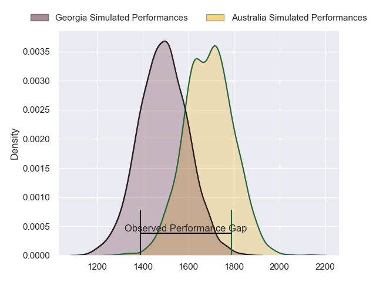
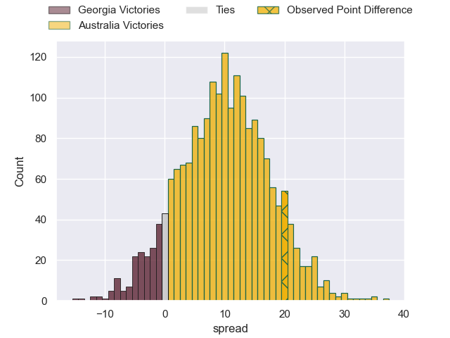
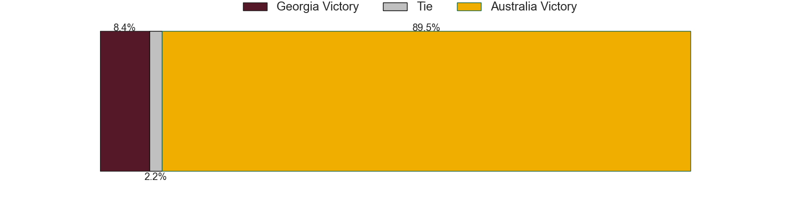
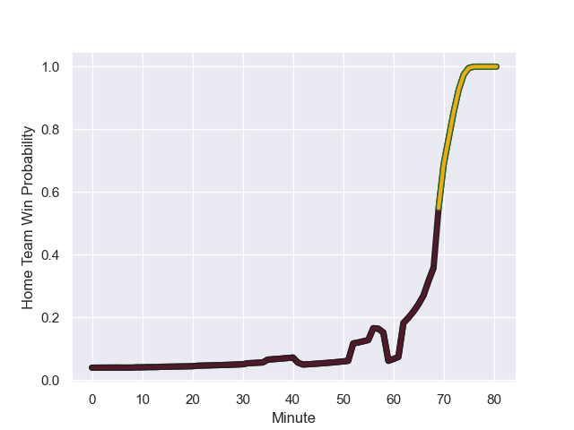

---  
layout: page  
title: Georgia at Australia; 15.0-35.0  
date: 2023-09-09 18:00:00 -0500  
categories: match review  
---
# Georgia at Australia; 15.0-35.0

# Club Level Predictions

The first set of predictions treats a club as the smallest object, as the club develops its members, organizes a gameplan, and deploys its players as needed for each match. This club model has a prediction of 0.748, which translates to predicting Australia to win by 9.9.

Each club has a rating and a rating deviation (simiar to a Glicko system), and expected performances can be generated. This allows for simulated matches and spreads like the ones below.
## Projected Performances

## Projected Spreads

## Projected Results

# Player Level Predictions - Version 1

Treating teams instead as an entity made up of the currently active players, I have ratings for each player in an altogether different system. These can be combined to form team ratings once teamsheets are announced, weighting starters a bit higher than the reserves. After the match is played, players can be weighted by their minutes on the field, allowing for an accurate measure of the team's composition. With these compiled team ratings, we can make predictions, measure inaccuracy, and update the individual player ratings.
## Prediction with Player Minutes: Georgia by 134.6

Georgia by 138.6 on a neutral field
## Prediction without Player Minutes: Georgia by 136.3

Georgia by 140.3 on a neutral pitch

## Scores over Time

## Win Probability over Time

There were 13 large changes in win probability in this match

|   Away Minutes | Away Player           |   Away elo |   Away Percentile |   Number |   Home Percentile |   Home elo | Home Player         |   Home Minutes |
|---------------:|:----------------------|-----------:|------------------:|---------:|------------------:|-----------:|:--------------------|---------------:|
|             52 | Nika Abuladze         |     406.47 |       1.01345e+06 |        1 |            960296 |     109.59 | Angus Bell          |             50 |
|             58 | Shalva Mamukashvili   |     142.48 |  626000           |        2 |            762801 |     106.87 | Dave Porecki        |             59 |
|             41 | Guram Papidze         |      55.2  |  912073           |        3 |            815403 |     103.16 | Taniela Tupou       |             69 |
|             80 | Nodar Cheishvili      |     267.17 |  882145           |        4 |            806247 |     125.95 | Richie Arnold       |             62 |
|             59 | Konstantin Mikautadze |      94.58 |  477591           |        5 |            694532 |     121.29 | Will Skelton        |             69 |
|             67 | Tornike Jalagonia     |     221.32 |  991179           |        6 |            999646 |     129.23 | Tom Hooper          |             80 |
|             80 | Luka Ivanishvili      |     309.52 |       1.01062e+06 |        7 |            936945 |     212.79 | Fraser McReight     |             80 |
|             80 | Beka Gorgadze         |     210.13 |       1.03443e+06 |        8 |            905023 |     224.47 | Rob Valetini        |             80 |
|             52 | Vasil Lobzhanidze     |     163.56 |  788153           |        9 |            923809 |      68.72 | Tate McDermott      |             35 |
|             69 | Luka Matkava          |     263.65 |       1.02029e+06 |       10 |            961992 |     141.91 | Carter Gordon       |             80 |
|             80 | Mirian Modebadze      |     195.82 |  917529           |       11 |            883687 |     103.97 | Marika Koroibete    |             80 |
|             80 | Merab Sharikadze      |      85.06 |  625863           |       12 |            741314 |     103.64 | Samu Kerevi         |             41 |
|             80 | Demur Tapladze        |     326.9  |  978260           |       13 |            925237 |     133.78 | Jordan Petaia       |             57 |
|             80 | Aka Tabutsadze        |     278.79 |  976931           |       14 |            960152 |     113.64 | Mark Nawaqanitawase |             80 |
|             62 | Davit Niniashvili     |     268.25 |  992236           |       15 |            960424 |     131.82 | Ben Donaldson       |             80 |
|             22 | Tengiz Zamtaradze     |     210.49 |     nan           |       16 |            961941 |     158.91 | Matt Faessler       |             21 |
|             28 | Guram Gogichashvili   |     126.85 |  938395           |       17 |           1031906 |     110.58 | Blake Schoupp       |             30 |
|             39 | Beka Gigashvili       |     172.28 |  906279           |       18 |            979221 |     114.54 | Zane Nonggorr       |             11 |
|             21 | Lasha Jaiani          |     323    |  978214           |       19 |            841217 |      74.95 | Rob Leota           |             18 |
|             13 | Giorgi Tsutskiridze   |     292.24 |  884529           |       20 |           1017072 |     123.1  | Langi Gleeson       |             11 |
|             28 | Gela Aprasidze        |     182.81 |  919159           |       21 |            575484 |     120.08 | Nic White           |             45 |
|             11 | Tedo Abzhandadze      |     285.5  |  947042           |       22 |            740797 |     111.26 | Lalakai Foketi      |             39 |
|             18 | Giorgi Kveseladze     |     194.13 |  919223           |       23 |            993488 |      56.48 | Suliasi Vunivalu    |             23 |

# Player Level Predictions - Version 2

Treating teams instead as an entity made up of the currently active players, I have ratings for each player in an altogether different system. These can be combined to form team ratings once teamsheets are announced, weighting starters a bit higher than the reserves. After the match is played, players can be weighted by their minutes on the field, allowing for an accurate measure of the team's composition. With these compiled team ratings, we can make predictions, measure inaccuracy, and update the individual player ratings.
## Prediction with Player Minutes: Georgia by 3.3

Georgia by 7.0 on a neutral field
## Prediction without Player Minutes: Georgia by 2.5

Georgia by 6.2 on a neutral pitch

|   Away Minutes | Away Player           |   Away elo |   Away variance |   Number |   Home variance |   Home elo | Home Player         |   Home Minutes |
|---------------:|:----------------------|-----------:|----------------:|---------:|----------------:|-----------:|:--------------------|---------------:|
|             52 | Nika Abuladze         |      72.48 |           49.95 |        1 |           49.77 |      59.23 | Angus Bell          |             50 |
|             58 | Shalva Mamukashvili   |      67.51 |           49.85 |        2 |           48.2  |      46.67 | Dave Porecki        |             59 |
|             41 | Guram Papidze         |      37.01 |           49.92 |        3 |           49.9  |      88.55 | Taniela Tupou       |             69 |
|             80 | Nodar Cheishvili      |     130.94 |           49.81 |        4 |           46.33 |      29.45 | Richie Arnold       |             62 |
|             59 | Konstantin Mikautadze |      11.5  |           49.81 |        5 |           44.1  |      90.53 | Will Skelton        |             69 |
|             67 | Tornike Jalagonia     |      45.55 |           49.72 |        6 |           48.86 |      42.78 | Tom Hooper          |             80 |
|             80 | Luka Ivanishvili      |      75.37 |           49.63 |        7 |           47.33 |      62.06 | Fraser McReight     |             80 |
|             80 | Beka Gorgadze         |      46.65 |           50    |        8 |           47.41 |      91.81 | Rob Valetini        |             80 |
|             52 | Vasil Lobzhanidze     |      53.56 |           49.79 |        9 |           47.81 |      51.93 | Tate McDermott      |             35 |
|             69 | Luka Matkava          |      88.92 |           49.64 |       10 |           47.46 |      40.38 | Carter Gordon       |             80 |
|             80 | Mirian Modebadze      |      88.24 |           49.67 |       11 |           49.45 |      56.84 | Marika Koroibete    |             80 |
|             80 | Merab Sharikadze      |      80.1  |           49.61 |       12 |           49.58 |      87.03 | Samu Kerevi         |             41 |
|             80 | Demur Tapladze        |      90.99 |           49.73 |       13 |           49.77 |      76.56 | Jordan Petaia       |             57 |
|             80 | Aka Tabutsadze        |      94.58 |           49.61 |       14 |           47.36 |      29.3  | Mark Nawaqanitawase |             80 |
|             62 | Davit Niniashvili     |      84.5  |           49.73 |       15 |           49.99 |      50.63 | Ben Donaldson       |             80 |
|             22 | Tengiz Zamtaradze     |      42.83 |           49.87 |       16 |           49.96 |      42.76 | Matt Faessler       |             21 |
|             28 | Guram Gogichashvili   |      54.11 |           49.9  |       17 |           50    |      43.89 | Blake Schoupp       |             30 |
|             39 | Beka Gigashvili       |      60.42 |           49.8  |       18 |           48.28 |      48.23 | Zane Nonggorr       |             11 |
|             21 | Lasha Jaiani          |      63.24 |           49.93 |       19 |           49.87 |      28.95 | Rob Leota           |             18 |
|             13 | Giorgi Tsutskiridze   |      58.82 |           49.94 |       20 |           49.99 |      50.68 | Langi Gleeson       |             11 |
|             28 | Gela Aprasidze        |      54.69 |           49.81 |       21 |           48.53 |     135.27 | Nic White           |             45 |
|             11 | Tedo Abzhandadze      |      56.76 |           49.97 |       22 |           49.96 |      62.19 | Lalakai Foketi      |             39 |
|             18 | Giorgi Kveseladze     |      86.57 |           49.86 |       23 |           47.9  |      33.22 | Suliasi Vunivalu    |             23 |

