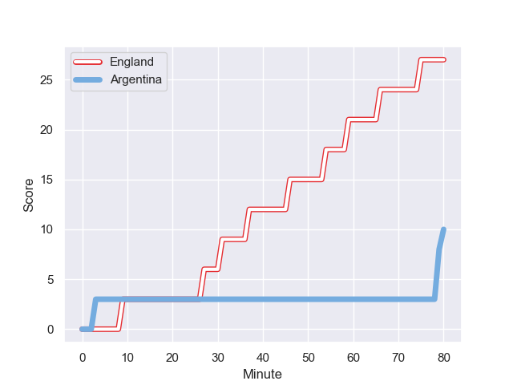
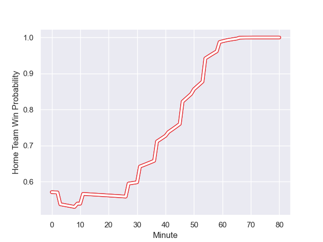

---  
layout: page  
title: Argentina at England; 10.0-27.0  
date: 2023-09-09 18:00:00 -0500  
categories: match review  
---
# Argentina at England; 10.0-27.0

# Club Level Predictions

The first set of predictions treats a club as the smallest object, as the club develops its members, organizes a gameplan, and deploys its players as needed for each match. This club model has a prediction of 0.426, which translates to predicting Argentina to win by 2.7.

Each club has a rating and a rating deviation (simiar to a Glicko system), and expected performances can be generated. This allows for simulated matches and spreads like the ones below.
## Projected Performances

## Projected Spreads

## Projected Results

# Player Level Predictions - Version 2

Treating teams instead as an entity made up of the currently active players, I have ratings for each player in an altogether different system. These can be combined to form team ratings once teamsheets are announced, weighting starters a bit higher than the reserves. After the match is played, players can be weighted by their minutes on the field, allowing for an accurate measure of the team's composition. With these compiled team ratings, we can make predictions, measure inaccuracy, and update the individual player ratings.
## Prediction with Player Minutes: England by 3.1

England by 3.1 on a neutral field
## Prediction without Player Minutes: England by 2.4

England by 2.4 on a neutral pitch

## Scores over Time

## Win Probability over Time

There were 8 large changes in win probability in this match

|   Away Minutes | Away Player            |   Away elo |   Number |   Home elo | Home Player     |   Home Minutes |
|---------------:|:-----------------------|-----------:|---------:|-----------:|:----------------|---------------:|
|             76 | Thomas Gallo           |      55.97 |        1 |      29.83 | Ellis Genge     |             54 |
|             69 | Julian Montoya         |      77.02 |        2 |     100.77 | Jamie George    |             72 |
|             50 | Francisco Gomez Kodela |      73.43 |        3 |      44.9  | Dan Cole        |             50 |
|             41 | Matias Alemanno        |      50.11 |        4 |      96.63 | Maro Itoje      |             80 |
|             50 | Tomas Lavanini         |      64.53 |        5 |      49.91 | Ollie Chessum   |             59 |
|             80 | Pablo Matera           |     116.95 |        6 |      77.7  | Courtney Lawes  |             66 |
|             80 | Marcos Kremer          |      46.65 |        7 |      46.65 | Tom Curry       |             80 |
|             59 | Juan Martin Gonzalez   |      62.55 |        8 |      83.53 | Ben Earl        |             80 |
|             69 | Gonzalo Bertranou      |      49.58 |        9 |      59.97 | Alex Mitchell   |             59 |
|             80 | Santiago Carreras      |      69.4  |       10 |      85.39 | George Ford     |             75 |
|             63 | Mateo Carreras         |      43.98 |       11 |      51.1  | Elliot Daly     |             80 |
|             80 | Santiago Chocobares    |      31.28 |       12 |      94.78 | Manu Tuilagi    |             69 |
|             80 | Lucio Cinti            |      45.89 |       13 |      71.44 | Joe Marchant    |             80 |
|             80 | Emiliano Boffelli      |      44.71 |       14 |      31    | Jonny May       |             80 |
|             72 | Juan Cruz Mallia       |      81.35 |       15 |      46.16 | Freddie Steward |             80 |
|             11 | Agustin Creevy         |      85.19 |       16 |      40.8  | Theo Dan        |              8 |
|             17 | Joel Sclavi            |      57.56 |       17 |      89.26 | Joe Marler      |             26 |
|             17 | Eduardo Bello          |       5.76 |       18 |      23.27 | Will Stuart     |             30 |
|             39 | Guido Petti            |      43.47 |       19 |      61.83 | George Martin   |             21 |
|             30 | Pedro Rubiolo          |      45.37 |       20 |      51.58 | Lewis Ludlam    |             14 |
|             21 | Rodrigo Bruni          |      91.1  |       21 |     131.68 | Danny Care      |             21 |
|             11 | Lautaro Bazan Velez    |      47.75 |       22 |      71.04 | Marcus Smith    |              5 |
|             25 | Matias Moroni          |     104.96 |       23 |      50.92 | Ollie Lawrence  |             11 |

