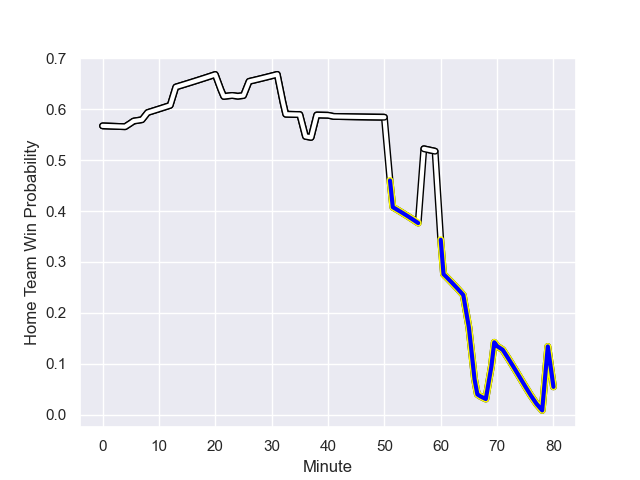

---  
layout: page  
title: Bay of Plenty at Hawke's Bay; 38.0-35.0  
date: 2023-09-09 18:00:00 -0500  
categories: match review  
---
# Bay of Plenty at Hawke's Bay; 38.0-35.0

# Club Level Predictions

The first set of predictions treats a club as the smallest object, as the club develops its members, organizes a gameplan, and deploys its players as needed for each match. This club model has a prediction of 0.58, which translates to predicting Hawke's Bay to win by 3.0.

Each club has a rating and a rating deviation (simiar to a Glicko system), and expected performances can be generated. This allows for simulated matches and spreads like the ones below.
## Projected Performances

## Projected Spreads

## Projected Results

# Player Level Predictions - Version 2

Treating teams instead as an entity made up of the currently active players, I have ratings for each player in an altogether different system. These can be combined to form team ratings once teamsheets are announced, weighting starters a bit higher than the reserves. After the match is played, players can be weighted by their minutes on the field, allowing for an accurate measure of the team's composition. With these compiled team ratings, we can make predictions, measure inaccuracy, and update the individual player ratings.
## Prediction with Player Minutes: Hawke's Bay by 3.0

Bay of Plenty by 0.3 on a neutral field
## Prediction without Player Minutes: Hawke's Bay by 2.9

Bay of Plenty by 0.4 on a neutral pitch

## Scores over Time

## Win Probability over Time

There were 18 large changes in win probability in this match

|   Away Minutes | Away Player            |   Away elo |   Number |   Home elo | Home Player          |   Home Minutes |
|---------------:|:-----------------------|-----------:|---------:|-----------:|:---------------------|---------------:|
|             71 | Aidan Ross             |      89.73 |        1 |      47.7  | Pouri Rakete-Stones  |             66 |
|             79 | Nathan Vella           |      54.27 |        2 |      38.15 | Tyrone Thompson      |             68 |
|             41 | Benet Kumeroa          |      43.66 |        3 |      68.16 | Joel Hintz           |             65 |
|             80 | Manaaki Selby-Rickit   |      24.17 |        4 |      44.29 | Geoff Cridge         |             80 |
|             80 | Justin Sangster        |      49.55 |        5 |      47.63 | Tom Parsons          |             80 |
|             80 | Naitoa Ah Kuoi         |      84.16 |        6 |      47.76 | Josh Gimblett        |             24 |
|             80 | Veveni Lasaqa          |      42.66 |        7 |      52.31 | Josh Kaifa           |             80 |
|             79 | Penitoa Finau          |      33.13 |        8 |      54.12 | Devan Flanders       |             79 |
|             55 | Richard Judd           |      88.43 |        9 |      94.7  | Brad Weber           |             65 |
|             79 | Wharenui Hawera        |      14.78 |       10 |      42.49 | Lincoln McClutchie   |             80 |
|             80 | Fehi Fineanganofo      |      46.65 |       11 |      49.27 | Ollie Sapsford       |             80 |
|             80 | Seamus Bardoul         |      44.3  |       12 |      50.47 | Chase Tiatia         |             80 |
|             80 | Melani Nanai           |      61.25 |       13 |      11.66 | Nick Grigg           |             80 |
|             80 | Cody Vai               |      39.64 |       14 |      48.69 | Jonah Lowe           |             80 |
|             65 | Sekuini Tanimo         |      31.67 |       15 |      37.15 | Harry Godfrey        |             13 |
|              9 | Josh Bartlett          |      44.75 |       16 |      60.98 | Kianu Kereru-Symes   |             12 |
|             39 | Pasilio Tosi           |      46.65 |       17 |      42.89 | Bo Abra              |             15 |
|              1 | Taine Kolose           |      46.65 |       18 |      47.35 | Timothy John Farrell |             14 |
|              1 | Ryosuke Funahashi      |      42.91 |       19 |      48.42 | Frank Lochore        |              1 |
|             25 | Te Toiroa Tahuriorangi |      58.05 |       20 |      44.2  | Sam Smith            |             56 |
|              1 | Tamiro Armstrong       |      46.65 |       21 |      74.52 | Stacey Ili           |             33 |
|             15 | Reon Paul              |      46.65 |       22 |      21.78 | Paula Balekana       |             34 |
|            nan | nan                    |     nan    |       23 |      44.21 | Folau Fakatava       |             15 |

