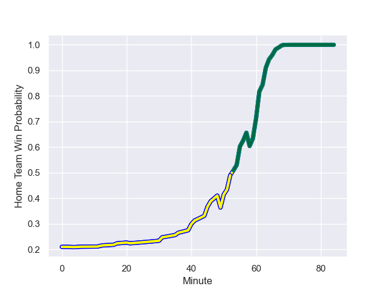

---  
layout: page  
title: Romania at Ireland; 8.0-82.0  
date: 2023-09-09 18:00:00 -0500  
categories: match review  
---
# Romania at Ireland; 8.0-82.0

# Club Level Predictions

The first set of predictions treats a club as the smallest object, as the club develops its members, organizes a gameplan, and deploys its players as needed for each match. This club model has a prediction of 0.989, which translates to predicting Ireland to win by 40.6.

Each club has a rating and a rating deviation (simiar to a Glicko system), and expected performances can be generated. This allows for simulated matches and spreads like the ones below.
## Projected Performances

## Projected Spreads

## Projected Results

# Player Level Predictions - Version 1

Treating teams instead as an entity made up of the currently active players, I have ratings for each player in an altogether different system. These can be combined to form team ratings once teamsheets are announced, weighting starters a bit higher than the reserves. After the match is played, players can be weighted by their minutes on the field, allowing for an accurate measure of the team's composition. With these compiled team ratings, we can make predictions, measure inaccuracy, and update the individual player ratings.
## Prediction with Player Minutes: Romania by 53.6

Romania by 57.6 on a neutral field
## Prediction without Player Minutes: Romania by 58.4

Romania by 62.4 on a neutral pitch

## Scores over Time

## Win Probability over Time

There were 13 large changes in win probability in this match

|   Away Minutes | Away Player       |   Away elo |   Away Percentile |   Number |   Home Percentile |   Home elo | Home Player         |   Home Minutes |
|---------------:|:------------------|-----------:|------------------:|---------:|------------------:|-----------:|:--------------------|---------------:|
|             49 | Iulian Hartig     |     152.63 |       1.02289e+06 |        1 |  851226           |     125.53 | Andrew Porter       |             51 |
|             55 | Ovidiu Cojocaru   |     172.33 |  918116           |        2 |  474459           |     106.95 | Rob Herring         |             51 |
|             52 | Alex Gordas       |     180.4  |  918093           |        3 |  722189           |     123.03 | Tadhg Furlong       |             51 |
|             84 | Adrian Motoc      |     230.36 |  919048           |        4 |       1.01526e+06 |     104.32 | Joe McCarthy        |             84 |
|             61 | Stefan Iancu      |     118.62 |       1.02342e+06 |        5 |  889566           |     142.66 | James Ryan          |             57 |
|             61 | Florian Rosu      |     366.42 |       1.00198e+06 |        6 |  813610           |     153.01 | Tadhg Beirne        |             84 |
|             84 | Vlad Neculau      |      73.85 |  943744           |        7 |  456943           |     100.18 | Peter O'Mahony      |             84 |
|             84 | Cristian Chirica  |     128.61 |  919090           |        8 |  927248           |     175.49 | Caelan Doris        |             57 |
|             75 | Gabriel Rupanu    |     207.83 |  944680           |        9 |  650801           |     118.29 | Jamison Gibson-Park |             60 |
|             61 | Hinckley Vaovasa  |     227.38 |       1.01194e+06 |       10 |       1.03443e+06 |     130.43 | Johnny Sexton       |             66 |
|             76 | Tevita Manumua    |      64.13 |  867985           |       11 |  650464           |     173.9  | James Lowe          |             84 |
|             66 | Fonovai Tangimana |     191.21 |       1.034e+06   |       12 |  585713           |     143.1  | Bundee Aki          |             84 |
|             84 | Jason Tomane      |     231.13 |       1.01187e+06 |       13 |  809964           |     154.13 | Garry Ringrose      |             84 |
|             84 | Nicolas Onutu     |     204.87 |  951003           |       14 |  373328           |     104.42 | Keith Earls         |             60 |
|             84 | Marius Simionescu |     123.42 |  879357           |       15 |  872621           |     170.58 | Hugo Keenan         |             84 |
|             29 | Florin Bardasu    |      69.12 |     nan           |       16 |     nan           |     130.13 | Ronan Kelleher      |             33 |
|             35 | Alexandru Savin   |     275.38 |  956806           |       17 |  826856           |      97.66 | Jeremy Loughman     |             33 |
|             32 | Gheorghe Gajion   |     103.76 |  775725           |       18 |  925103           |     101.12 | Tom O'Toole         |             33 |
|             23 | Marius Iftimiciuc |      40.04 |  943728           |       19 |  633305           |     161.78 | Iain Henderson      |             27 |
|             23 | Dragos Ser        |     256.45 |  976249           |       20 |  772560           |     169.68 | Josh van der Flier  |             27 |
|              9 | Alin Conache      |     169.58 |       1.0259e+06  |       21 |  424326           |     133.76 | Conor Murray        |             24 |
|             23 | Tudor Boldor      |     216.65 |  956491           |       22 |  986400           |     125.36 | Jack Crowley        |             18 |
|             26 | Taylor Gontineac  |     232.31 |  956534           |       23 |  940815           |     198.16 | Mack Hansen         |             24 |

# Player Level Predictions - Version 2

Treating teams instead as an entity made up of the currently active players, I have ratings for each player in an altogether different system. These can be combined to form team ratings once teamsheets are announced, weighting starters a bit higher than the reserves. After the match is played, players can be weighted by their minutes on the field, allowing for an accurate measure of the team's composition. With these compiled team ratings, we can make predictions, measure inaccuracy, and update the individual player ratings.
## Prediction with Player Minutes: Ireland by 41.5

Ireland by 37.9 on a neutral field
## Prediction without Player Minutes: Ireland by 40.4

Ireland by 36.7 on a neutral pitch

|   Away Minutes | Away Player       |   Away elo |   Away variance |   Number |   Home variance |   Home elo | Home Player         |   Home Minutes |
|---------------:|:------------------|-----------:|----------------:|---------:|----------------:|-----------:|:--------------------|---------------:|
|             49 | Iulian Hartig     |      37.71 |           49.87 |        1 |           49.86 |      77.65 | Andrew Porter       |             51 |
|             55 | Ovidiu Cojocaru   |      28.03 |           49.78 |        2 |           49.77 |      74.17 | Rob Herring         |             51 |
|             52 | Alex Gordas       |      62.05 |           49.89 |        3 |           49.83 |      90.91 | Tadhg Furlong       |             51 |
|             84 | Adrian Motoc      |       6.98 |           49.76 |        4 |           49.78 |      48.16 | Joe McCarthy        |             84 |
|             61 | Stefan Iancu      |      26.71 |           49.69 |        5 |           49.84 |      87.75 | James Ryan          |             57 |
|             61 | Florian Rosu      |      43.95 |           49.88 |        6 |           49.68 |     134.87 | Tadhg Beirne        |             84 |
|             84 | Vlad Neculau      |      36.73 |           49.84 |        7 |           49.87 |      97.03 | Peter O'Mahony      |             84 |
|             84 | Cristian Chirica  |      26.68 |           49.69 |        8 |           49.7  |     108.35 | Caelan Doris        |             57 |
|             75 | Gabriel Rupanu    |      45.54 |           49.88 |        9 |           49.87 |     115.07 | Jamison Gibson-Park |             60 |
|             61 | Hinckley Vaovasa  |      49.36 |           49.69 |       10 |           50    |      46.65 | Johnny Sexton       |             66 |
|             76 | Tevita Manumua    |       9.36 |           49.69 |       11 |           49.88 |     167.18 | James Lowe          |             84 |
|             66 | Fonovai Tangimana |      46.65 |           50    |       12 |           49.86 |     115.68 | Bundee Aki          |             84 |
|             84 | Jason Tomane      |      32.23 |           49.74 |       13 |           49.82 |     115.5  | Garry Ringrose      |             84 |
|             84 | Nicolas Onutu     |      45.39 |           49.81 |       14 |           49.79 |      52.45 | Keith Earls         |             60 |
|             84 | Marius Simionescu |       7.96 |           49.69 |       15 |           49.84 |     116.4  | Hugo Keenan         |             84 |
|             29 | Florin Bardasu    |      43    |           49.91 |       16 |           50    |      46.65 | Ronan Kelleher      |             33 |
|             35 | Alexandru Savin   |      35.95 |           49.8  |       17 |           49.91 |      83.54 | Jeremy Loughman     |             33 |
|             32 | Gheorghe Gajion   |      70.31 |           49.8  |       18 |           49.86 |      49.68 | Tom O'Toole         |             33 |
|             23 | Marius Iftimiciuc |      26    |           49.82 |       19 |           49.8  |      70.09 | Iain Henderson      |             27 |
|             23 | Dragos Ser        |      19.97 |           49.87 |       20 |           49.74 |     117.18 | Josh van der Flier  |             27 |
|              9 | Alin Conache      |      39.55 |           49.78 |       21 |           49.88 |     109.93 | Conor Murray        |             24 |
|             23 | Tudor Boldor      |      39.26 |           49.92 |       22 |           49.68 |      55.85 | Jack Crowley        |             18 |
|             26 | Taylor Gontineac  |      57.56 |           49.88 |       23 |           49.74 |      73.17 | Mack Hansen         |             24 |

