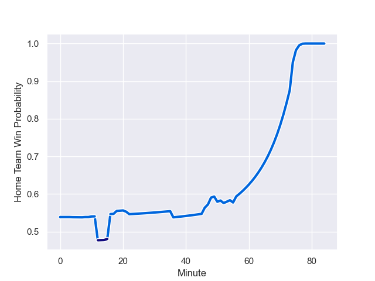

---  
layout: page  
title: Namibia at Italy; 8.0-52.0  
date: 2023-09-09 18:00:00 -0500  
categories: match review  
---
# Namibia at Italy; 8.0-52.0

# Club Level Predictions

The first set of predictions treats a club as the smallest object, as the club develops its members, organizes a gameplan, and deploys its players as needed for each match. This club model has a prediction of 0.915, which translates to predicting Italy to win by 22.5.

Each club has a rating and a rating deviation (simiar to a Glicko system), and expected performances can be generated. This allows for simulated matches and spreads like the ones below.
## Projected Performances

## Projected Spreads

## Projected Results

# Player Level Predictions - Version 1

Treating teams instead as an entity made up of the currently active players, I have ratings for each player in an altogether different system. These can be combined to form team ratings once teamsheets are announced, weighting starters a bit higher than the reserves. After the match is played, players can be weighted by their minutes on the field, allowing for an accurate measure of the team's composition. With these compiled team ratings, we can make predictions, measure inaccuracy, and update the individual player ratings.
## Prediction with Player Minutes: Italy by 10.7

Italy by 6.7 on a neutral field
## Prediction without Player Minutes: Italy by 8.5

Italy by 4.5 on a neutral pitch

## Scores over Time

## Win Probability over Time

There were 7 large changes in win probability in this match

|   Away Minutes | Away Player              |   Away elo |   Away Percentile |   Number |   Home Percentile |   Home elo | Home Player       |   Home Minutes |
|---------------:|:-------------------------|-----------:|------------------:|---------:|------------------:|-----------:|:------------------|---------------:|
|             36 | Des Sethie               |     100.04 |  901452           |        1 |            949767 |      82.15 | Danilo Fischetti  |             57 |
|             52 | Torsten van Jaarsveld    |     138.55 |       1.03443e+06 |        2 |            974133 |     133.96 | Giacomo Nicotera  |             50 |
|             50 | Aranos Coetzee           |     110.04 |  495045           |        3 |            719906 |     127.67 | Simone Ferrari    |             50 |
|             53 | Adriaan Ludick           |     281.78 |  930074           |        4 |            909422 |     158.1  | Dino Lamb         |             84 |
|             84 | Tjiuee Uanivi            |     125.75 |       1.03371e+06 |        5 |            789942 |     122.29 | Federico Ruzza    |             53 |
|             42 | Wian Conradie            |     213.76 |  816502           |        6 |            898764 |     110.81 | Sebastian Negri   |             48 |
|             84 | Johan Retief             |     104.33 |  918160           |        7 |            942884 |     169.52 | Michele Lamaro    |             84 |
|             84 | Richard Hardwick         |     111.75 |  761968           |        8 |            989664 |      92.13 | Lorenzo Cannone   |             84 |
|             58 | Damian Stevens           |      89.5  |  815866           |        9 |            978178 |      71.88 | Stephen Varney    |             48 |
|             84 | Tiaan Swanepoel          |     129.33 |  976365           |       10 |            967822 |     165.68 | Paolo Garbisi     |             84 |
|             84 | JC Greyling              |     164.08 |  646371           |       11 |            760874 |     151.7  | Monty Ioane       |             84 |
|             58 | Danco Burger             |     154.4  |       1.03372e+06 |       12 |            595449 |     145.28 | Luca Morisi       |             48 |
|             84 | Johan Deysel             |     125.04 |       1.03371e+06 |       13 |            636665 |     238.59 | Juan Ignacio Brex |             62 |
|             64 | Gerswin Mouton           |      94.74 |       1.02285e+06 |       14 |            955690 |     179.25 | Ange Capuozzo     |             84 |
|             84 | Divan Rossouw            |      17.06 |  923878           |       15 |            714191 |     179.4  | Tommaso Allan     |             84 |
|             36 | Louis van der Westhuizen |     182.85 |  815529           |       16 |            718254 |      84.57 | Hame Faiva        |             34 |
|             48 | Jason Benade             |     175.11 |       1.02284e+06 |       17 |            979325 |     144.01 | Ivan Nemer        |             27 |
|             34 | Casper Viviers           |     306.61 |  784235           |       18 |            825483 |      92.82 | Marco Riccioni    |             34 |
|             31 | Tiaan de Klerk           |     131.12 |     nan           |       19 |            542751 |     116.69 | Dave Sisi         |             31 |
|             38 | Prince Gaoseb            |     157.58 |  964262           |       20 |            975371 |      63.52 | Manuel Zuliani    |             36 |
|             26 | Jacques Theron           |     144.24 |     nan           |       21 |            983122 |     249.39 | Martin Page-Relo  |             36 |
|             20 | Andre van der Berg       |     150.57 |       1.02284e+06 |       22 |            818297 |     115.76 | Paolo Odogwu      |             22 |
|             26 | Le Roux Malan            |     138.87 |     nan           |       23 |            919954 |      84.85 | Pierre Bruno      |             36 |

# Player Level Predictions - Version 2

Treating teams instead as an entity made up of the currently active players, I have ratings for each player in an altogether different system. These can be combined to form team ratings once teamsheets are announced, weighting starters a bit higher than the reserves. After the match is played, players can be weighted by their minutes on the field, allowing for an accurate measure of the team's composition. With these compiled team ratings, we can make predictions, measure inaccuracy, and update the individual player ratings.
## Prediction with Player Minutes: Italy by 18.9

Italy by 15.3 on a neutral field
## Prediction without Player Minutes: Italy by 19.8

Italy by 16.2 on a neutral pitch

|   Away Minutes | Away Player              |   Away elo |   Away variance |   Number |   Home variance |   Home elo | Home Player       |   Home Minutes |
|---------------:|:-------------------------|-----------:|----------------:|---------:|----------------:|-----------:|:------------------|---------------:|
|             36 | Des Sethie               |      41.1  |           49.65 |        1 |           49.69 |      40.4  | Danilo Fischetti  |             57 |
|             52 | Torsten van Jaarsveld    |      46.65 |           50    |        2 |           49.66 |      92.37 | Giacomo Nicotera  |             50 |
|             50 | Aranos Coetzee           |      49.26 |           49.8  |        3 |           49.62 |      86.86 | Simone Ferrari    |             50 |
|             53 | Adriaan Ludick           |      45.37 |           49.66 |        4 |           49.7  |      70.21 | Dino Lamb         |             84 |
|             84 | Tjiuee Uanivi            |      46.65 |           50    |        5 |           49.5  |      98.32 | Federico Ruzza    |             53 |
|             42 | Wian Conradie            |      74.19 |           47.17 |        6 |           49.54 |      59.52 | Sebastian Negri   |             48 |
|             84 | Johan Retief             |      52.17 |           49.82 |        7 |           49.6  |      90.69 | Michele Lamaro    |             84 |
|             84 | Richard Hardwick         |      52.31 |           49.66 |        8 |           49.59 |      79.37 | Lorenzo Cannone   |             84 |
|             58 | Damian Stevens           |      15.27 |           49.6  |        9 |           49.72 |      32.98 | Stephen Varney    |             48 |
|             84 | Tiaan Swanepoel          |      56.66 |           49.6  |       10 |           49.49 |      58.66 | Paolo Garbisi     |             84 |
|             84 | JC Greyling              |      18.77 |           49.6  |       11 |           49.39 |      98.4  | Monty Ioane       |             84 |
|             58 | Danco Burger             |      46.65 |           50    |       12 |           49.61 |      85.72 | Luca Morisi       |             48 |
|             84 | Johan Deysel             |      46.65 |           50    |       13 |           49.49 |      89.11 | Juan Ignacio Brex |             62 |
|             64 | Gerswin Mouton           |      46.29 |           49.84 |       14 |           49.72 |      85.01 | Ange Capuozzo     |             84 |
|             84 | Divan Rossouw            |      32.59 |           49.6  |       15 |           49.45 |      49.72 | Tommaso Allan     |             84 |
|             36 | Louis van der Westhuizen |      67.9  |           49.62 |       16 |           49.86 |      17.77 | Hame Faiva        |             34 |
|             48 | Jason Benade             |      24.78 |           49.95 |       17 |           49.86 |      63.29 | Ivan Nemer        |             27 |
|             34 | Casper Viviers           |      42.01 |           49.84 |       18 |           49.98 |      42.52 | Marco Riccioni    |             34 |
|             31 | Tiaan de Klerk           |      46.65 |           50    |       19 |           50    |       4.39 | Dave Sisi         |             31 |
|             38 | Prince Gaoseb            |      19.44 |           49.94 |       20 |           49.76 |      51.08 | Manuel Zuliani    |             36 |
|             26 | Jacques Theron           |      46.65 |           50    |       21 |           49.87 |      59.11 | Martin Page-Relo  |             36 |
|             20 | Andre van der Berg       |      30.95 |           49.97 |       22 |           49.81 |      67.11 | Paolo Odogwu      |             22 |
|             26 | Le Roux Malan            |      46.65 |           50    |       23 |           50    |      23.42 | Pierre Bruno      |             36 |

