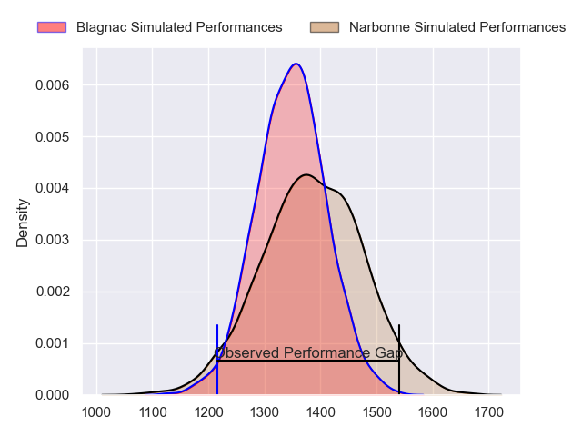
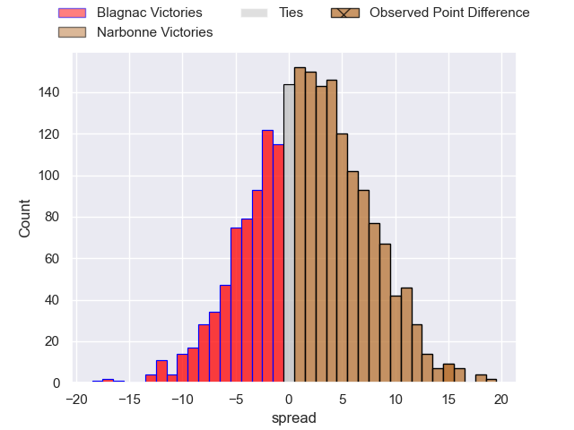
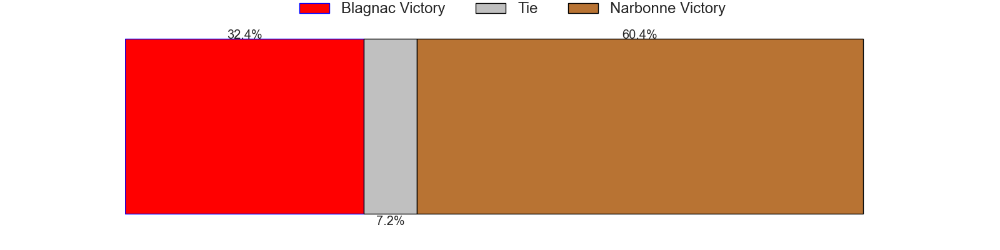
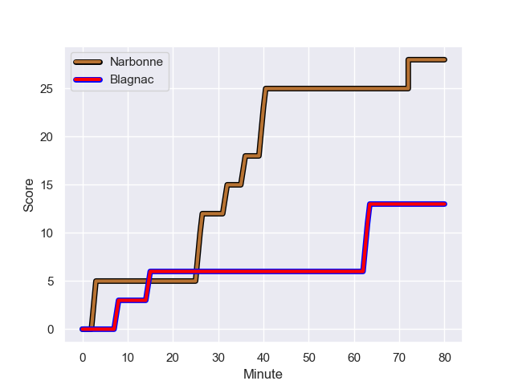
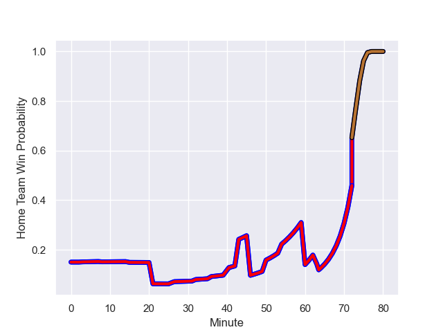

---  
layout: page  
title: Blagnac at Narbonne; 13.0-28.0  
date: 2023-09-09 18:00:00 -0500  
categories: match review  
---
# Blagnac at Narbonne; 13.0-28.0

# Club Level Predictions

The first set of predictions treats a club as the smallest object, as the club develops its members, organizes a gameplan, and deploys its players as needed for each match. This club model has a prediction of 0.555, which translates to predicting Narbonne to win by 2.0.

Each club has a rating and a rating deviation (simiar to a Glicko system), and expected performances can be generated. This allows for simulated matches and spreads like the ones below.
## Projected Performances

## Projected Spreads

## Projected Results

# Player Level Predictions - Version 1

Treating teams instead as an entity made up of the currently active players, I have ratings for each player in an altogether different system. These can be combined to form team ratings once teamsheets are announced, weighting starters a bit higher than the reserves. After the match is played, players can be weighted by their minutes on the field, allowing for an accurate measure of the team's composition. With these compiled team ratings, we can make predictions, measure inaccuracy, and update the individual player ratings.
## Prediction with Player Minutes: Blagnac by 71.2

Blagnac by 75.2 on a neutral field
## Prediction without Player Minutes: Blagnac by 47.4

Blagnac by 51.4 on a neutral pitch

## Scores over Time

## Win Probability over Time

There were 17 large changes in win probability in this match

|   Away Minutes | Away Player         |   Away elo |   Away Percentile |   Number |   Home Percentile |   Home elo | Home Player            |   Home Minutes |
|---------------:|:--------------------|-----------:|------------------:|---------:|------------------:|-----------:|:-----------------------|---------------:|
|             50 | Romain Fricou       |     213.93 |       1.0344e+06  |        1 |  878807           |     160    | Théo Castinel          |             46 |
|             63 | Gabin Villerouge    |     326.09 |  991618           |        2 |  783977           |     152.61 | Christophe David       |             46 |
|             50 | Benjamin Bertrand   |     209.56 |       1.03431e+06 |        3 |       1.02943e+06 |     165.71 | Levi Tikoipau          |             54 |
|             80 | Nikita Bekov        |     278.62 |  991983           |        4 |       1.00004e+06 |     316.03 | Bill Caffo             |             80 |
|             21 | Vincent Mutel       |     -40.21 |  362403           |        5 |  842861           |     183.09 | Dennis Visser          |             54 |
|             63 | Matthieu Thomas     |     142.3  |  999465           |        6 |       1.02514e+06 |     170.68 | Luke Nakobukobua       |             80 |
|             80 | Bastien Gest        |     216.2  |       1.03431e+06 |        7 |       1.02511e+06 |     215.07 | Thibault Clauzade      |             80 |
|             80 | Ianis Ponsole       |     461.21 |  981346           |        8 |  999977           |     354.76 | Baptiste Abescat-Leroy |             60 |
|             46 | Pierre Jeudi        |     215.39 |       1.03429e+06 |        9 |  790692           |     172.41 | Pierrick Nova          |             60 |
|             80 | Gérald Augustin     |     384.56 |  981568           |       10 |  435839           |      44.39 | Gilles Bosch           |             43 |
|             80 | Dorian Terrou       |     308.54 |  987428           |       11 |  808981           |     144.87 | Sébastien Giorgis      |             80 |
|             80 | Clément Vareilles   |     253.65 |  998669           |       12 |  557678           |     122.17 | Peter Betham           |             80 |
|             80 | Thibault Moleana    |     242.45 |       1.00713e+06 |       13 |  920766           |      99.86 | Pierre Nueno           |             43 |
|             46 | Francois Tardieu    |       0.04 |  822145           |       14 |  984196           |     210.97 | Étienne Ducom          |             80 |
|             46 | Jean-Andre Vernetti |      71.54 |  328837           |       15 |       1.02068e+06 |     267.31 | Paul Auradou           |             80 |
|             30 | Alexis Decaux       |     207.76 |       1.02499e+06 |       16 |  724817           |      72.62 | Geoffrey Moise         |             34 |
|             17 | Enzo Rivier         |     217.13 |     nan           |       17 |     nan           |     181.83 | Avto Gogiashvili       |             26 |
|             30 | Victor Delmas       |     127.85 |  721977           |       18 |     nan           |     185.64 | Gabriel Atlan          |             34 |
|             59 | Enzo Zaitri         |     198.12 |     nan           |       19 |  933083           |     209.59 | Mohamed Kbaier         |             26 |
|             17 | Alexandre Perrin    |     192.56 |       1.03102e+06 |       20 |     nan           |     197.58 | Dorian Peron           |             20 |
|             34 | Bernard Reggiardo   |     204.56 |  972333           |       21 |   97269           |      12.6  | Josh Valentine         |             20 |
|             34 | Ugo Seunes          |     196.8  |  986806           |       22 |  983015           |     228.03 | Tom Chauvet            |             37 |
|             34 | Lukas Doyhenard     |     157.39 |       1.02785e+06 |       23 |  706768           |     102.92 | Ambrose Curtis         |             37 |

# Player Level Predictions - Version 2

Treating teams instead as an entity made up of the currently active players, I have ratings for each player in an altogether different system. These can be combined to form team ratings once teamsheets are announced, weighting starters a bit higher than the reserves. After the match is played, players can be weighted by their minutes on the field, allowing for an accurate measure of the team's composition. With these compiled team ratings, we can make predictions, measure inaccuracy, and update the individual player ratings.
## Prediction with Player Minutes: Narbonne by 3.4

Blagnac by 1.2 on a neutral field
## Prediction without Player Minutes: Narbonne by 3.5

Blagnac by 1.0 on a neutral pitch

|   Away Minutes | Away Player         |   Away elo |   Away variance |   Number |   Home variance |   Home elo | Home Player            |   Home Minutes |
|---------------:|:--------------------|-----------:|----------------:|---------:|----------------:|-----------:|:-----------------------|---------------:|
|             50 | Romain Fricou       |      46.65 |           50    |        1 |           49.96 |      52.03 | Théo Castinel          |             46 |
|             63 | Gabin Villerouge    |      49.45 |           50    |        2 |           49.94 |      53.25 | Christophe David       |             46 |
|             50 | Benjamin Bertrand   |      49.92 |           49.91 |        3 |           49.93 |      47.13 | Levi Tikoipau          |             54 |
|             80 | Nikita Bekov        |      75.04 |           49.87 |        4 |           50    |      38.56 | Bill Caffo             |             80 |
|             21 | Vincent Mutel       |      53.97 |           49.91 |        5 |           49.88 |      31.06 | Dennis Visser          |             54 |
|             63 | Matthieu Thomas     |      31.39 |           50    |        6 |           50    |      61.67 | Luke Nakobukobua       |             80 |
|             80 | Bastien Gest        |      49.82 |           49.91 |        7 |           49.79 |      49.66 | Thibault Clauzade      |             80 |
|             80 | Ianis Ponsole       |      67.31 |           49.79 |        8 |           49.91 |      41.05 | Baptiste Abescat-Leroy |             60 |
|             46 | Pierre Jeudi        |      49.82 |           49.91 |        9 |           49.95 |      46.38 | Pierrick Nova          |             60 |
|             80 | Gérald Augustin     |      45.72 |           49.91 |       10 |           49.82 |       3.53 | Gilles Bosch           |             43 |
|             80 | Dorian Terrou       |      43.39 |           50    |       11 |           49.79 |      26.7  | Sébastien Giorgis      |             80 |
|             80 | Clément Vareilles   |      38.95 |           50    |       12 |           49.79 |     112.59 | Peter Betham           |             80 |
|             80 | Thibault Moleana    |      47.01 |           49.91 |       13 |           50    |      51.53 | Pierre Nueno           |             43 |
|             46 | Francois Tardieu    |       4.76 |           49.79 |       14 |           50    |      34.54 | Étienne Ducom          |             80 |
|             46 | Jean-Andre Vernetti |      59.07 |           50    |       15 |           49.79 |      49.99 | Paul Auradou           |             80 |
|             30 | Alexis Decaux       |      59.9  |           49.88 |       16 |           49.83 |      34.91 | Geoffrey Moise         |             34 |
|             17 | Enzo Rivier         |      49.92 |           49.91 |       17 |           50    |      44.67 | Avto Gogiashvili       |             26 |
|             30 | Victor Delmas       |      54.45 |           49.88 |       18 |           50    |      46.26 | Gabriel Atlan          |             34 |
|             59 | Enzo Zaitri         |      46.65 |           50    |       19 |           49.91 |      41.21 | Mohamed Kbaier         |             26 |
|             17 | Alexandre Perrin    |      47.63 |           50    |       20 |           50    |      46.5  | Dorian Peron           |             20 |
|             34 | Bernard Reggiardo   |      48.24 |           49.87 |       21 |           49.83 |      78.56 | Josh Valentine         |             20 |
|             34 | Ugo Seunes          |      64.38 |           49.87 |       22 |           49.96 |      46.25 | Tom Chauvet            |             37 |
|             34 | Lukas Doyhenard     |      57.64 |           49.87 |       23 |           49.87 |      30.33 | Ambrose Curtis         |             37 |

