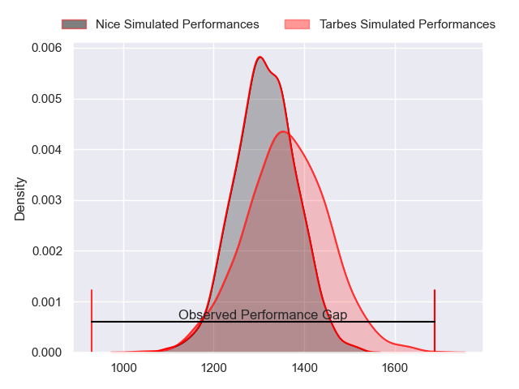
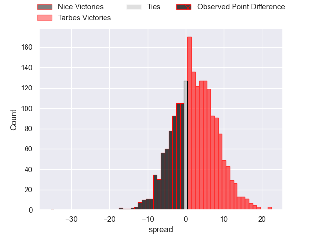
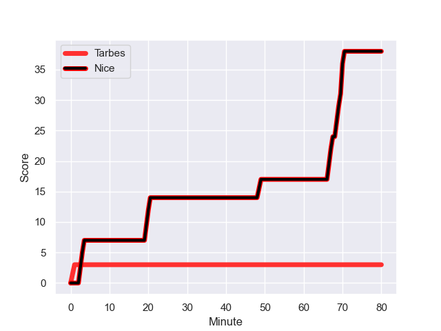
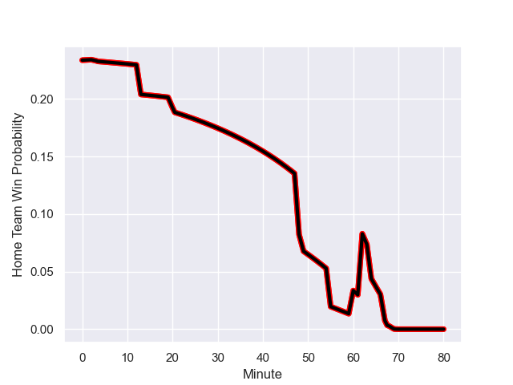

---  
layout: page  
title: Nice at Tarbes; 38.0-3.0  
date: 2023-09-09 18:00:00 -0500  
categories: match review  
---
# Nice at Tarbes; 38.0-3.0

# Club Level Predictions

The first set of predictions treats a club as the smallest object, as the club develops its members, organizes a gameplan, and deploys its players as needed for each match. This club model has a prediction of 0.564, which translates to predicting Tarbes to win by 2.3.

Each club has a rating and a rating deviation (simiar to a Glicko system), and expected performances can be generated. This allows for simulated matches and spreads like the ones below.
## Projected Performances

## Projected Spreads

## Projected Results

# Player Level Predictions - Version 1

Treating teams instead as an entity made up of the currently active players, I have ratings for each player in an altogether different system. These can be combined to form team ratings once teamsheets are announced, weighting starters a bit higher than the reserves. After the match is played, players can be weighted by their minutes on the field, allowing for an accurate measure of the team's composition. With these compiled team ratings, we can make predictions, measure inaccuracy, and update the individual player ratings.
## Prediction with Player Minutes: Nice by 47.6

Nice by 51.6 on a neutral field
## Prediction without Player Minutes: Nice by 37.2

Nice by 41.2 on a neutral pitch

## Scores over Time

## Win Probability over Time

There were 5 large changes in win probability in this match

|   Away Minutes | Away Player              |   Away elo |   Away Percentile |   Number |   Home Percentile |   Home elo | Home Player            |   Home Minutes |
|---------------:|:-------------------------|-----------:|------------------:|---------:|------------------:|-----------:|:-----------------------|---------------:|
|             48 | Sunia Vola               |     205.29 |  867800           |        1 |  848533           |     179.81 | Johan Mees Erasmus     |             55 |
|             80 | Sione Anga'aelangi       |      86.81 |  748980           |        2 |  965079           |     147.73 | Enzo Mondon            |             55 |
|             60 | Luvuyo Pupuma            |     189.23 |  957478           |        3 |  868721           |      76.96 | Toma Taufa             |             48 |
|             64 | Tom Murday               |     102.07 |  703491           |        4 |       1.01712e+06 |     230.07 | Antoine Bousquet       |             13 |
|             80 | Adrien Vigne             |     309.68 |  980941           |        5 |  951959           |     142.5  | Jone Trevor Seuvou     |             48 |
|             62 | Arthur Vignolles         |     426.23 |       1.0074e+06  |        6 |  959494           |     234.49 | Alexis Armary          |             48 |
|             80 | Louis Suaud              |     304.53 |  991355           |        7 |  985663           |     219.81 | Léo Saint-Guilhem      |             80 |
|             55 | Ramiha Tarrel Tia Smiler |     195.25 |       1.03438e+06 |        8 |  914207           |     130.59 | Len Massyn             |             80 |
|             64 | Jules Solinas            |     277.66 |       1.01712e+06 |        9 |  984893           |     276.78 | Thibaut Dulucq         |             55 |
|             64 | Romain Riguet            |     114.61 |       1.02697e+06 |       10 |  832472           |      61.17 | Anthony Fuertes        |             80 |
|             80 | Andrzej Charlat          |     212.62 |  943469           |       11 |       1.03084e+06 |     179.23 | Clement Latorre        |             80 |
|             80 | Luca Cutayar             |     271.41 |       1.01129e+06 |       12 |  987389           |     262.45 | Johan Paulet           |             80 |
|             80 | Nathan Courtade          |     177.79 |  946714           |       13 |  992735           |     259.71 | Julien Cantan          |             80 |
|             80 | Simon Delas              |     194.13 |  977887           |       14 |  834822           |     206.36 | Jone Tuva              |             62 |
|             80 | David Odiete             |      94.56 |  672907           |       15 |       1.03425e+06 |     171.19 | Yon Camou              |             80 |
|             32 | Julien Beaufils          |     311.43 |  985344           |       16 |       1.00898e+06 |     253.15 | Alexandre Combier      |             25 |
|             20 | Nicolas Ciancio          |     179.76 |       1.02515e+06 |       17 |     nan           |     139.72 | Vincent Dolier         |             25 |
|             16 | Louis Vincent            |     244.52 |       1.02139e+06 |       18 |       1.02727e+06 |     158.93 | Aleksi Tchitchiashvili |             32 |
|             18 | Laijiasa Bolenaivalu     |     184.92 |  860322           |       19 |       1.03425e+06 |     184.55 | Francis Rolland        |             67 |
|             25 | Martin Freytes           |     376.1  |  980789           |       20 |       1.03425e+06 |     174.41 | Baptiste Peytavi       |             32 |
|             16 | Corentin Penc'hoat       |     188.47 |       1.02496e+06 |       21 |       1.02915e+06 |     180.4  | Léo Estaque            |             32 |
|             16 | Mathis Viard             |     220.33 |  882438           |       22 |  795108           |      36.28 | Anthony Meric          |             25 |
|            nan | nan                      |     nan    |     nan           |       23 |       1.0132e+06  |     251.21 | Thibaut Trotta         |             18 |

# Player Level Predictions - Version 2

Treating teams instead as an entity made up of the currently active players, I have ratings for each player in an altogether different system. These can be combined to form team ratings once teamsheets are announced, weighting starters a bit higher than the reserves. After the match is played, players can be weighted by their minutes on the field, allowing for an accurate measure of the team's composition. With these compiled team ratings, we can make predictions, measure inaccuracy, and update the individual player ratings.
## Prediction with Player Minutes: Nice by 4.5

Nice by 8.8 on a neutral field
## Prediction without Player Minutes: Nice by 4.5

Nice by 8.8 on a neutral pitch

|   Away Minutes | Away Player              |   Away elo |   Away variance |   Number |   Home variance |   Home elo | Home Player            |   Home Minutes |
|---------------:|:-------------------------|-----------:|----------------:|---------:|----------------:|-----------:|:-----------------------|---------------:|
|             48 | Sunia Vola               |      56.99 |           50    |        1 |           49.93 |      36.7  | Johan Mees Erasmus     |             55 |
|             80 | Sione Anga'aelangi       |      49.16 |           49.84 |        2 |           49.92 |      42.97 | Enzo Mondon            |             55 |
|             60 | Luvuyo Pupuma            |      21.99 |           49.94 |        3 |           50    |      43.56 | Toma Taufa             |             48 |
|             64 | Tom Murday               |     105.12 |           49.83 |        4 |           50    |      40.63 | Antoine Bousquet       |             13 |
|             80 | Adrien Vigne             |      53.63 |           49.95 |        5 |           49.94 |      34.25 | Jone Trevor Seuvou     |             48 |
|             62 | Arthur Vignolles         |      46.45 |           49.86 |        6 |           49.79 |      55.5  | Alexis Armary          |             48 |
|             80 | Louis Suaud              |      59.44 |           49.79 |        7 |           49.88 |      41.21 | Léo Saint-Guilhem      |             80 |
|             55 | Ramiha Tarrel Tia Smiler |      46.65 |           50    |        8 |           50    |      33.42 | Len Massyn             |             80 |
|             64 | Jules Solinas            |      39.05 |           49.96 |        9 |           49.94 |      32.19 | Thibaut Dulucq         |             55 |
|             64 | Romain Riguet            |      39.72 |           49.9  |       10 |           49.79 |      19.74 | Anthony Fuertes        |             80 |
|             80 | Andrzej Charlat          |      55.35 |           49.79 |       11 |           49.83 |      40.93 | Clement Latorre        |             80 |
|             80 | Luca Cutayar             |      47.45 |           50    |       12 |           50    |      24.7  | Johan Paulet           |             80 |
|             80 | Nathan Courtade          |      40.38 |           49.79 |       13 |           49.89 |      34.99 | Julien Cantan          |             80 |
|             80 | Simon Delas              |      37.72 |           49.79 |       14 |           50    |      11.72 | Jone Tuva              |             62 |
|             80 | David Odiete             |      56.41 |           49.79 |       15 |           49.96 |      46.38 | Yon Camou              |             80 |
|             32 | Julien Beaufils          |      43.83 |           49.91 |       16 |           49.94 |      39.06 | Alexandre Combier      |             25 |
|             20 | Nicolas Ciancio          |      45.16 |           50    |       17 |           50    |      49.86 | Vincent Dolier         |             25 |
|             16 | Louis Vincent            |      44.27 |           50    |       18 |           49.86 |      39.69 | Aleksi Tchitchiashvili |             32 |
|             18 | Laijiasa Bolenaivalu     |      70.92 |           49.79 |       19 |           49.84 |      45.6  | Francis Rolland        |             67 |
|             25 | Martin Freytes           |      58.01 |           50    |       20 |           49.79 |      45.23 | Baptiste Peytavi       |             32 |
|             16 | Corentin Penc'hoat       |      46.52 |           50    |       21 |           50    |      43.87 | Léo Estaque            |             32 |
|             16 | Mathis Viard             |      56.57 |           49.89 |       22 |           49.84 |      19.96 | Anthony Meric          |             25 |
|            nan | nan                      |     nan    |          nan    |       23 |           49.79 |      36.23 | Thibaut Trotta         |             18 |

