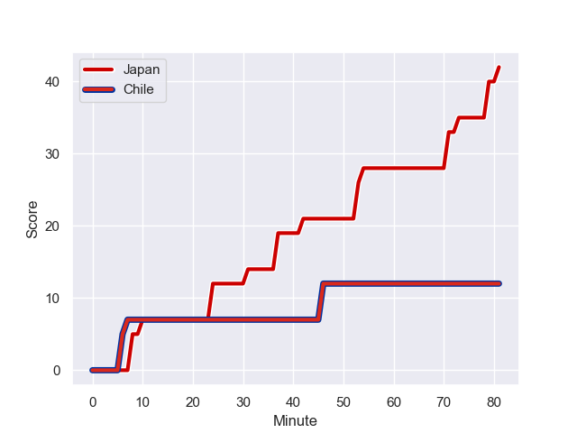
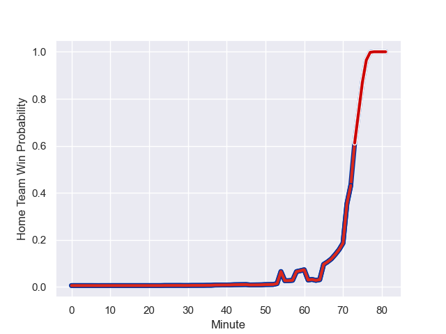

---  
layout: page  
title: Chile at Japan; 12.0-42.0  
date: 2023-09-10 18:00:00 -0500  
categories: match review  
---
# Chile at Japan; 12.0-42.0

# Club Level Predictions

The first set of predictions treats a club as the smallest object, as the club develops its members, organizes a gameplan, and deploys its players as needed for each match. This club model has a prediction of 0.876, which translates to predicting Japan to win by 18.5.

Each club has a rating and a rating deviation (simiar to a Glicko system), and expected performances can be generated. This allows for simulated matches and spreads like the ones below.
## Projected Performances

## Projected Spreads

## Projected Results

# Player Level Predictions - Version 1

Treating teams instead as an entity made up of the currently active players, I have ratings for each player in an altogether different system. These can be combined to form team ratings once teamsheets are announced, weighting starters a bit higher than the reserves. After the match is played, players can be weighted by their minutes on the field, allowing for an accurate measure of the team's composition. With these compiled team ratings, we can make predictions, measure inaccuracy, and update the individual player ratings.
## Prediction with Player Minutes: Chile by 216.6

Chile by 220.6 on a neutral field
## Prediction without Player Minutes: Chile by 222.4

Chile by 226.4 on a neutral pitch

## Scores over Time

## Win Probability over Time

There were 13 large changes in win probability in this match

|   Away Minutes | Away Player          |   Away elo |   Away Percentile |   Number |   Home Percentile |   Home elo | Home Player       |   Home Minutes |
|---------------:|:---------------------|-----------:|------------------:|---------:|------------------:|-----------:|:------------------|---------------:|
|             54 | Javier Carrasco      |     350.38 |  971887           |        1 |  707482           |     122.37 | Keita Inagaki     |             58 |
|             58 | Diego Escobar        |     267.04 |       1.03445e+06 |        2 |  865034           |     102.08 | Atsushi Sakate    |             50 |
|             68 | Matias Dittus        |     287.49 |  956662           |        3 |  831884           |      21.46 | Koo Ji-won        |             41 |
|             65 | Clemente Saavedra    |     261.83 |       1.03445e+06 |        4 |       1.0342e+06  |     132.63 | Amanaki Saumaki   |             55 |
|             56 | Javier Eissmann      |     261.38 |  956741           |        5 |       1.03357e+06 |     116.94 | Amato Fakatava    |             81 |
|             81 | Martin Sigren        |     269.03 |       1.03444e+06 |        6 |  400505           |      29.58 | Michael Leitch    |             81 |
|             58 | Raimundo Martinez    |     270.16 |       1.03444e+06 |        7 |       1.0286e+06  |     136.87 | Kanji Shimokawa   |             50 |
|             81 | Alfonso Escobar      |     271.39 |       1.03444e+06 |        8 |  806102           |     103.88 | Jack Cornelsen    |             81 |
|             81 | Marcelo Torrealba    |     327.95 |  947179           |        9 |  820145           |     169.26 | Yutaka Nagare     |             61 |
|             81 | Rodrigo Fernandez    |     266.15 |       1.03445e+06 |       10 |  839985           |     110.36 | Rikiya Matsuda    |             81 |
|             50 | Franco Velarde       |     265.32 |       1.03445e+06 |       11 |  934270           |     168.35 | Jone Naikabula    |             63 |
|             81 | Matias Garafulic     |     261.23 |       1.03446e+06 |       12 |  823651           |     183.42 | Ryoto Nakamura    |             81 |
|             81 | Domingo Saavedra     |     264.15 |       1.03397e+06 |       13 |  907188           |     254.46 | Dylan Riley       |             81 |
|             81 | Santiago Videla      |     264.54 |       1.03445e+06 |       14 |  741799           |      71.36 | Kotaro Matsushima |             81 |
|             61 | Inaki Ayarza         |     265.13 |       1.03396e+06 |       15 |  703325           |     131.54 | Semisi Masirewa   |             56 |
|             23 | Augusto Bohme        |     272.75 |     nan           |       16 |  451647           |      51.95 | Shota Horie       |             31 |
|             27 | Salvador Lues        |     274.28 |     nan           |       17 |  705102           |      73.64 | Craig Millar      |             23 |
|             19 | Inaki Gurruchaga     |     276    |     nan           |       18 |  824268           |     214.07 | Asaeli Ai Valu    |             40 |
|             16 | Pablo Huete          |     277.22 |       1.03396e+06 |       19 |     nan           |     121.36 | Warner Dearns     |             26 |
|             25 | Santiago Pedrero     |     268    |     nan           |       20 |  947948           |     214.6  | Shota Fukui       |             31 |
|             23 | Ignacio Silva        |     262.45 |     nan           |       21 |  976096           |      75.62 | Naoto Saito       |             20 |
|             20 | Lukas Carvallo       |     263.11 |     nan           |       22 |       1.03046e+06 |     204.44 | Tomoki Osada      |             18 |
|             25 | Jose Ignacio Larenas |     263.8  |     nan           |       23 |     nan           |     121.64 | Lomano Lemeki     |             25 |

# Player Level Predictions - Version 2

Treating teams instead as an entity made up of the currently active players, I have ratings for each player in an altogether different system. These can be combined to form team ratings once teamsheets are announced, weighting starters a bit higher than the reserves. After the match is played, players can be weighted by their minutes on the field, allowing for an accurate measure of the team's composition. With these compiled team ratings, we can make predictions, measure inaccuracy, and update the individual player ratings.
## Prediction with Player Minutes: Japan by 19.0

Japan by 15.7 on a neutral field
## Prediction without Player Minutes: Japan by 17.0

Japan by 13.7 on a neutral pitch

|   Away Minutes | Away Player          |   Away elo |   Away variance |   Number |   Home variance |   Home elo | Home Player       |   Home Minutes |
|---------------:|:---------------------|-----------:|----------------:|---------:|----------------:|-----------:|:------------------|---------------:|
|             54 | Javier Carrasco      |      39.22 |           49.92 |        1 |           49.53 |      86.02 | Keita Inagaki     |             58 |
|             58 | Diego Escobar        |      46.65 |           50    |        2 |           49.55 |      50.62 | Atsushi Sakate    |             50 |
|             68 | Matias Dittus        |      36.28 |           49.71 |        3 |           49.52 |      10.11 | Koo Ji-won        |             41 |
|             65 | Clemente Saavedra    |      46.65 |           50    |        4 |           50    |      46.65 | Amanaki Saumaki   |             55 |
|             56 | Javier Eissmann      |       5.12 |           49.68 |        5 |           49.58 |      41.22 | Amato Fakatava    |             81 |
|             81 | Martin Sigren        |      46.65 |           50    |        6 |           49.58 |      77.6  | Michael Leitch    |             81 |
|             58 | Raimundo Martinez    |      46.65 |           50    |        7 |           49.85 |      38.63 | Kanji Shimokawa   |             50 |
|             81 | Alfonso Escobar      |      46.65 |           50    |        8 |           49.2  |      78.85 | Jack Cornelsen    |             81 |
|             81 | Marcelo Torrealba    |      22.41 |           49.68 |        9 |           49.54 |      73.7  | Yutaka Nagare     |             61 |
|             81 | Rodrigo Fernandez    |      46.65 |           50    |       10 |           49.65 |     103.96 | Rikiya Matsuda    |             81 |
|             50 | Franco Velarde       |      46.65 |           50    |       11 |           49.2  |      60.68 | Jone Naikabula    |             63 |
|             81 | Matias Garafulic     |      46.65 |           50    |       12 |           49.92 |      99.83 | Ryoto Nakamura    |             81 |
|             81 | Domingo Saavedra     |      46.65 |           50    |       13 |           49.29 |      92.22 | Dylan Riley       |             81 |
|             81 | Santiago Videla      |      46.65 |           50    |       14 |           49.35 |      94.33 | Kotaro Matsushima |             81 |
|             61 | Inaki Ayarza         |      46.65 |           50    |       15 |           49.4  |      29.26 | Semisi Masirewa   |             56 |
|             23 | Augusto Bohme        |      46.65 |           50    |       16 |           49.64 |      88.81 | Shota Horie       |             31 |
|             27 | Salvador Lues        |      46.65 |           50    |       17 |           49.66 |      39.16 | Craig Millar      |             23 |
|             19 | Inaki Gurruchaga     |      46.65 |           50    |       18 |           49.7  |      79.01 | Asaeli Ai Valu    |             40 |
|             16 | Pablo Huete          |      46.65 |           50    |       19 |           50    |      46.65 | Warner Dearns     |             26 |
|             25 | Santiago Pedrero     |      46.65 |           50    |       20 |           49.78 |      52.28 | Shota Fukui       |             31 |
|             23 | Ignacio Silva        |      46.65 |           50    |       21 |           49.65 |      29.48 | Naoto Saito       |             20 |
|             20 | Lukas Carvallo       |      46.65 |           50    |       22 |           49.38 |      35.31 | Tomoki Osada      |             18 |
|             25 | Jose Ignacio Larenas |      46.65 |           50    |       23 |           50    |      46.65 | Lomano Lemeki     |             25 |

