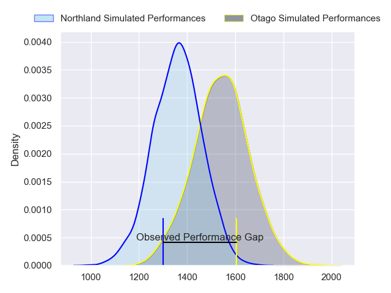
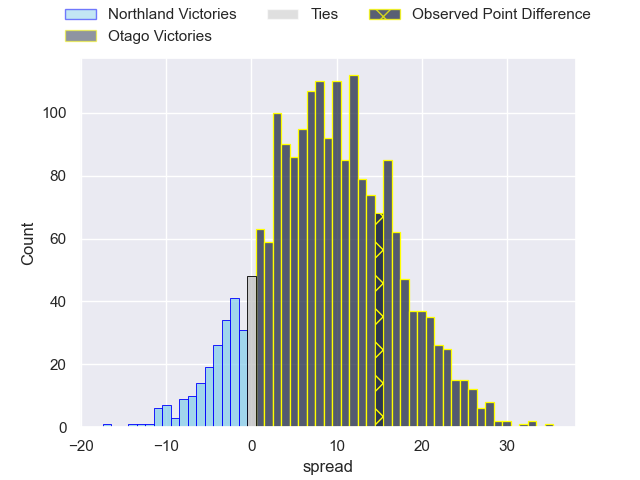
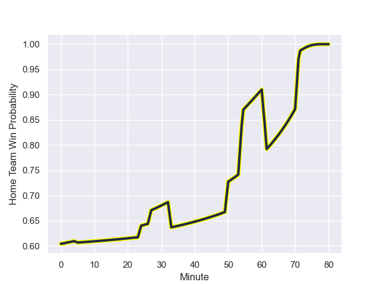

---  
layout: page  
title: Northland at Otago; 15.0-30.0  
date: 2023-09-10 18:00:00 -0500  
categories: match review  
---
# Northland at Otago; 15.0-30.0

# Club Level Predictions

The first set of predictions treats a club as the smallest object, as the club develops its members, organizes a gameplan, and deploys its players as needed for each match. This club model has a prediction of 0.729, which translates to predicting Otago to win by 9.0.

Each club has a rating and a rating deviation (simiar to a Glicko system), and expected performances can be generated. This allows for simulated matches and spreads like the ones below.
## Projected Performances

## Projected Spreads

## Projected Results

# Player Level Predictions - Version 2

Treating teams instead as an entity made up of the currently active players, I have ratings for each player in an altogether different system. These can be combined to form team ratings once teamsheets are announced, weighting starters a bit higher than the reserves. After the match is played, players can be weighted by their minutes on the field, allowing for an accurate measure of the team's composition. With these compiled team ratings, we can make predictions, measure inaccuracy, and update the individual player ratings.
## Prediction with Player Minutes: Otago by 4.8

Otago by 1.4 on a neutral field
## Prediction without Player Minutes: Otago by 4.8

Otago by 1.4 on a neutral pitch

## Scores over Time

## Win Probability over Time

There were 8 large changes in win probability in this match

|   Away Minutes | Away Player           |   Away elo |   Number |   Home elo | Home Player          |   Home Minutes |
|---------------:|:----------------------|-----------:|---------:|-----------:|:---------------------|---------------:|
|             80 | Jarred Adams          |      51.41 |        1 |      40.52 | Rohan Wingham        |             80 |
|             80 | Bruce Kauika-Petersen |      41.46 |        2 |      39.03 | Henry Bell           |             80 |
|             80 | Remsy Lemisio         |      48.86 |        3 |      38.85 | Saula Mau            |             80 |
|             80 | Sam Caird             |      -5.08 |        4 |      18.58 | Will Tucker          |             80 |
|             80 | Liam Hallam-Eames     |       5.26 |        5 |      36.61 | Josh Dickson         |             80 |
|             80 | Rory Woods            |      46.5  |        6 |      78.34 | Tom Sanders          |             80 |
|             80 | Jonah Mau'u           |      50.5  |        7 |      37.7  | Sean Withy           |             80 |
|             80 | Rob Rush              |      34.2  |        8 |      49.23 | Christian Lio-Willie |             80 |
|             80 | Sam Nock              |      56.47 |        9 |      31.86 | James Arscott        |             80 |
|             80 | Rivez Reihana         |      44.68 |       10 |      44.97 | Ajay Faleafaga       |             80 |
|             80 | Heremaia Murray       |      43.37 |       11 |      67.08 | Jona Nareki          |             80 |
|             80 | Blake Hohaia          |      31.31 |       12 |      42.92 | Jack Leslie          |             80 |
|             80 | Tamati Tua            |      46.17 |       13 |      34.33 | Jake Te Hiwi         |             80 |
|             80 | Tama Anderson         |      46.65 |       14 |      35.56 | Josh Whaanga         |             80 |
|             80 | Joshua Moorby         |      59.57 |       15 |      39.54 | Sam Gilbert          |             80 |

