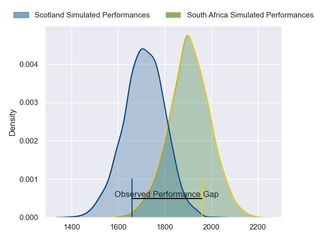
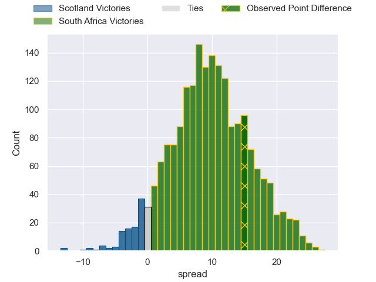
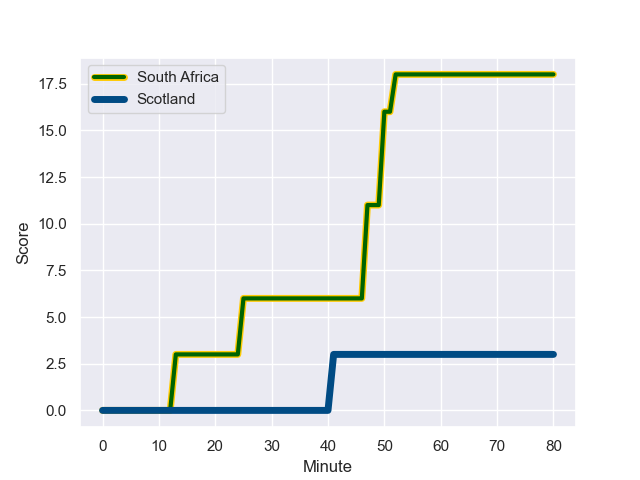
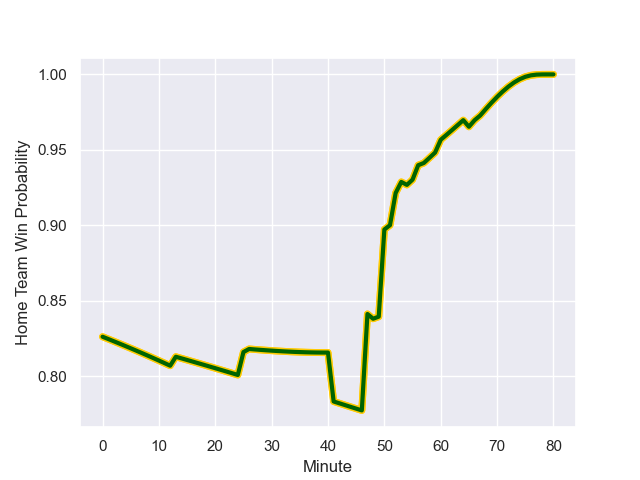

---  
layout: page  
title: Scotland at South Africa; 3.0-18.0  
date: 2023-09-10 18:00:00 -0500  
categories: match review  
---
# Scotland at South Africa; 3.0-18.0

# Club Level Predictions

The first set of predictions treats a club as the smallest object, as the club develops its members, organizes a gameplan, and deploys its players as needed for each match. This club model has a prediction of 0.744, which translates to predicting South Africa to win by 9.6.

Each club has a rating and a rating deviation (simiar to a Glicko system), and expected performances can be generated. This allows for simulated matches and spreads like the ones below.
## Projected Performances

## Projected Spreads

## Projected Results

# Player Level Predictions - Version 2

Treating teams instead as an entity made up of the currently active players, I have ratings for each player in an altogether different system. These can be combined to form team ratings once teamsheets are announced, weighting starters a bit higher than the reserves. After the match is played, players can be weighted by their minutes on the field, allowing for an accurate measure of the team's composition. With these compiled team ratings, we can make predictions, measure inaccuracy, and update the individual player ratings.
## Prediction with Player Minutes: South Africa by 17.2

South Africa by 17.2 on a neutral field
## Prediction without Player Minutes: South Africa by 16.3

South Africa by 16.3 on a neutral pitch

## Scores over Time

## Win Probability over Time

There were 3 large changes in win probability in this match

|   Away Minutes | Away Player         |   Away elo |   Number |   Home elo | Home Player          |   Home Minutes |
|---------------:|:--------------------|-----------:|---------:|-----------:|:---------------------|---------------:|
|             56 | Pierre Schoeman     |      48.68 |        1 |      97.96 | Steven Kitshoff      |             53 |
|             56 | George Turner       |     111.12 |        2 |     114.79 | Malcolm Marx         |             52 |
|             56 | Zander Fagerson     |     108.14 |        3 |      86.16 | Frans Malherbe       |             54 |
|             80 | Richie Gray         |      60.62 |        4 |     112.78 | Eben Etzebeth        |             26 |
|             56 | Grant Gilchrist     |      97.76 |        5 |     115.01 | Franco Mostert       |             80 |
|             80 | Jamie Ritchie       |     121.23 |        6 |     115.63 | Siya Kolisi          |             65 |
|             65 | Rory Darge          |      59.98 |        7 |      80.58 | Pieter-Steph du Toit |             80 |
|             80 | Jack Dempsey        |      28.46 |        8 |      80.1  | Jasper Wiese         |             60 |
|             67 | Ben White           |      59.91 |        9 |     109.92 | Faf de Klerk         |             75 |
|             80 | Finn Russell        |     124.91 |       10 |      76.5  | Manie Libbok         |             69 |
|             80 | Duhan van der Merwe |      70.05 |       11 |     138.17 | Cheslin Kolbe        |             80 |
|             67 | Sione Tuipulotu     |      43.82 |       12 |      90.38 | Damian de Allende    |             80 |
|             80 | Huw Jones           |      41.22 |       13 |     136.17 | Jesse Kriel          |             80 |
|             65 | Darcy Graham        |      49.95 |       14 |     111.73 | Kurt-Lee Arendse     |             80 |
|             80 | Blair Kinghorn      |     129.34 |       15 |     113.17 | Damian Willemse      |             80 |
|             24 | Dave Cherry         |      44.98 |       16 |     102.19 | Bongi Mbonambi       |             28 |
|             24 | Jamie Bhatti        |      82.77 |       17 |     107.92 | Ox Nche              |             27 |
|             24 | WP Nel              |      93.97 |       18 |      56.87 | Trevor Nyakane       |             26 |
|             24 | Scott Cummings      |     104.55 |       19 |     117.59 | RG Snyman            |             54 |
|             15 | Matt Fagerson       |      99.93 |       20 |      69.45 | Marco van Staden     |             15 |
|             13 | Ali Price           |      70.49 |       21 |     125.58 | Duane Vermeulen      |             20 |
|             13 | Cameron Redpath     |      52.14 |       22 |      44.09 | Grant Williams       |              5 |
|             15 | Ollie Smith         |      76.11 |       23 |     105.72 | Willie le Roux       |             11 |

