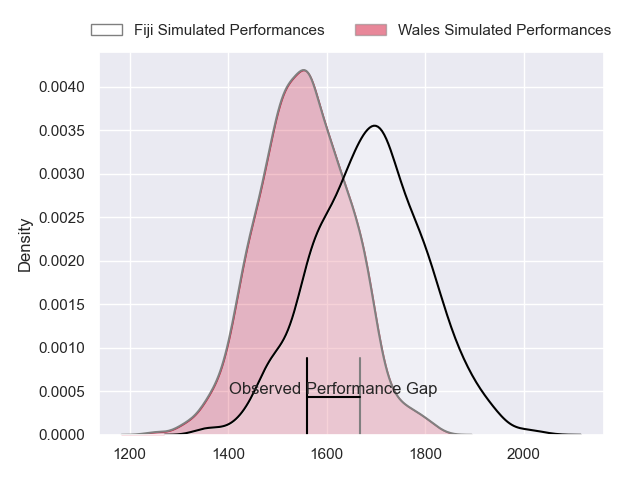
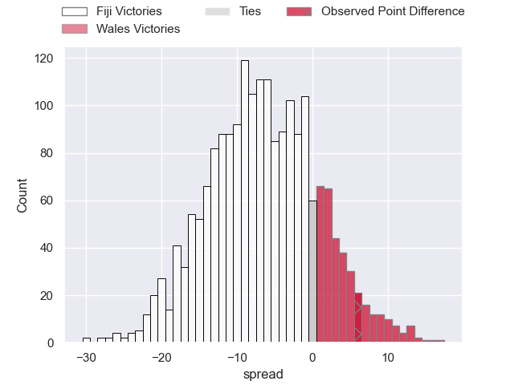
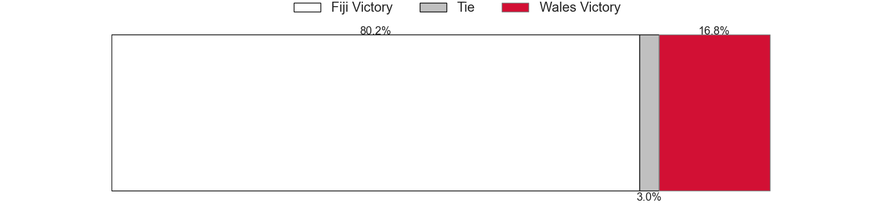
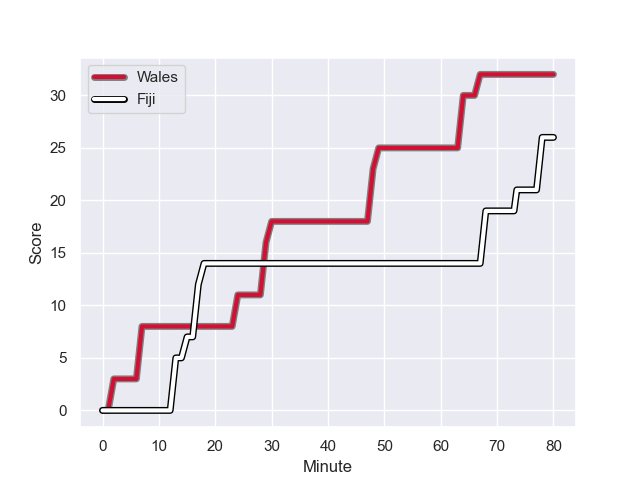
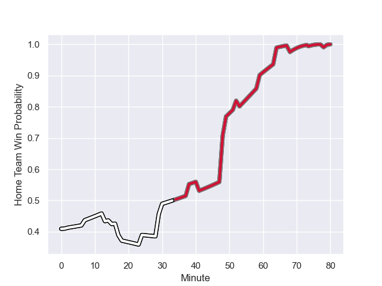

---  
layout: page  
title: Fiji at Wales; 26.0-32.0  
date: 2023-09-10 18:00:00 -0500  
categories: match review  
---
# Fiji at Wales; 26.0-32.0

# Club Level Predictions

The first set of predictions treats a club as the smallest object, as the club develops its members, organizes a gameplan, and deploys its players as needed for each match. This club model has a prediction of 0.326, which translates to predicting Fiji to win by 6.7.

Each club has a rating and a rating deviation (simiar to a Glicko system), and expected performances can be generated. This allows for simulated matches and spreads like the ones below.
## Projected Performances

## Projected Spreads

## Projected Results

# Player Level Predictions - Version 2

Treating teams instead as an entity made up of the currently active players, I have ratings for each player in an altogether different system. These can be combined to form team ratings once teamsheets are announced, weighting starters a bit higher than the reserves. After the match is played, players can be weighted by their minutes on the field, allowing for an accurate measure of the team's composition. With these compiled team ratings, we can make predictions, measure inaccuracy, and update the individual player ratings.
## Prediction with Player Minutes: Fiji by 4.0

Fiji by 4.0 on a neutral field
## Prediction without Player Minutes: Fiji by 3.6

Fiji by 3.6 on a neutral pitch

## Scores over Time

## Win Probability over Time

There were 11 large changes in win probability in this match

|   Away Minutes | Away Player                    |   Away elo |   Number |   Home elo | Home Player       |   Home Minutes |
|---------------:|:-------------------------------|-----------:|---------:|-----------:|:------------------|---------------:|
|             57 | Eroni Mawi                     |      50.33 |        1 |      29.57 | Gareth Thomas     |             72 |
|             67 | Sam Matavesi                   |      66.07 |        2 |      75.03 | Ryan Elias        |             53 |
|             67 | Luke Tagi                      |      57.37 |        3 |      95.68 | Tomas Francis     |             63 |
|             80 | Isoa Nasilasila                |      74.97 |        4 |      32.88 | Will Rowlands     |             80 |
|             70 | Te Ahiwaru Cirikidaveta        |      49.47 |        5 |      51.91 | Adam Beard        |             59 |
|             59 | Albert Tuisue                  |      88.91 |        6 |      63.71 | Aaron Wainwright  |             71 |
|             80 | Lekima Tagitagivalu            |      83.81 |        7 |      61.6  | Jac Morgan        |             80 |
|             80 | Viliame Mata                   |      47.45 |        8 |      46.65 | Taulupe Faletau   |             59 |
|             53 | Frank Lomani                   |      53.2  |        9 |      33.64 | Gareth Davies     |             49 |
|             80 | Teti Tela                      |      83.69 |       10 |     126.1  | Dan Biggar        |             67 |
|             53 | Vinaya Habosi                  |      60.17 |       11 |      57.57 | Josh Adams        |             59 |
|             80 | Semi Radradra                  |     134.03 |       12 |      98.2  | Nick Tompkins     |             80 |
|             80 | Waisea Nayacalevu Vuidravuwalu |     138.88 |       13 |     110.42 | George North      |             80 |
|             80 | Selestino Ravutaumada          |      75.35 |       14 |      71.13 | Louis Rees-Zammit |             80 |
|             75 | Ilaisa Droasese                |      67.14 |       15 |     110.02 | Liam Williams     |             80 |
|             13 | Tevita Ikanivere               |      69.58 |       16 |      68.53 | Elliot Dee        |             27 |
|             23 | Peni Ravai Kovekalou           |      43.1  |       17 |      55.54 | Corey Domachowski |             17 |
|             13 | Mesake Doge                    |      41.46 |       18 |      77.6  | Dillon Lewis      |             17 |
|             10 | Temo Mayanavanua               |      67.97 |       19 |      60.16 | Dafydd Jenkins    |             21 |
|             21 | Levani Botia                   |     113.75 |       20 |      59.17 | Tommy Reffell     |             21 |
|             27 | Simione Kuruvoli               |      50.53 |       21 |      67.56 | Tomos Williams    |             31 |
|             27 | Josua Tuisova                  |     107.98 |       22 |      38.54 | Sam Costelow      |             13 |
|              5 | Sireli Maqala                  |      73.23 |       23 |      16.54 | Rio Dyer          |             21 |

