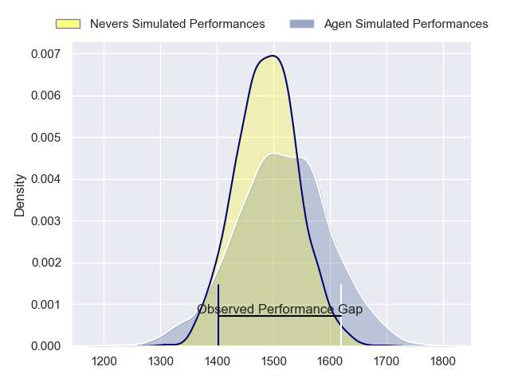
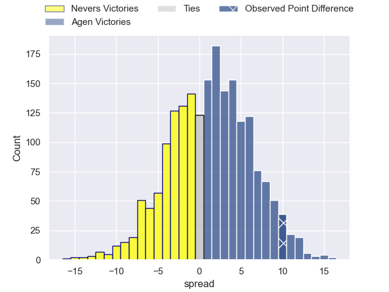
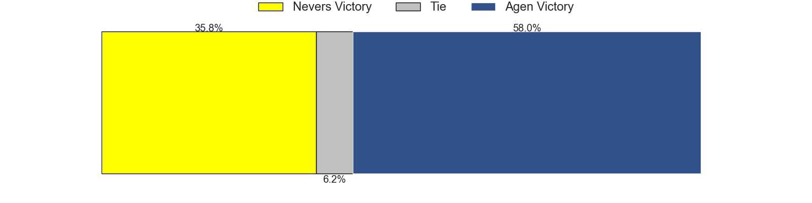
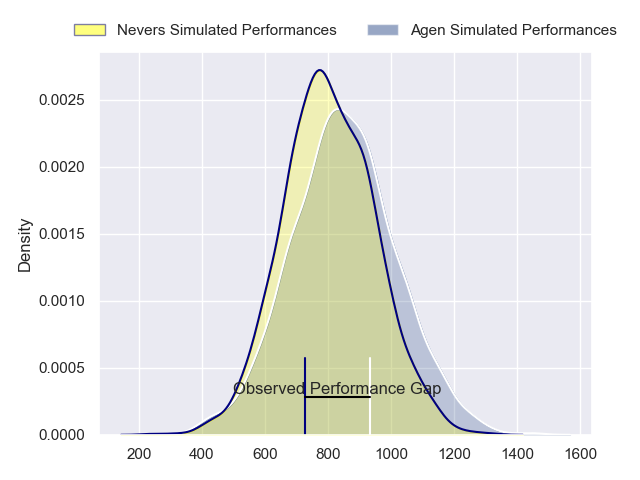
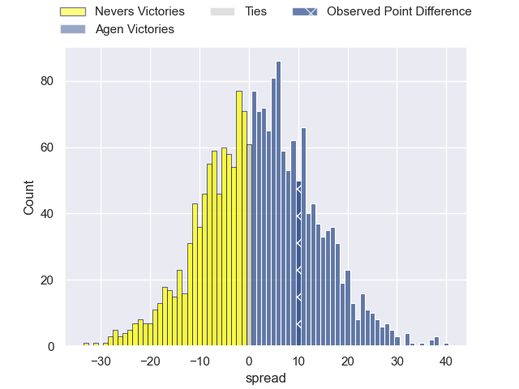
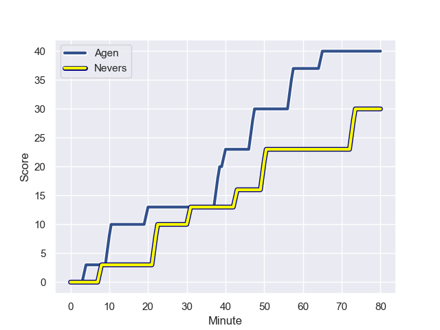
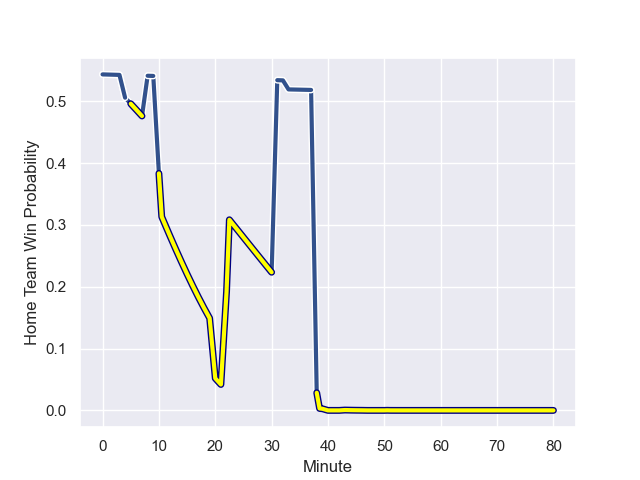

---  
layout: page  
title: Nevers at Agen; 30.0-40.0  
date: 2023-09-12 18:00:00 -0500  
categories: match review  
---
# Nevers at Agen; 30.0-40.0

# Club Level Predictions

The first set of predictions treats a club as the smallest object, as the club develops its members, organizes a gameplan, and deploys its players as needed for each match. This club model has a prediction of 0.54, which translates to predicting Agen to win by 1.4.

Each club has a rating and a rating deviation (simiar to a Glicko system), and expected performances can be generated. This allows for simulated matches and spreads like the ones below.
## Projected Performances - Club Model

## Projected Spreads - Club Model

## Projected Results - Club Model

# Player Level Predictions - Version 2

Treating teams instead as an entity made up of the currently active players, I have ratings for each player in an altogether different system. These can be combined to form team ratings once teamsheets are announced, weighting starters a bit higher than the reserves. After the match is played, players can be weighted by their minutes on the field, allowing for an accurate measure of the team's composition. With these compiled team ratings, we can make predictions, measure inaccuracy, and update the individual player ratings.
## Prediction with Player Minutes: Agen by 1.9

Nevers by 2.9 on a neutral field
## Prediction without Player Minutes: Nevers by 0.2

Nevers by 5.0 on a neutral pitch

## Projected Performances - Player Model

## Projected Spreads - Player Model

## Projected Results - Player Model

## Scores over Time

## Win Probability over Time

There were 10 large changes in win probability in this match

|   Away Minutes | Away Player              |   Away elo |   Number |   Home elo | Home Player        |   Home Minutes |
|---------------:|:-------------------------|-----------:|---------:|-----------:|:-------------------|---------------:|
|             33 | Jordan Seneca            |      50.56 |        1 |      50.88 | Hans Lombard-Buret |             69 |
|             55 | Elia Elia                |      45.98 |        2 |      -2.21 | Mike Sosene-Feagai |             33 |
|             40 | Cleopas Kundiona         |      43.88 |        3 |      48.94 | Alex Burin         |             69 |
|             80 | Christiaan van der Merwe |       4.35 |        4 |      45.92 | Zak Farrance       |             55 |
|             49 | Will Skelton             |      90.21 |        5 |      72.78 | William Demotte    |             80 |
|             58 | Luka Plataret            |      49.82 |        6 |      31.88 | Julien Lebian      |             51 |
|             58 | Hugues Bastide           |      79.77 |        7 |      47.01 | Valentin Gayraud   |             80 |
|             80 | Jason-Colin Fraser       |      87.29 |        8 |      39.28 | Martin Devergie    |             80 |
|             53 | Guillaume Manevy         |      39.17 |        9 |      37.76 | Theo Idjellidaine  |             52 |
|             80 | Shaun Reynolds           |      58.68 |       10 |      53.47 | Thomas Vincent     |             80 |
|             80 | Thomas Zenon             |      28.66 |       11 |      74.45 | Henry Purdy        |             80 |
|             80 | Rudy Derrieux            |      59.83 |       12 |      63.91 | Harry Sloan        |             80 |
|             49 | Alifereti Loaloa         |      68.29 |       13 |      29.92 | Kolinio Ramoka     |             71 |
|             80 | Christian Ambadiang      |      60.95 |       14 |      42.09 | Timilai Rokoduru   |             80 |
|             80 | Kylian Jaminet           |      66.5  |       15 |      77.07 | Mathieu Lamoulie   |             71 |
|             47 | Kamaliele Tufele         |      48.7  |       16 |      41.96 | Clement Martinez   |             47 |
|             40 | Farai Mudariki           |      41.51 |       17 |      51.77 | Matthieu Bonnet    |             29 |
|             31 | Leonard Paris            |      69.68 |       18 |      46.88 | Dorian Bellot      |             28 |
|             31 | Kevin Noah               |      46.48 |       19 |      -1.35 | Evan Olmstead      |             25 |
|             27 | Hugo Bouyssou            |      20.44 |       20 |      24.8  | Florent Guion      |             11 |
|             25 | Jonathan Maiau           |      37.62 |       21 |      42.87 | Beau Farrance      |             11 |
|             22 | Julien Kazubek           |      60.97 |       22 |      46.46 | Emile Dayral       |              9 |
|             22 | Robin Dione              |      44.02 |       23 |      53.21 | Clement Garrigues  |              9 |

