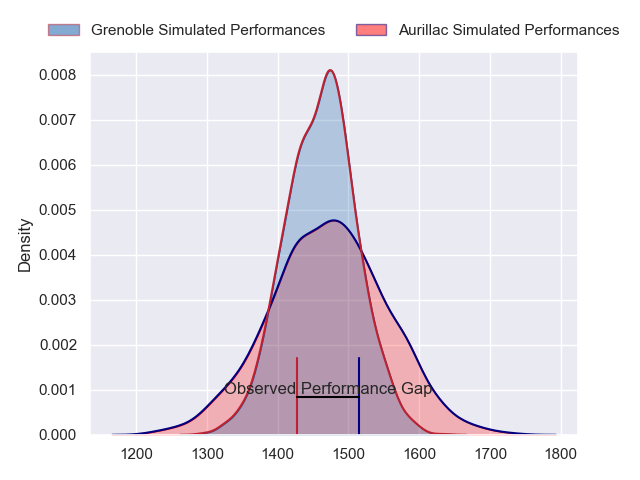
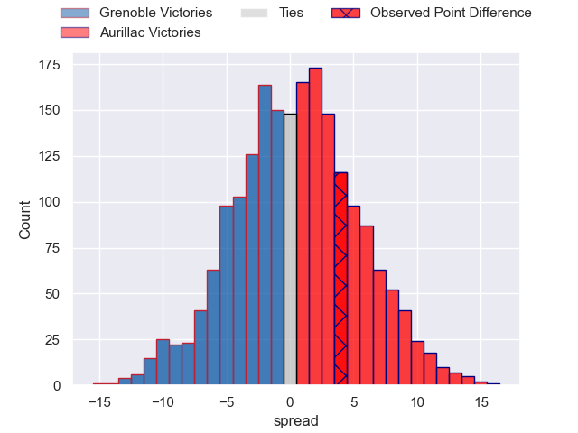
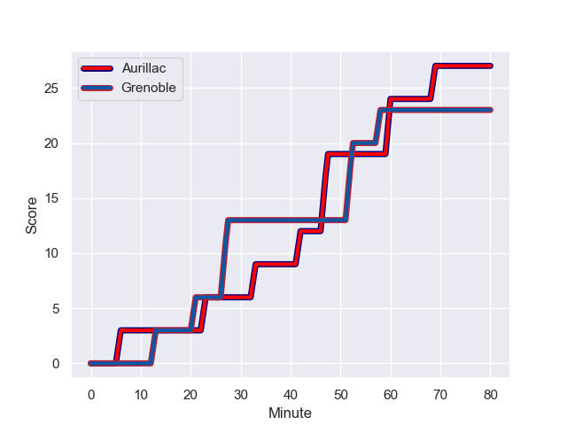
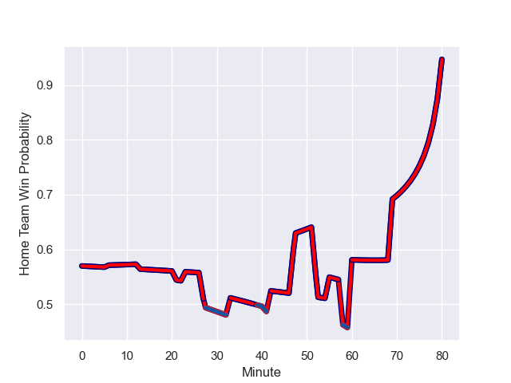

---  
layout: page  
title: Grenoble at Aurillac; 23.0-27.0  
date: 2023-09-13 18:00:00 -0500  
categories: match review  
---
# Grenoble at Aurillac; 23.0-27.0

# Club Level Predictions

The first set of predictions treats a club as the smallest object, as the club develops its members, organizes a gameplan, and deploys its players as needed for each match. This club model has a prediction of 0.517, which translates to predicting Aurillac to win by 0.6.

Each club has a rating and a rating deviation (simiar to a Glicko system), and expected performances can be generated. This allows for simulated matches and spreads like the ones below.
## Projected Performances

## Projected Spreads

## Projected Results

# Player Level Predictions - Version 2

Treating teams instead as an entity made up of the currently active players, I have ratings for each player in an altogether different system. These can be combined to form team ratings once teamsheets are announced, weighting starters a bit higher than the reserves. After the match is played, players can be weighted by their minutes on the field, allowing for an accurate measure of the team's composition. With these compiled team ratings, we can make predictions, measure inaccuracy, and update the individual player ratings.
## Prediction with Player Minutes: Aurillac by 3.1

Grenoble by 1.6 on a neutral field
## Prediction without Player Minutes: Aurillac by 3.3

Grenoble by 1.4 on a neutral pitch

## Scores over Time

## Win Probability over Time

There were 14 large changes in win probability in this match

|   Away Minutes | Away Player         |   Away elo |   Number |   Home elo | Home Player           |   Home Minutes |
|---------------:|:--------------------|-----------:|---------:|-----------:|:----------------------|---------------:|
|             62 | Luka Goginava       |      45.46 |        1 |      48.87 | Alexandre Plantier    |             58 |
|             70 | Bernabe Massa       |      52.11 |        2 |      66.46 | Adrian Smith          |             27 |
|             33 | Siua Halanukonuka   |      58.92 |        3 |      47.28 | Giorgi Kartvelishvili |             41 |
|             80 | Pierce Phillips     |      46.2  |        4 |      62.03 | Heath Backhouse       |             55 |
|             61 | Brandon Nansen      |      47.48 |        5 |      46.23 | Mehdi Slamani         |             53 |
|             55 | Victor Guillaumond  |      45.99 |        6 |      45    | Didier Tison          |             80 |
|             80 | Steeve Blanc-Mappaz |      36.28 |        7 |      61.54 | Beka Shvangiradze     |             80 |
|             80 | Antonin Berruyer    |      30.43 |        8 |      60.63 | Yohann Gbizie         |             53 |
|             62 | Barnabe Couilloud   |      23.42 |        9 |      36.23 | Mikheil Alania        |             63 |
|             41 | Sam Davies          |      58.55 |       10 |      30.88 | Antoine Aucagne       |             80 |
|             80 | Karim Qadiri        |      45.37 |       11 |      49.97 | AJ Coertzen           |             80 |
|             80 | Bautista Ezcurra    |      80.2  |       12 |      20.46 | Christa Powell        |             63 |
|             80 | Romain Trouilloud   |      46.95 |       13 |      47.79 | Hugo Bastard          |             80 |
|             80 | Nathan Farissier    |      20.67 |       14 |      43.04 | Juun Pieters          |             80 |
|             62 | Julien Farnoux      |      84.58 |       15 |      38.37 | Marc Palmier          |             80 |
|             47 | Regis Montagne      |      48.36 |       16 |      47.48 | Basa Khonelidze       |             53 |
|             39 | Max Clement         |      46.51 |       17 |      33.98 | Tim Daniel-Meissen    |             39 |
|             25 | Diego Pinheiro Ruiz |      46.65 |       18 |      31.13 | Martial Rolland       |             27 |
|             18 | Felipe Ezcurra      |      95.43 |       19 |      47.82 | Hugo Huurman          |             27 |
|             19 | Quentin Dubois      |      46.65 |       20 |      66.18 | Eoghan Masterson      |             25 |
|             18 | Wilfried Hulleu     |      52.1  |       21 |      27.55 | Robert Rodgers        |             22 |
|             18 | Eli Eglaine         |      33.21 |       22 |      37.71 | David Delarue         |             17 |
|             10 | Enzo Camilleri      |      45.66 |       23 |      46.98 | Anderson Neisen       |             17 |

