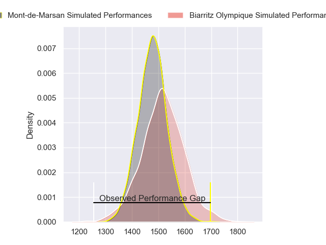
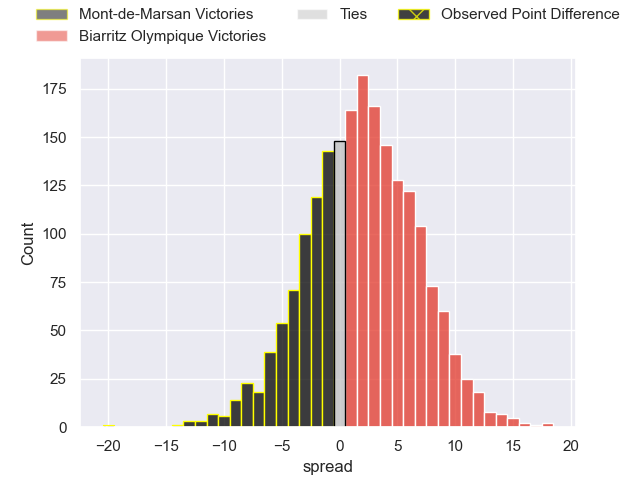
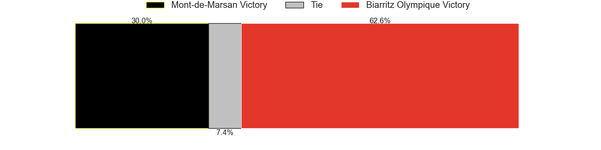
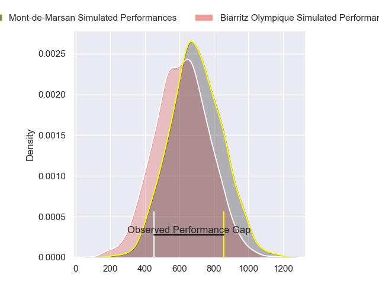
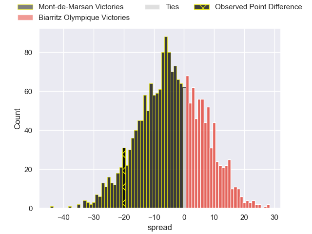
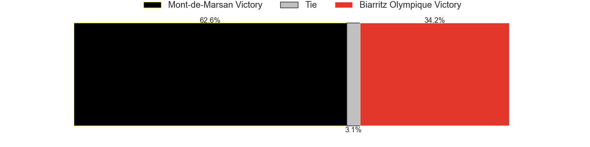
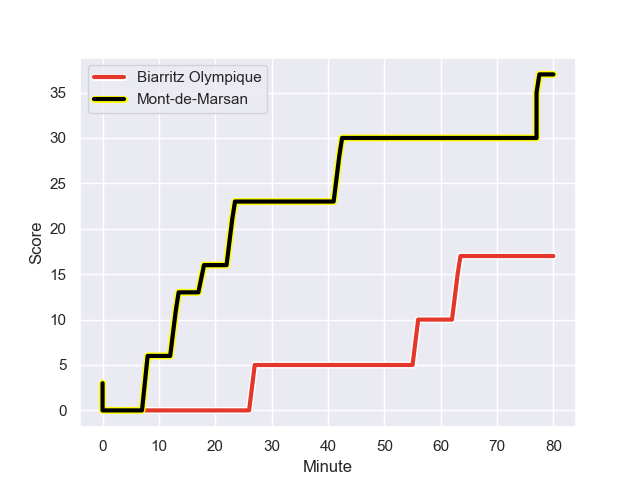
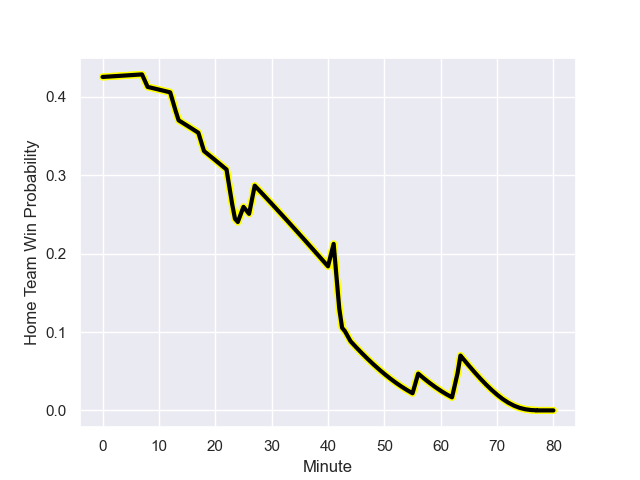

---  
layout: page  
title: Mont-de-Marsan at Biarritz Olympique; 37.0-17.0  
date: 2023-09-13 18:00:00 -0500  
categories: match review  
---
# Mont-de-Marsan at Biarritz Olympique; 37.0-17.0

# Club Level Predictions

The first set of predictions treats a club as the smallest object, as the club develops its members, organizes a gameplan, and deploys its players as needed for each match. This club model has a prediction of 0.554, which translates to predicting Biarritz Olympique to win by 1.9.

Each club has a rating and a rating deviation (simiar to a Glicko system), and expected performances can be generated. This allows for simulated matches and spreads like the ones below.
## Projected Performances - Club Model

## Projected Spreads - Club Model

## Projected Results - Club Model

# Player Level Predictions - Version 2

Treating teams instead as an entity made up of the currently active players, I have ratings for each player in an altogether different system. These can be combined to form team ratings once teamsheets are announced, weighting starters a bit higher than the reserves. After the match is played, players can be weighted by their minutes on the field, allowing for an accurate measure of the team's composition. With these compiled team ratings, we can make predictions, measure inaccuracy, and update the individual player ratings.
## Prediction with Player Minutes: Mont-de-Marsan by 3.3

Mont-de-Marsan by 8.4 on a neutral field
## Prediction without Player Minutes: Mont-de-Marsan by 2.5

Mont-de-Marsan by 7.6 on a neutral pitch

## Projected Performances - Player Model

## Projected Spreads - Player Model

## Projected Results - Player Model

## Scores over Time

## Win Probability over Time

There were 6 large changes in win probability in this match

|   Away Minutes | Away Player               |   Away elo |   Number |   Home elo | Home Player         |   Home Minutes |
|---------------:|:--------------------------|-----------:|---------:|-----------:|:--------------------|---------------:|
|             41 | Thomas Bultel             |      38.4  |        1 |      35.33 | Giorgi Nutsubidze   |             44 |
|             41 | Simon Labouyrie           |      36    |        2 |      37.83 | Brendan Lebrun      |             41 |
|             41 | Mathis Bats               |      45.88 |        3 |      43.28 | Mohamed Haouas      |             44 |
|             80 | Aston Fortuin             |      34.61 |        4 |       2.5  | Johnny Dyer         |             80 |
|             57 | Myles Edwards             |      21.7  |        5 |      53.18 | Charlie Matthews    |             44 |
|             41 | Aurélien Lisena           |      46.18 |        6 |      23.63 | Charlie Francoz     |             80 |
|             80 | Nicolas Garrault          |      40.22 |        7 |      34.98 | Thomas Hebert       |             80 |
|             80 | William Wavrin            |      51.58 |        8 |      43.07 | Temo Matiu          |             80 |
|             63 | Christophe Loustalot      |      31.3  |        9 |      44.55 | Antoine Domercq     |             44 |
|             73 | Willie du Plessis         |      72.64 |       10 |      11.5  | Chris Hilsenbeck    |             80 |
|             80 | Pierre Sayerse            |      50.14 |       11 |      36.48 | Gervais Cordin      |             80 |
|             70 | Jules Even                |      55.04 |       12 |      52.97 | Ilian Perraux       |             80 |
|             80 | Nacani Wakaya             |      80    |       13 |       7.38 | Francois Vergnaud   |             25 |
|             80 | Eroni Sau                 |      45.47 |       14 |      20.97 | Zach Kibirige       |             80 |
|             80 | Yoann Laousse Azpiazu     |      34.51 |       15 |      45.91 | Joe Jonas           |             80 |
|             39 | Dino Casadei              |      46.69 |       16 |      45.09 | Robin McClintock    |             17 |
|             39 | Sacha Idoumi              |      44.13 |       17 |      48.11 | Bastien Soury       |             39 |
|             39 | Chris Talakai             |      32.78 |       18 |      22.35 | Vincent Martin      |             38 |
|             39 | Veresa Tuqovu Ramototabua |      55.28 |       19 |      20.15 | Dave O'Callaghan    |             36 |
|             23 | Andrei Ostrikov           |      43.78 |       20 |      28.51 | Zakaria El Fakir    |             36 |
|             17 | Kevin Viallard            |      47.96 |       21 |      38.07 | Kerman Aurrekoetxea |             36 |
|             10 | Patricio Fernandez        |      44.09 |       22 |      42.18 | Kevin Tougne        |             36 |
|              7 | Joris Pialot              |      35.03 |       23 |     nan    | nan                 |            nan |

