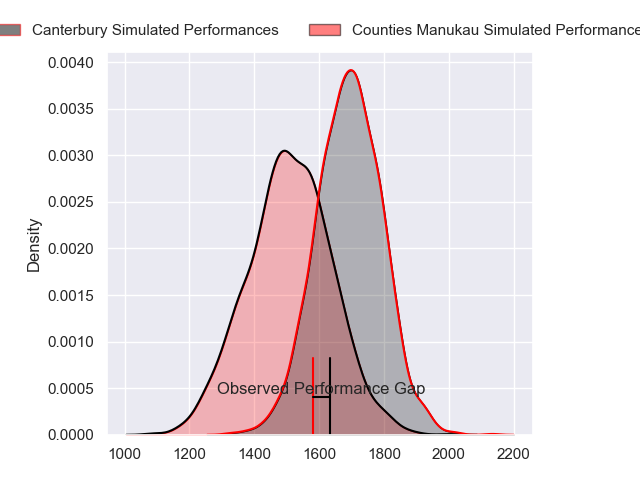
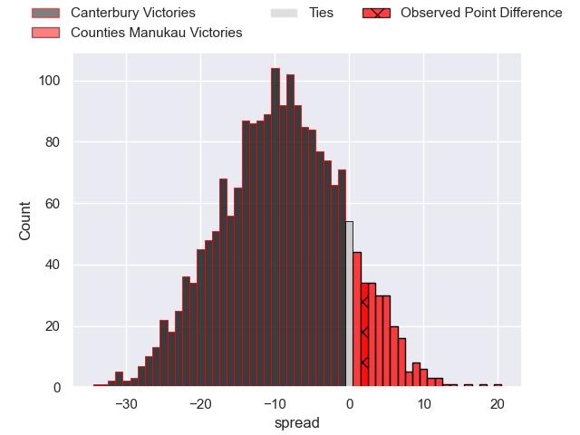
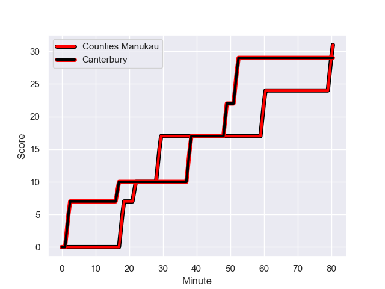
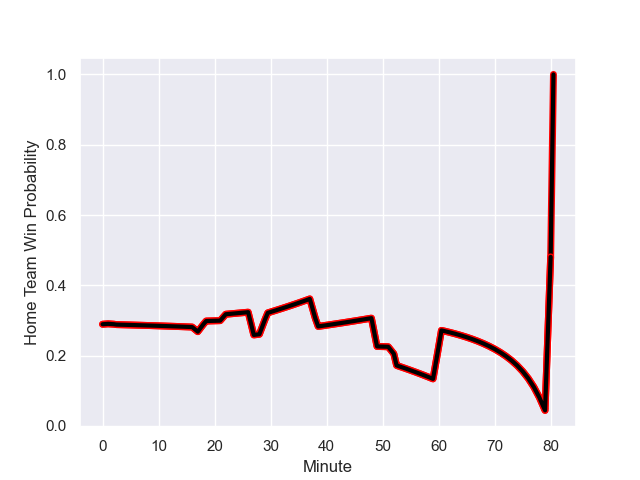

---  
layout: page  
title: Canterbury at Counties Manukau; 29.0-31.0  
date: 2023-09-13 18:00:00 -0500  
categories: match review  
---
# Canterbury at Counties Manukau; 29.0-31.0

# Club Level Predictions

The first set of predictions treats a club as the smallest object, as the club develops its members, organizes a gameplan, and deploys its players as needed for each match. This club model has a prediction of 0.267, which translates to predicting Canterbury to win by 9.2.

Each club has a rating and a rating deviation (simiar to a Glicko system), and expected performances can be generated. This allows for simulated matches and spreads like the ones below.
## Projected Performances

## Projected Spreads

## Projected Results

# Player Level Predictions - Version 2

Treating teams instead as an entity made up of the currently active players, I have ratings for each player in an altogether different system. These can be combined to form team ratings once teamsheets are announced, weighting starters a bit higher than the reserves. After the match is played, players can be weighted by their minutes on the field, allowing for an accurate measure of the team's composition. With these compiled team ratings, we can make predictions, measure inaccuracy, and update the individual player ratings.
## Prediction with Player Minutes: Canterbury by 9.9

Canterbury by 13.3 on a neutral field
## Prediction without Player Minutes: Canterbury by 10.9

Canterbury by 14.3 on a neutral pitch

## Scores over Time

## Win Probability over Time

There were 11 large changes in win probability in this match

|   Away Minutes | Away Player        |   Away elo |   Number |   Home elo | Home Player         |   Home Minutes |
|---------------:|:-------------------|-----------:|---------:|-----------:|:--------------------|---------------:|
|             69 | Dan Lienert-Brown  |      46.35 |        1 |      12.74 | Ezekiel Lindenmuth  |             52 |
|             47 | Ben Funnell        |      84.71 |        2 |      47.69 | Ioane Moananu       |             52 |
|             14 | Oli Jager          |      82.96 |        3 |      33.51 | Suetena Asomua      |             62 |
|             80 | Zach Gallagher     |      43.68 |        4 |      32.47 | Jimmy Tupou         |             80 |
|             69 | Sam Darry          |      54.9  |        5 |      49.08 | Jim Thompson        |             54 |
|             80 | Billy Harmon       |      77.03 |        6 |      27.01 | Maama Vaipulu       |             47 |
|             47 | Corey Kellow       |      57.21 |        7 |      78.27 | Sean Reidy          |             54 |
|             80 | Cullen Grace       |      86.76 |        8 |      83.61 | Hoskins Sotutu      |             80 |
|             62 | Willi Heinz        |      93.05 |        9 |      47.75 | Liam Daniela        |             80 |
|             80 | Fergus Burke       |      59.03 |       10 |      31.28 | Riley Hohepa        |             80 |
|             62 | Solomon Alaimalo   |      89.54 |       11 |      31.02 | Peniasi Malimali    |             80 |
|             80 | Rameka Poihipi     |      67.49 |       12 |      63.39 | AJ Alatimu          |             27 |
|             69 | Jone Rova          |      46.47 |       13 |      42.68 | Tevita Ofa          |             80 |
|             80 | Ngatungane Punivai |      60.11 |       14 |      51.81 | Josh Gray           |             54 |
|             80 | Chay Fihaki        |      67.37 |       15 |      48.91 | Sione Molia         |             80 |
|             11 | Tom Heywood        |      44.72 |       16 |      46.52 | Cohen Brady-Leathem |             53 |
|             66 | Seb Calder         |      45.17 |       17 |      49.91 | Kauvaka Kaivelata   |             28 |
|             33 | George Bell        |      60.41 |       18 |      46.95 | Salesi Tuifua       |             18 |
|             11 | Tahlor Cahill      |      47.68 |       19 |      48.18 | Ian West-Stevens    |             28 |
|             33 | Tom Christie       |      91.19 |       20 |      23.13 | Alex McRobbie       |             26 |
|             18 | Mitchell Drummond  |      93.6  |       21 |      48.89 | Sam Tuifua          |             33 |
|             11 | Ryan Crotty        |     121.33 |       22 |      41.82 | Adam Brash          |             26 |
|             18 | Dallas McLeod      |      70.31 |       23 |      47.72 | Blake Makiri        |             26 |

