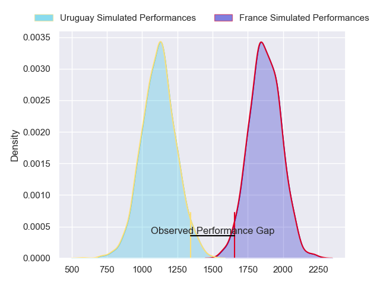
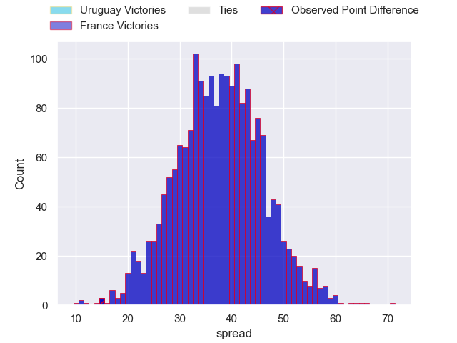
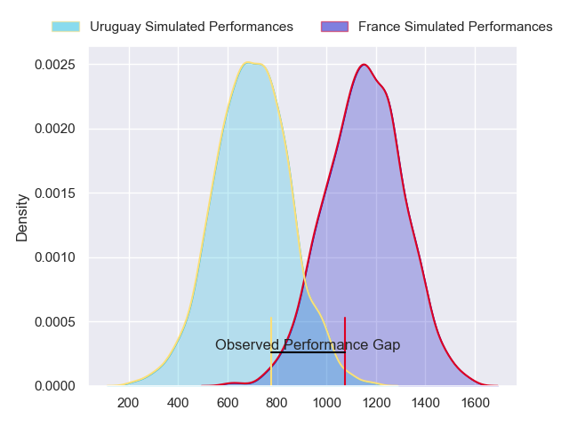
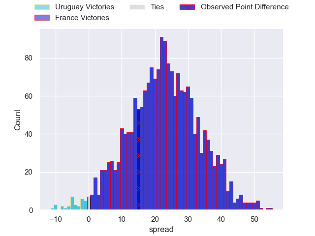
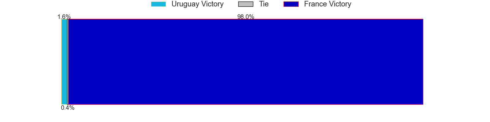
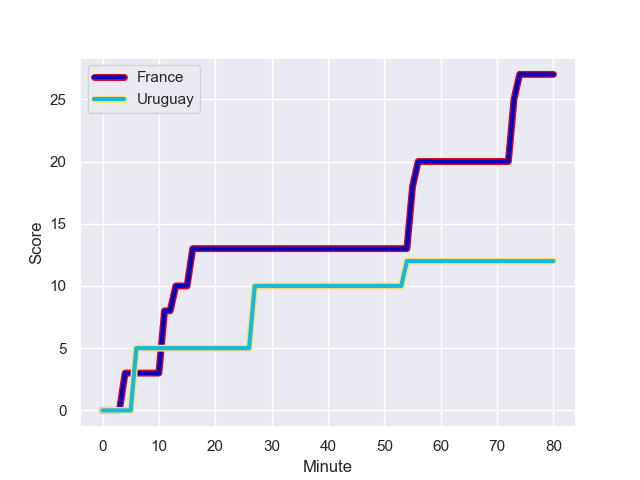
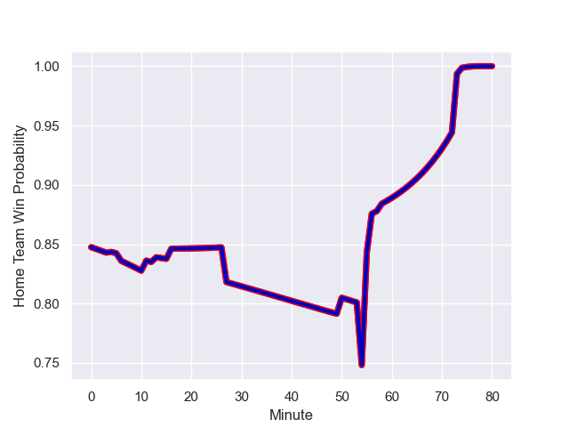

---  
layout: page  
title: Uruguay at France; 12.0-27.0  
date: 2023-09-14 18:00:00 -0500  
categories: match review  
---
# Uruguay at France; 12.0-27.0

# Club Level Predictions

The first set of predictions treats a club as the smallest object, as the club develops its members, organizes a gameplan, and deploys its players as needed for each match. This club model has a prediction of 0.983, which translates to predicting France to win by 37.6.

Each club has a rating and a rating deviation (simiar to a Glicko system), and expected performances can be generated. This allows for simulated matches and spreads like the ones below.
## Projected Performances - Club Model

## Projected Spreads - Club Model

## Projected Results - Club Model

# Player Level Predictions - Version 2

Treating teams instead as an entity made up of the currently active players, I have ratings for each player in an altogether different system. These can be combined to form team ratings once teamsheets are announced, weighting starters a bit higher than the reserves. After the match is played, players can be weighted by their minutes on the field, allowing for an accurate measure of the team's composition. With these compiled team ratings, we can make predictions, measure inaccuracy, and update the individual player ratings.
## Prediction with Player Minutes: France by 18.8

France by 15.2 on a neutral field
## Prediction without Player Minutes: France by 19.1

France by 15.4 on a neutral pitch

## Projected Performances - Player Model

## Projected Spreads - Player Model

## Projected Results - Player Model

## Scores over Time

## Win Probability over Time

There were 5 large changes in win probability in this match

|   Away Minutes | Away Player        |   Away elo |   Number |   Home elo | Home Player          |   Home Minutes |
|---------------:|:-------------------|-----------:|---------:|-----------:|:---------------------|---------------:|
|             50 | Mateo Sanguinetti  |      42.48 |        1 |      82.44 | Jean-Baptiste Gros   |             50 |
|             50 | Guillermo Pujadas  |      87.64 |        2 |      78.35 | Pierre Bourgarit     |             50 |
|             50 | Ignacio Peculo     |      64.13 |        3 |     100.43 | Dorian Aldegheri     |             50 |
|             58 | Felipe Aliaga      |      44.38 |        4 |      60.89 | Cameron Woki         |             58 |
|             80 | Manuel Leindekar   |      14.9  |        5 |      47.58 | Romain Taofifenua    |             50 |
|             54 | Manuel Ardao       |      64.26 |        6 |      37.63 | Paul Boudehent       |             80 |
|             80 | Santiago Civetta   |      70.48 |        7 |      87.64 | Sekou Macalou        |             80 |
|             54 | Manuel Diana       |      46.65 |        8 |     107.52 | Anthony Jelonch      |             50 |
|             58 | Santiago Arata     |      51.44 |        9 |     108.59 | Maxime Lucu          |             64 |
|             58 | Felipe Etcheverry  |      63.89 |       10 |      55.49 | Antoine Hastoy       |             80 |
|             80 | Nicolas Freitas    |      17.11 |       11 |      73.03 | Gabin Villiere       |             80 |
|             80 | Andres Vilaseca    |      16.16 |       12 |      51.79 | Yoram Moefana        |             80 |
|             80 | Tomas Inciarte     |      46.65 |       13 |      57.59 | Arthur Vincent       |             80 |
|             80 | Bautista Basso     |      54.7  |       14 |      58.75 | Louis Bielle-Biarrey |             80 |
|             80 | Baltazar Amaya     |      46.65 |       15 |      66.18 | Melvyn Jaminet       |             80 |
|             30 | Facundo Gattas     |      46.68 |       16 |      83.04 | Peato Mauvaka        |             30 |
|             30 | Matias Benitez     |      46.65 |       17 |      79.26 | Reda Wardi           |             30 |
|             30 | Reinaldo Piussi    |      46.65 |       18 |      49.95 | Sipili Falatea       |             30 |
|             22 | Ignacio Dotti Uria |       4.75 |       19 |      66.33 | Bastien Chalureau    |             30 |
|             26 | Lucas Bianchi      |      70.1  |       20 |      76.66 | Thibaud Flament      |             22 |
|             26 | Carlos Deus        |      68.81 |       21 |     118.68 | Francois Cros        |             30 |
|             22 | Agustin Ormaechea  |      33.63 |       22 |      87.36 | Baptiste Couilloud   |             16 |
|             22 | Felipe Berchesi    |      46.65 |       23 |     118.04 | Thomas Ramos         |              0 |

