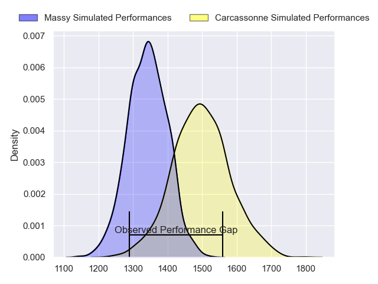
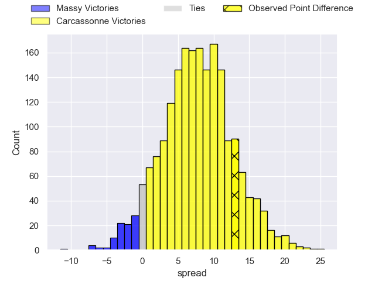
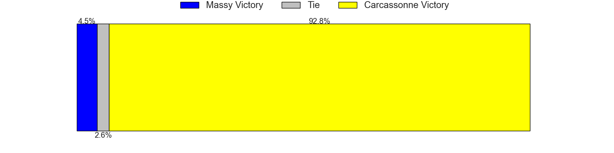
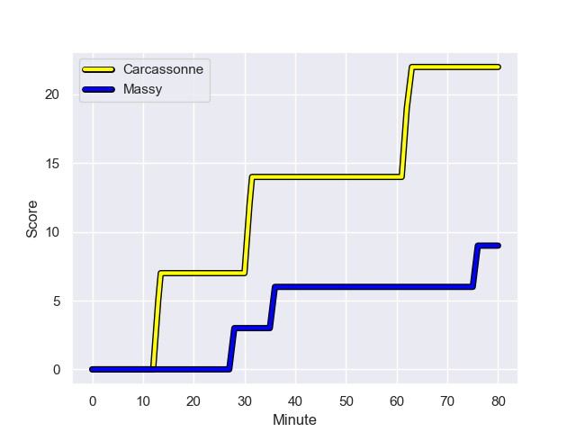
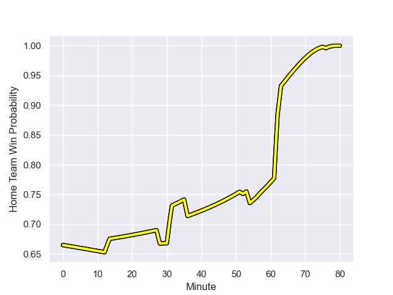

---  
layout: page  
title: Massy at Carcassonne; 9.0-22.0  
date: 2023-09-15 18:00:00 -0500  
categories: match review  
---
# Massy at Carcassonne; 9.0-22.0

# Club Level Predictions

The first set of predictions treats a club as the smallest object, as the club develops its members, organizes a gameplan, and deploys its players as needed for each match. This club model has a prediction of 0.702, which translates to predicting Carcassonne to win by 7.6.

Each club has a rating and a rating deviation (simiar to a Glicko system), and expected performances can be generated. This allows for simulated matches and spreads like the ones below.
## Projected Performances

## Projected Spreads

## Projected Results

# Player Level Predictions - Version 2

Treating teams instead as an entity made up of the currently active players, I have ratings for each player in an altogether different system. These can be combined to form team ratings once teamsheets are announced, weighting starters a bit higher than the reserves. After the match is played, players can be weighted by their minutes on the field, allowing for an accurate measure of the team's composition. With these compiled team ratings, we can make predictions, measure inaccuracy, and update the individual player ratings.
## Prediction with Player Minutes: Carcassonne by 7.6

Carcassonne by 3.4 on a neutral field
## Prediction without Player Minutes: Carcassonne by 7.9

Carcassonne by 3.7 on a neutral pitch

## Scores over Time

## Win Probability over Time

There were 4 large changes in win probability in this match

|   Away Minutes | Away Player              |   Away elo |   Number |   Home elo | Home Player         |   Home Minutes |
|---------------:|:-------------------------|-----------:|---------:|-----------:|:--------------------|---------------:|
|             52 | Fernandez Correa         |       4.3  |        1 |      51.33 | Andrei Ursache      |             57 |
|             66 | Pierre Trassoudaine      |      69.35 |        2 |      42.37 | Raphael Carbou      |             76 |
|             52 | Nicolas Ferrer           |      46.08 |        3 |      20.11 | Vakhtangi Akhobadze |             52 |
|             80 | Abongile Nonkontwana     |       1.25 |        4 |      15.69 | Romain Manchia      |             76 |
|             54 | Andrei Mahu              |       0.94 |        5 |      41.2  | Romain Guyot        |             52 |
|             80 | Hugo Boutin              |      44.75 |        6 |      44.81 | Ferdinand Dreno     |             80 |
|             66 | Marius Ruyffelaere       |      47.01 |        7 |      32.81 | Etienne Herjean     |             80 |
|             80 | Samuel Nollet            |      18.36 |        8 |      48.79 | Carl Fearns         |             52 |
|             80 | Benjamin Prier           |      27.85 |        9 |      41.27 | Damien Añon         |             80 |
|             67 | Tristan Joly             |      46.65 |       10 |      51.22 | Gabin Michet        |             80 |
|             80 | Yanis Dit Robaglia       |      30.41 |       11 |      57.07 | Clement Egiziano    |             80 |
|             77 | Tom Cusson               |      37.94 |       12 |      14.38 | Jordan Puletua      |             80 |
|             80 | Arthur Seigneuret        |      47.46 |       13 |      46.65 | Mathys Barka        |             63 |
|             80 | Alex Preira              |      65.11 |       14 |      65.52 | Léo Darrelatour     |             80 |
|             80 | Giorgi Gogoladze         |      40.54 |       15 |      51.71 | Maxime Gianet       |             69 |
|             28 | Tijde Visser             |      40.59 |       16 |      64.64 | Gary Graham         |             28 |
|             28 | Robin Poipy              |      44.26 |       17 |      37.36 | Florent Lorenzon    |             28 |
|             26 | Saba Pesvianidze         |      60.25 |       18 |      25.32 | Clément Fontaine    |             28 |
|             14 | Tony Tissot              |      38.65 |       19 |      55.26 | Fabien Lorenzon     |             23 |
|             14 | Pierre-Alexandre Duclieu |      44.16 |       20 |      39.92 | Tutuila Vaea        |             17 |
|             13 | Lucas Rubio              |      23.55 |       21 |      49.3  | Mesake Kurisaru     |             11 |
|              3 | Mathys Bigot             |      46.65 |       22 |      45.15 | Jason Nel           |              4 |
|            nan | nan                      |     nan    |       23 |      46.65 | Baptiste Moreno     |              4 |

