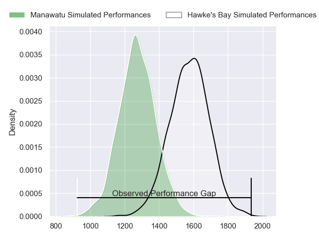
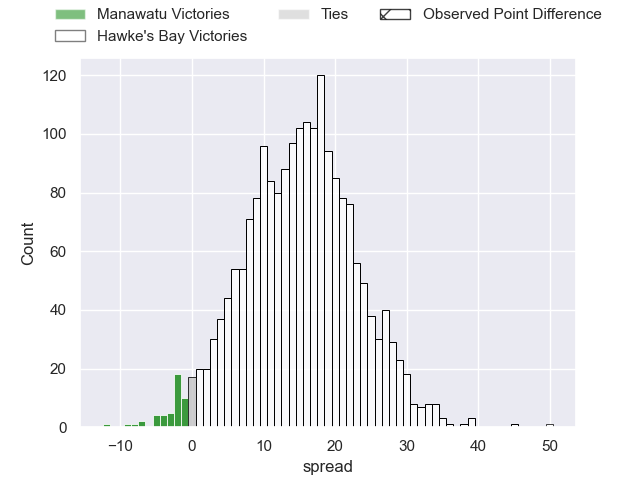
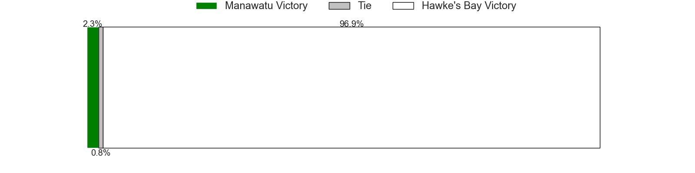
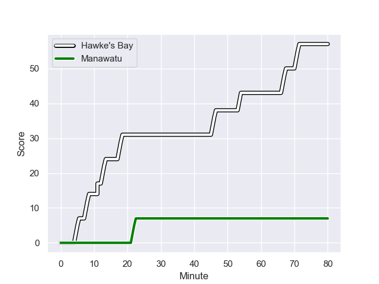
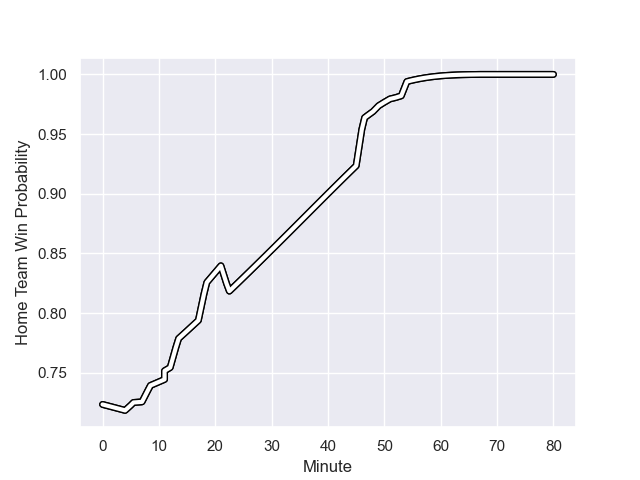

---  
layout: page  
title: Manawatu at Hawke's Bay; 7.0-57.0  
date: 2023-09-15 18:00:00 -0500  
categories: match review  
---
# Manawatu at Hawke's Bay; 7.0-57.0

# Club Level Predictions

The first set of predictions treats a club as the smallest object, as the club develops its members, organizes a gameplan, and deploys its players as needed for each match. This club model has a prediction of 0.843, which translates to predicting Hawke's Bay to win by 15.4.

Each club has a rating and a rating deviation (simiar to a Glicko system), and expected performances can be generated. This allows for simulated matches and spreads like the ones below.
## Projected Performances

## Projected Spreads

## Projected Results

# Player Level Predictions - Version 2

Treating teams instead as an entity made up of the currently active players, I have ratings for each player in an altogether different system. These can be combined to form team ratings once teamsheets are announced, weighting starters a bit higher than the reserves. After the match is played, players can be weighted by their minutes on the field, allowing for an accurate measure of the team's composition. With these compiled team ratings, we can make predictions, measure inaccuracy, and update the individual player ratings.
## Prediction with Player Minutes: Hawke's Bay by 10.5

Hawke's Bay by 7.2 on a neutral field
## Prediction without Player Minutes: Hawke's Bay by 11.0

Hawke's Bay by 7.6 on a neutral pitch

## Scores over Time

## Win Probability over Time

There were 1 large changes in win probability in this match

|   Away Minutes | Away Player          |   Away elo |   Number |   Home elo | Home Player          |   Home Minutes |
|---------------:|:---------------------|-----------:|---------:|-----------:|:---------------------|---------------:|
|             49 | Cole Keith           |      64.08 |        1 |      47.7  | Pouri Rakete-Stones  |             57 |
|             57 | AJ Quattrin          |      46.4  |        2 |      38.15 | Tyrone Thompson      |             60 |
|             49 | Flyn Yates           |      29.09 |        3 |      68.16 | Joel Hintz           |             57 |
|             80 | Stan van den Hoven   |      31.86 |        4 |      44.29 | Geoff Cridge         |             60 |
|             80 | Ofa Tauatevalu       |      36.1  |        5 |      47.63 | Tom Parsons          |             80 |
|             80 | TK Howden            |      15.73 |        6 |      52.31 | Josh Kaifa           |             60 |
|             54 | Slade McDowall       |      78.91 |        7 |      44.2  | Sam Smith            |             80 |
|             61 | Brayden Iose         |      10.31 |        8 |      23.53 | Marino Mikaele-Tu'u  |             80 |
|             52 | Jordi Viljoen        |      45.94 |        9 |      94.7  | Brad Weber           |             59 |
|             80 | Isaiah Ravula        |      50.43 |       10 |      42.49 | Lincoln McClutchie   |             80 |
|             80 | James Tofa           |      26.9  |       11 |      48.69 | Jonah Lowe           |             80 |
|             57 | Kegan Christian-Goss |      48.83 |       12 |      50.47 | Chase Tiatia         |             80 |
|             80 | Drew Wild            |      41.58 |       13 |      11.66 | Nick Grigg           |             80 |
|             80 | Tima Fainga'anuku    |      17.63 |       14 |      49.27 | Ollie Sapsford       |             59 |
|             53 | Beaudein Waaka       |      -2.79 |       15 |      74.31 | Caleb Makene         |             52 |
|             31 | Joseph Gavigan       |      29.36 |       16 |      42.89 | Bo Abra              |             23 |
|             31 | Feleti Sae-Ta'ufo'ou |      44.98 |       17 |      47.35 | Timothy John Farrell |             23 |
|             23 | Vernon Bason         |      44.83 |       18 |      60.98 | Kianu Kereru-Symes   |             20 |
|             26 | Johnny Galloway      |      34.89 |       19 |      48.42 | Frank Lochore        |             20 |
|             19 | Terrell Peita        |      66.54 |       20 |      45.45 | Patrick Tuifua       |             20 |
|             28 | Luke Campbell        |      31.96 |       21 |      46.32 | Sam Wye              |             21 |
|             23 | Jason Emery          |      27.07 |       22 |      35.85 | Lolagi Visinia       |             28 |
|             27 | Nehe Milner-Skudder  |      17.71 |       23 |      21.78 | Paula Balekana       |             21 |

