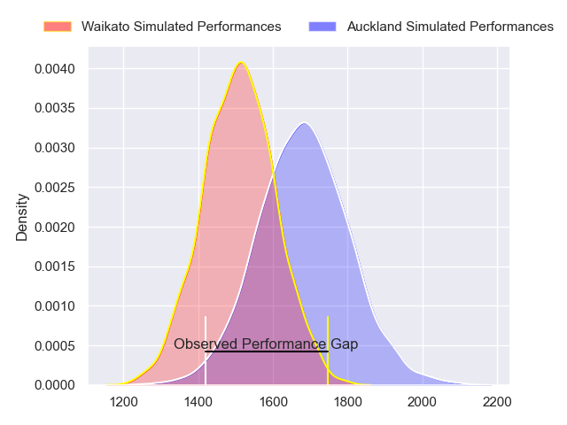
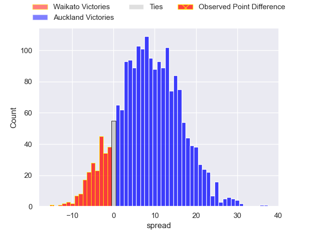
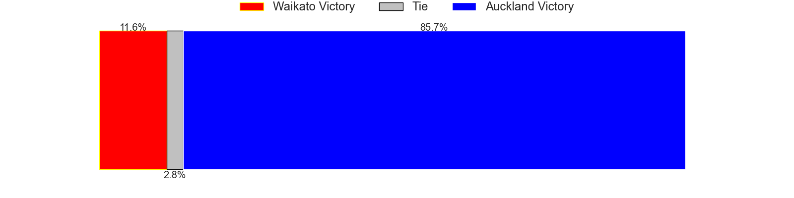
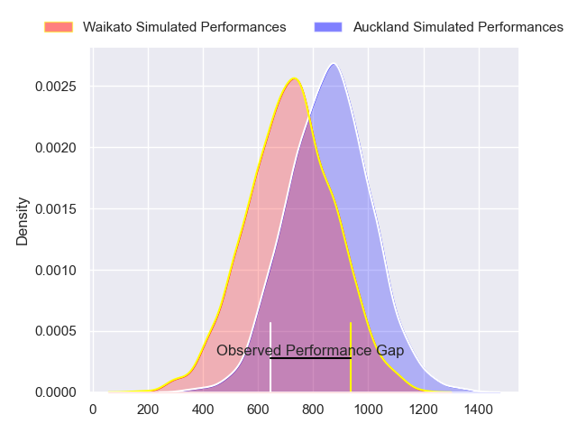
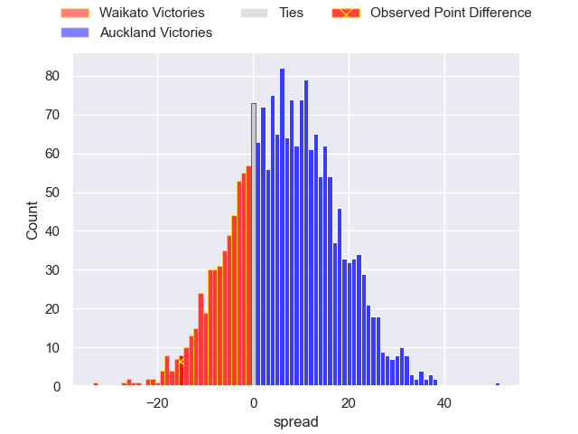
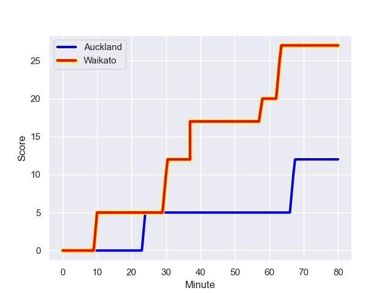
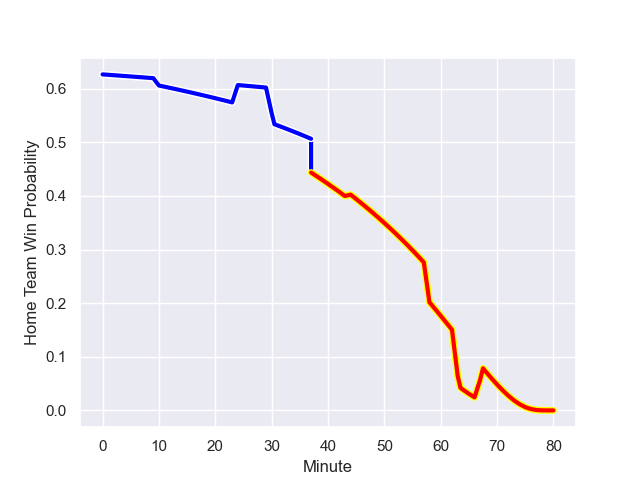

---  
layout: page  
title: Waikato at Auckland; 27.0-12.0  
date: 2023-09-16 18:00:00 -0500  
categories: match review  
---
# Waikato at Auckland; 27.0-12.0

# Club Level Predictions

The first set of predictions treats a club as the smallest object, as the club develops its members, organizes a gameplan, and deploys its players as needed for each match. This club model has a prediction of 0.721, which translates to predicting Auckland to win by 8.6.

Each club has a rating and a rating deviation (simiar to a Glicko system), and expected performances can be generated. This allows for simulated matches and spreads like the ones below.
## Projected Performances - Club Model

## Projected Spreads - Club Model

## Projected Results - Club Model

# Player Level Predictions - Version 2

Treating teams instead as an entity made up of the currently active players, I have ratings for each player in an altogether different system. These can be combined to form team ratings once teamsheets are announced, weighting starters a bit higher than the reserves. After the match is played, players can be weighted by their minutes on the field, allowing for an accurate measure of the team's composition. With these compiled team ratings, we can make predictions, measure inaccuracy, and update the individual player ratings.
## Prediction with Player Minutes: Auckland by 5.7

Auckland by 2.3 on a neutral field
## Prediction without Player Minutes: Auckland by 5.4

Auckland by 2.0 on a neutral pitch

## Projected Performances - Player Model

## Projected Spreads - Player Model

## Projected Results - Player Model

## Scores over Time

## Win Probability over Time

There were 6 large changes in win probability in this match

|   Away Minutes | Away Player            |   Away elo |   Number |   Home elo | Home Player         |   Home Minutes |
|---------------:|:-----------------------|-----------:|---------:|-----------:|:--------------------|---------------:|
|             44 | Ayden Johnstone        |      80.16 |        1 |      50.98 | Josh Fusitua        |             53 |
|             45 | Caleb Ralph            |      45.37 |        2 |      17.34 | Leni Apisai         |             80 |
|             65 | George Dyer            |      55.47 |        3 |      86.26 | Angus Ta'avao       |             53 |
|             80 | James Tucker           |      62.1  |        4 |      37.33 | Edward Annandale    |             53 |
|             53 | Hamilton Burr          |      41.36 |        5 |      39.61 | Hamish Dalzell      |             80 |
|             80 | Samipeni Finau         |      64.03 |        6 |      48.74 | Adrian Choat        |             80 |
|             61 | Joe Johnston           |      26.97 |        7 |      71.66 | Blake Gibson        |             80 |
|             68 | Simon Parker           |      33.95 |        8 |      37.54 | Vaiolini Ekuasi     |             63 |
|             75 | Xavier Roe             |      29.76 |        9 |      30.36 | Taufa Funaki        |             44 |
|             80 | Tepaea Cook-Savage     |      38.9  |       10 |      64.47 | Zarn Sullivan       |             80 |
|             50 | Aki Tuivailala         |      46.65 |       11 |      49.22 | AJ Lam              |             80 |
|             80 | Austin Anderson        |      42.79 |       12 |     113.59 | Bryce Heem          |             80 |
|             80 | Tana Tuhakaraina       |      47.24 |       13 |      52.31 | Corey Evans         |             44 |
|             80 | Cody Nordstrom         |      45.32 |       14 |      46.65 | Xavier TIto-Harris  |             47 |
|             80 | Daniel Sinkinson       |      48.39 |       15 |      33.68 | Roger Tuivasa-Sheck |             80 |
|             36 | Ollie Norris           |      60.84 |       16 |      44.87 | Che Clark           |             27 |
|             15 | Solomone Tukuafu       |      54.76 |       17 |      33.41 | Niko Jones          |             17 |
|             35 | Pita Anae Ah-Sue       |      56.21 |       18 |      49.53 | Kalani Thomas       |             36 |
|             27 | Laghlan McWhannell     |      86.18 |       19 |      34.98 | Tanielu Teleʻa      |             36 |
|             12 | Xavier Saifoloi        |      41.72 |       20 |      78.86 | Salesi Rayasi       |             33 |
|             19 | Jack Lam               |      20.28 |       21 |      46.62 | Sione Ahio          |             27 |
|             30 | Malachi Wrampling-Alec |      48.89 |       22 |      43.33 | Ben Ake             |             15 |
|              5 | Quintony Ngatai        |      46.65 |       23 |      27.93 | Joe Royal           |             12 |

