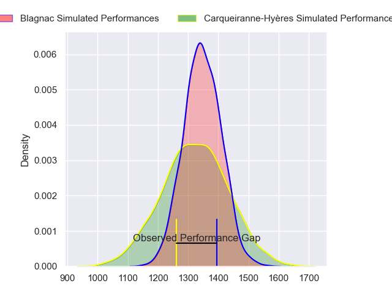
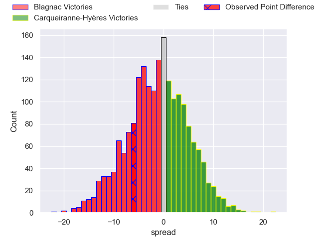
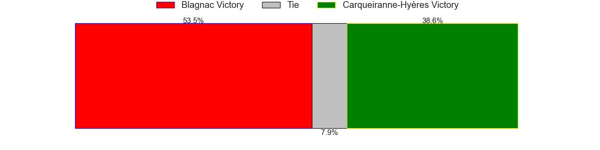
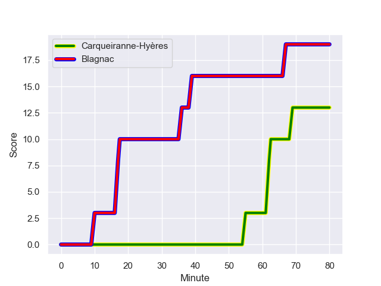
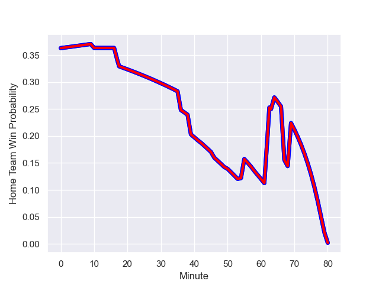

---  
layout: page  
title: Blagnac at Carqueiranne-Hyères; 19.0-13.0  
date: 2023-09-16 18:00:00 -0500  
categories: match review  
---
# Blagnac at Carqueiranne-Hyères; 19.0-13.0

# Club Level Predictions

The first set of predictions treats a club as the smallest object, as the club develops its members, organizes a gameplan, and deploys its players as needed for each match. This club model has a prediction of 0.472, which translates to predicting Blagnac to win by 1.0.

Each club has a rating and a rating deviation (simiar to a Glicko system), and expected performances can be generated. This allows for simulated matches and spreads like the ones below.
## Projected Performances

## Projected Spreads

## Projected Results

# Player Level Predictions - Version 2

Treating teams instead as an entity made up of the currently active players, I have ratings for each player in an altogether different system. These can be combined to form team ratings once teamsheets are announced, weighting starters a bit higher than the reserves. After the match is played, players can be weighted by their minutes on the field, allowing for an accurate measure of the team's composition. With these compiled team ratings, we can make predictions, measure inaccuracy, and update the individual player ratings.
## Prediction with Player Minutes: Blagnac by 6.2

Blagnac by 9.3 on a neutral field
## Prediction without Player Minutes: Blagnac by 6.1

Blagnac by 9.2 on a neutral pitch

## Scores over Time

## Win Probability over Time

There were 10 large changes in win probability in this match

|   Away Minutes | Away Player         |   Away elo |   Number |   Home elo | Home Player              |   Home Minutes |
|---------------:|:--------------------|-----------:|---------:|-----------:|:-------------------------|---------------:|
|             50 | Alexis Decaux       |      59.89 |        1 |      46.26 | Sti Sithole              |             58 |
|             64 | Gabin Villerouge    |      49.45 |        2 |      40.57 | Yan Tabarot              |             80 |
|             50 | Victor Delmas       |      54.45 |        3 |      48.31 | Lasha Mchelidze          |             58 |
|             80 | Nikita Bekov        |      75.03 |        4 |      25.25 | Adam Peters              |             80 |
|             64 | Victor Fromenteze   |       8.62 |        5 |      13.74 | Lucas Cazac              |             46 |
|             80 | Simon Veyrac        |      60.12 |        6 |      48.74 | Florian Munoz Rivero     |             80 |
|             80 | Ianis Ponsole       |      67.31 |        7 |      51.63 | Joachim Beaumont         |             80 |
|             54 | Mathieu Vachon      |      62.22 |        8 |      46.65 | Johann Afonso Grundlingh |             46 |
|             80 | Bernard Reggiardo   |      48.24 |        9 |      44.4  | Jérémy Fleury            |             46 |
|             64 | Ugo Seunes          |      64.42 |       10 |      36.32 | Juan Kotze               |             80 |
|             80 | Thibault Moleana    |      47.04 |       11 |      46.06 | Paul Gadea               |             80 |
|             80 | Aurelien Labau      |      62.03 |       12 |      33.59 | Dylan Sage               |             80 |
|             54 | Lukas Doyhenard     |      57.66 |       13 |      32.71 | Charles Brousse          |             80 |
|             80 | Peïo Retegui        |      46.65 |       14 |      25.35 | Vincent Alessi           |             42 |
|             80 | Gérald Augustin     |      45.74 |       15 |      37.66 | Théo Defrance            |             80 |
|             30 | Antoine Marty-Rybak |      51.06 |       16 |      44.31 | Ferdinand Changel        |             22 |
|             16 | Benjamin Bertrand   |      49.91 |       17 |      39.39 | Miguel Mathieu           |             22 |
|             30 | Baptiste Collet     |      54.85 |       18 |      26.2  | Nathan Gendre            |             34 |
|             16 | Lucas Tolofua       |      40.32 |       19 |      33.27 | Nicolas Baquer           |             34 |
|             26 | Bastien Gest        |      49.82 |       20 |      32.04 | Rémi Dubié               |             34 |
|             16 | Antoine Renaud      |      26.33 |       21 |      27.01 | Michael Tyumenev         |             38 |
|             26 | Clément Vareilles   |      38.94 |       22 |     nan    | nan                      |            nan |

