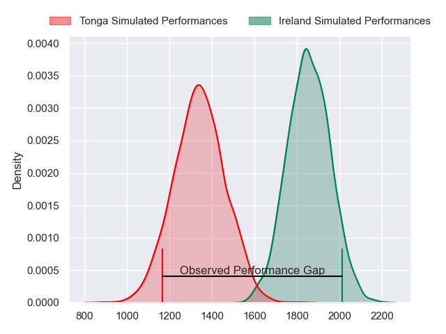
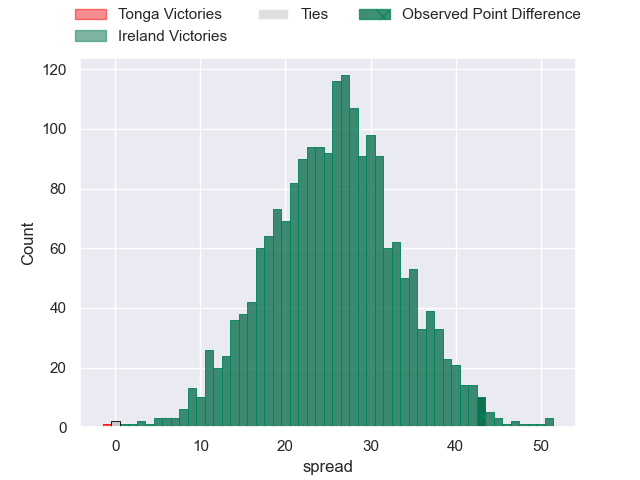
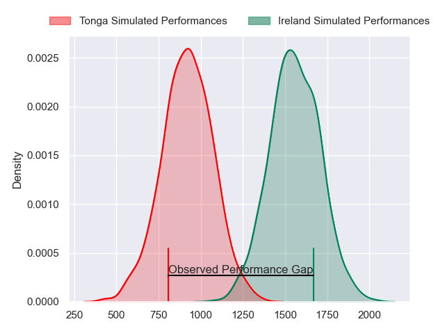
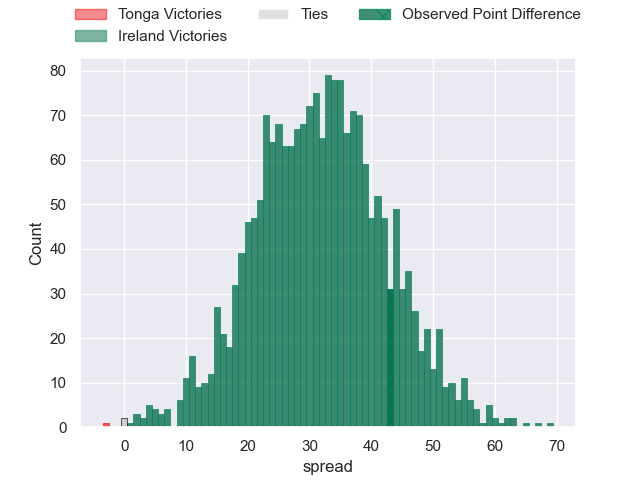
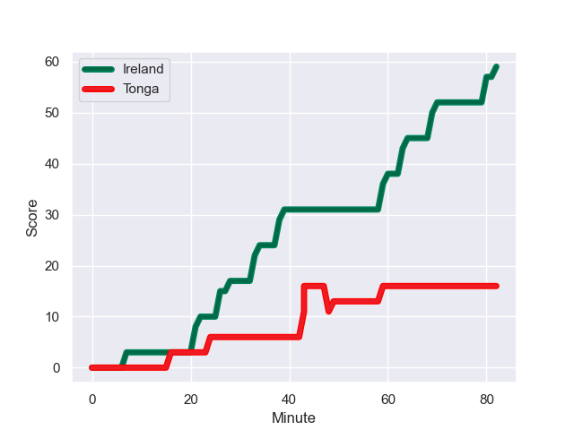
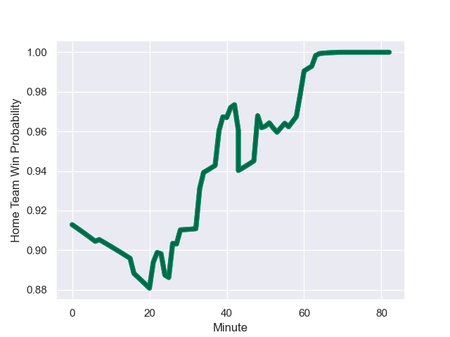

---  
layout: page  
title: Tonga at Ireland; 16.0-59.0  
date: 2023-09-16 18:00:00 -0500  
categories: match review  
---
# Tonga at Ireland; 16.0-59.0

# Club Level Predictions

The first set of predictions treats a club as the smallest object, as the club develops its members, organizes a gameplan, and deploys its players as needed for each match. This club model has a prediction of 0.942, which translates to predicting Ireland to win by 25.8.

Each club has a rating and a rating deviation (simiar to a Glicko system), and expected performances can be generated. This allows for simulated matches and spreads like the ones below.
## Projected Performances - Club Model

## Projected Spreads - Club Model

## Projected Results - Club Model

# Player Level Predictions - Version 2

Treating teams instead as an entity made up of the currently active players, I have ratings for each player in an altogether different system. These can be combined to form team ratings once teamsheets are announced, weighting starters a bit higher than the reserves. After the match is played, players can be weighted by their minutes on the field, allowing for an accurate measure of the team's composition. With these compiled team ratings, we can make predictions, measure inaccuracy, and update the individual player ratings.
## Prediction with Player Minutes: Ireland by 25.8

Ireland by 25.8 on a neutral field
## Prediction without Player Minutes: Ireland by 25.8

Ireland by 25.8 on a neutral pitch

## Projected Performances - Player Model

## Projected Spreads - Player Model

## Projected Results - Player Model

## Scores over Time

## Win Probability over Time

|   Away Minutes | Away Player          |   Away elo |   Number |   Home elo | Home Player        |   Home Minutes |
|---------------:|:---------------------|-----------:|---------:|-----------:|:-------------------|---------------:|
|             68 | Siegfried Fisi'ihoi  |      47.5  |        1 |      78.25 | Andrew Porter      |             41 |
|             50 | Paula Ngauamo        |      64.87 |        2 |      75.69 | Ronan Kelleher     |             41 |
|             60 | Ben Tameifuna        |      88.69 |        3 |      90.43 | Tadhg Furlong      |             73 |
|             82 | Sam Lousi            |      76.17 |        4 |     135.05 | Tadhg Beirne       |             82 |
|             71 | Leva Fifita          |      20.13 |        5 |      88.52 | James Ryan         |             50 |
|             52 | Tanginoa Halaifonua  |      27.01 |        6 |      97.69 | Peter O'Mahony     |             82 |
|             82 | Sione Havili Talitui |     100.38 |        7 |     117.59 | Josh van der Flier |             82 |
|             60 | Vaea Fifita          |     116.29 |        8 |     108.04 | Caelan Doris       |             53 |
|             41 | Augustine Pulu       |      46.65 |        9 |     111.29 | Conor Murray       |             56 |
|             82 | William Havili       |      56.67 |       10 |     111.12 | Johnny Sexton      |             40 |
|             71 | Solomone Kata        |      51.63 |       11 |     167.21 | James Lowe         |             82 |
|             82 | Pita Ahki            |      43.89 |       12 |     116.93 | Bundee Aki         |             82 |
|             82 | Malakai Fekitoa      |      77.33 |       13 |     115.14 | Garry Ringrose     |             50 |
|             82 | Afusipa Taumoepeau   |      74.03 |       14 |      73.4  | Mack Hansen        |             82 |
|             82 | Charles Piutau       |      76.35 |       15 |     116.5  | Hugo Keenan        |             82 |
|             32 | Samiuela Moli        |      33.34 |       16 |      75.08 | Rob Herring        |             41 |
|             22 | Joe Apikotoa         |      46.65 |       17 |      80.88 | Dave Kilcoyne      |             41 |
|             14 | Tau Koloamatangi     |      64.15 |       18 |      89.87 | Finlay Bealham     |              9 |
|             11 | Semisi Paea          |      46.65 |       19 |      71.93 | Iain Henderson     |             32 |
|             30 | Solomone Funaki      |      68.31 |       20 |      68.96 | Ryan Baird         |             29 |
|             22 | Sione Vailanu        |      46.5  |       21 |      68.41 | Craig Casey        |             26 |
|             41 | Sonatane Takulua     |      14.1  |       22 |      93.9  | Ross Byrne         |             42 |
|             11 | Fine Inisi           |      28.73 |       23 |      92.13 | Robbie Henshaw     |             32 |

