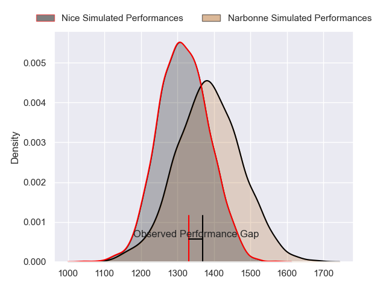
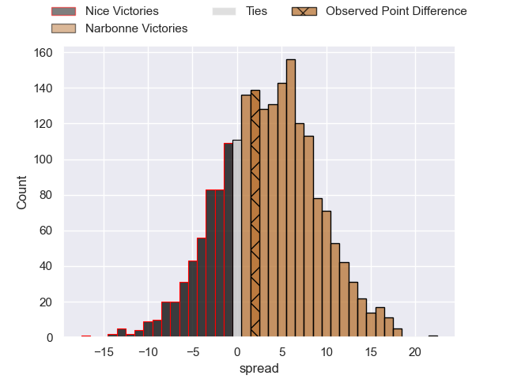
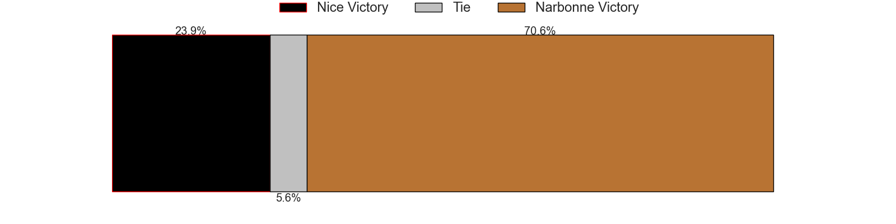
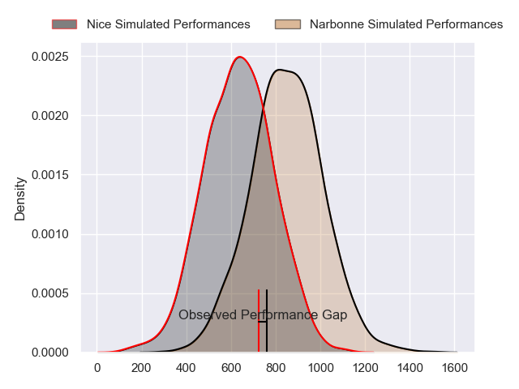
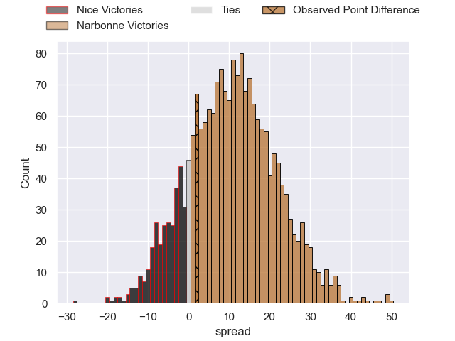
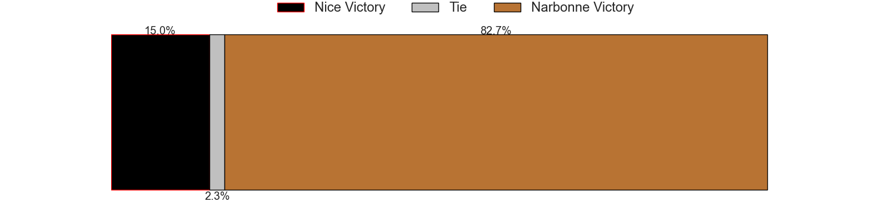
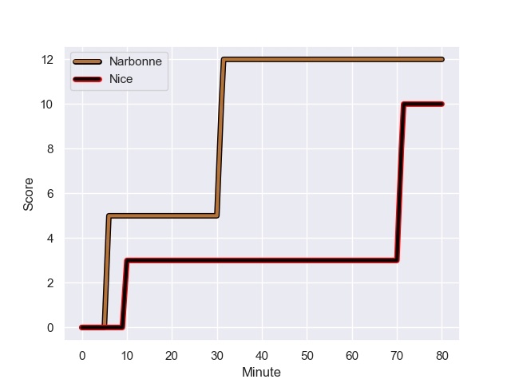
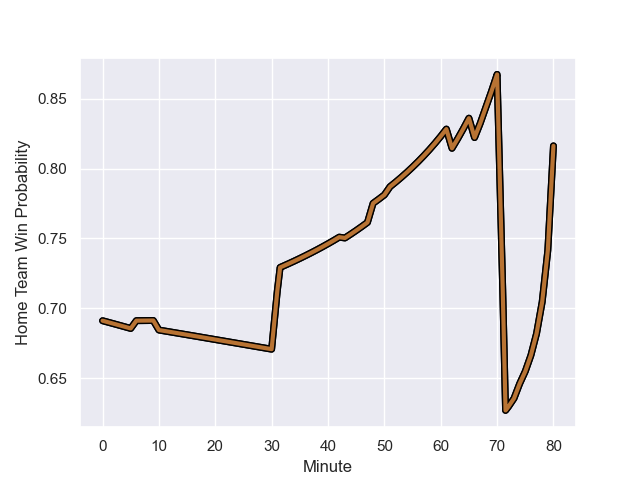

---  
layout: page  
title: Nice at Narbonne; 10.0-12.0  
date: 2023-09-16 18:00:00 -0500  
categories: match review  
---
# Nice at Narbonne; 10.0-12.0

# Club Level Predictions

The first set of predictions treats a club as the smallest object, as the club develops its members, organizes a gameplan, and deploys its players as needed for each match. This club model has a prediction of 0.599, which translates to predicting Narbonne to win by 3.6.

Each club has a rating and a rating deviation (simiar to a Glicko system), and expected performances can be generated. This allows for simulated matches and spreads like the ones below.
## Projected Performances - Club Model

## Projected Spreads - Club Model

## Projected Results - Club Model

# Player Level Predictions - Version 2

Treating teams instead as an entity made up of the currently active players, I have ratings for each player in an altogether different system. These can be combined to form team ratings once teamsheets are announced, weighting starters a bit higher than the reserves. After the match is played, players can be weighted by their minutes on the field, allowing for an accurate measure of the team's composition. With these compiled team ratings, we can make predictions, measure inaccuracy, and update the individual player ratings.
## Prediction with Player Minutes: Narbonne by 8.9

Narbonne by 4.3 on a neutral field
## Prediction without Player Minutes: Narbonne by 9.2

Narbonne by 4.7 on a neutral pitch

## Projected Performances - Player Model

## Projected Spreads - Player Model

## Projected Results - Player Model

## Scores over Time

## Win Probability over Time

There were 5 large changes in win probability in this match

|   Away Minutes | Away Player              |   Away elo |   Number |   Home elo | Home Player            |   Home Minutes |
|---------------:|:-------------------------|-----------:|---------:|-----------:|:-----------------------|---------------:|
|             48 | Sunia Vola               |      57.01 |        1 |      52.06 | Théo Castinel          |             51 |
|             60 | Sione Anga'aelangi       |      49.2  |        2 |      53.23 | Christophe David       |             43 |
|             51 | Luvuyo Pupuma            |      22.01 |        3 |      47.13 | Levi Tikoipau          |             68 |
|             51 | Thibault Rey             |       6.28 |        4 |      53.44 | Marius Antonescu       |             80 |
|             80 | Adrien Vigne             |      53.61 |        5 |      30.97 | Dennis Visser          |             66 |
|             80 | Ramiha Tarrel Tia Smiler |      46.65 |        6 |      49.68 | Thibault Clauzade      |             60 |
|             62 | Bastien Berenguel        |      12.54 |        7 |      38.57 | Bill Caffo             |             80 |
|             62 | Martin Freytes           |      58.02 |        8 |      41.04 | Baptiste Abescat-Leroy |             65 |
|             60 | Jules Solinas            |      39.05 |        9 |      46.41 | Pierrick Nova          |             51 |
|             80 | Romain Riguet            |      39.74 |       10 |      46.27 | Tom Chauvet            |             80 |
|             80 | Andrzej Charlat          |      55.29 |       11 |      26.68 | Sébastien Giorgis      |             80 |
|             80 | Nathan Courtade          |      40.37 |       12 |     112.61 | Peter Betham           |             80 |
|             80 | Baptiste Lafond          |      21.93 |       13 |      51.52 | Pierre Nueno           |             80 |
|             66 | Hugo Martin              |      37.31 |       14 |      30.31 | Ambrose Curtis         |             74 |
|             80 | David Odiete             |      56.68 |       15 |      50.03 | Paul Auradou           |             80 |
|             32 | Jules Martinez           |      30.01 |       16 |      33.96 | Sylvain Abadie         |             29 |
|             20 | Pierre Strippoli         |      38.8  |       17 |      46.26 | Gabriel Atlan          |             37 |
|             29 | Kevin Yameogo            |      28.58 |       18 |      44.67 | Avto Gogiashvili       |             12 |
|             29 | Tom Murday               |     105.11 |       19 |      50.54 | Mauro Rebussone        |             14 |
|             18 | Laijiasa Bolenaivalu     |      70.88 |       20 |      50.11 | Arthur Christienne     |             20 |
|             18 | Louis Vincent            |      44.28 |       21 |      61.69 | Luke Nakobukobua       |             15 |
|             20 | Corentin Penc'hoat       |      46.54 |       22 |      78.52 | Josh Valentine         |             29 |
|             14 | Mathis Viard             |      56.62 |       23 |      34.53 | Étienne Ducom          |              6 |

