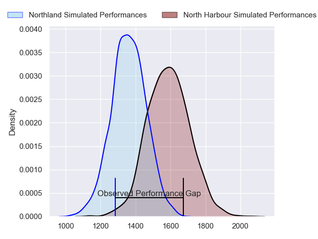
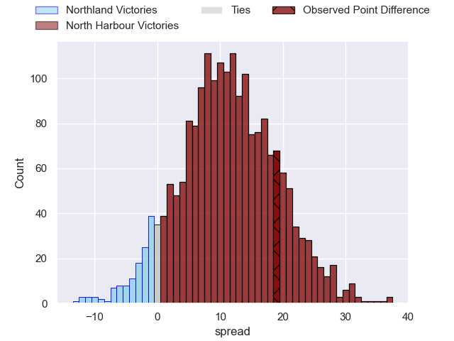
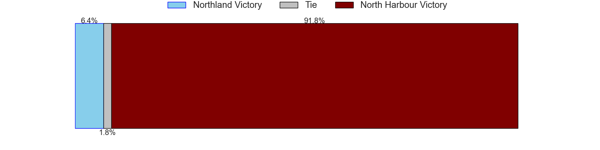
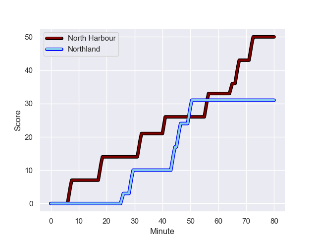
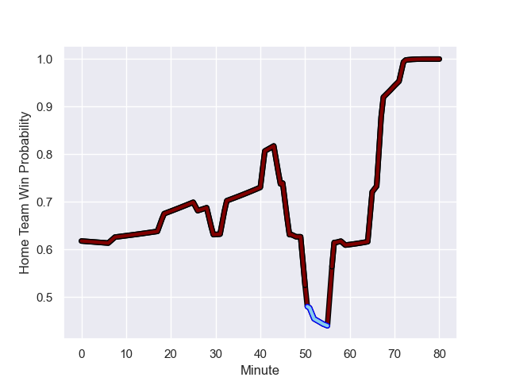

---  
layout: page  
title: Northland at North Harbour; 31.0-50.0  
date: 2023-09-16 18:00:00 -0500  
categories: match review  
---
# Northland at North Harbour; 31.0-50.0

# Club Level Predictions

The first set of predictions treats a club as the smallest object, as the club develops its members, organizes a gameplan, and deploys its players as needed for each match. This club model has a prediction of 0.772, which translates to predicting North Harbour to win by 11.1.

Each club has a rating and a rating deviation (simiar to a Glicko system), and expected performances can be generated. This allows for simulated matches and spreads like the ones below.
## Projected Performances

## Projected Spreads

## Projected Results

# Player Level Predictions - Version 2

Treating teams instead as an entity made up of the currently active players, I have ratings for each player in an altogether different system. These can be combined to form team ratings once teamsheets are announced, weighting starters a bit higher than the reserves. After the match is played, players can be weighted by their minutes on the field, allowing for an accurate measure of the team's composition. With these compiled team ratings, we can make predictions, measure inaccuracy, and update the individual player ratings.
## Prediction with Player Minutes: North Harbour by 5.3

North Harbour by 1.9 on a neutral field
## Prediction without Player Minutes: North Harbour by 6.1

North Harbour by 2.7 on a neutral pitch

## Scores over Time

## Win Probability over Time

There were 16 large changes in win probability in this match

|   Away Minutes | Away Player           |   Away elo |   Number |   Home elo | Home Player       |   Home Minutes |
|---------------:|:----------------------|-----------:|---------:|-----------:|:------------------|---------------:|
|             55 | Jarred Adams          |      51.41 |        1 |      75.65 | Nic Mayhew        |             52 |
|             55 | Matt Moulds           |      41.6  |        2 |      45.65 | Shilo Klein       |             75 |
|             37 | Coree Te Whata-Colley |      38.37 |        3 |      60.03 | Tevita Mafileo    |             66 |
|             41 | Sam Caird             |      -5.08 |        4 |      82.58 | Ben Grant         |             80 |
|             80 | Allan Craig           |      52.69 |        5 |      12.69 | Mahroni Ngakuru   |             52 |
|             80 | Rob Rush              |      34.2  |        6 |      52.05 | Tamarau McGahan   |             66 |
|             58 | Jonah Mau'u           |      50.5  |        7 |      55.08 | Jed Melvin        |             80 |
|             80 | Matt Polwart-Matich   |      54.99 |        8 |      46.73 | Cameron Suafoa    |             80 |
|             59 | Lisati Milo-Harris    |      26.44 |        9 |      12.54 | Jamie Booth       |             72 |
|             66 | Rivez Reihana         |      44.68 |       10 |      77.73 | Bryn Gatland      |             80 |
|             80 | Heremaia Murray       |      43.37 |       11 |      50.06 | Moses Leo         |             80 |
|             48 | Rene Ranger           |      37.74 |       12 |      25.81 | Henry Taefu       |             75 |
|             80 | Jack Goodhue          |     104.2  |       13 |      41.11 | Tom Barham        |             70 |
|             80 | Jordan Trainor        |      74.26 |       14 |      45.13 | Kade Banks        |             80 |
|             80 | Joshua Moorby         |      59.57 |       15 |      82.97 | Shaun Stevenson   |             80 |
|             25 | Rob Cobb              |      47.15 |       16 |      41.5  | Tevita Langi      |             28 |
|             43 | Nelson Rebolo         |      54.19 |       17 |      72.95 | Sione Mafileo     |             14 |
|             25 | Jordan Olsen          |      41.95 |       18 |      46.56 | Bryn Gordon       |              5 |
|             39 | Liam Hallam-Eames     |       5.26 |       19 |      49.76 | Lotu Inisi        |             28 |
|             21 | Trent Hape            |      47.5  |       20 |      43.03 | Karl Ruzich       |             14 |
|             22 | Matt Letoga           |      46.65 |       21 |      48.03 | Siaosi Nginingini |              8 |
|             32 | Tamati Tua            |      46.17 |       22 |      40.78 | Oscar Koller      |              5 |
|             14 | Daniel Hawkins        |      30.04 |       23 |      46.65 | Sofai Maka        |             10 |

