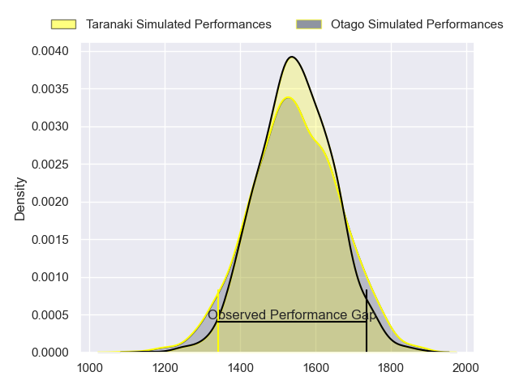
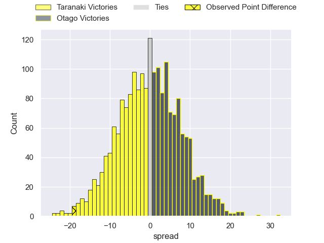
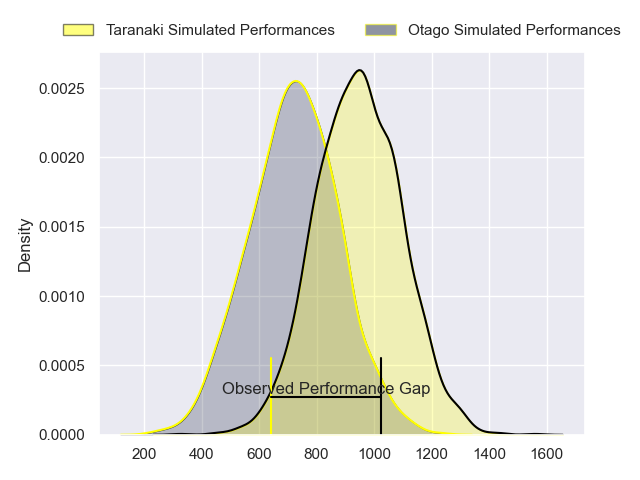
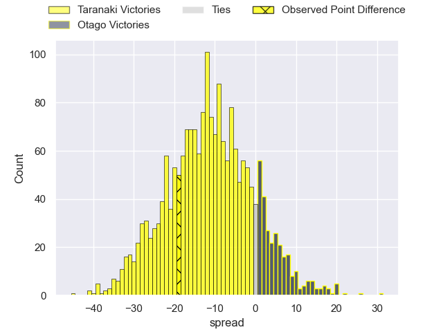
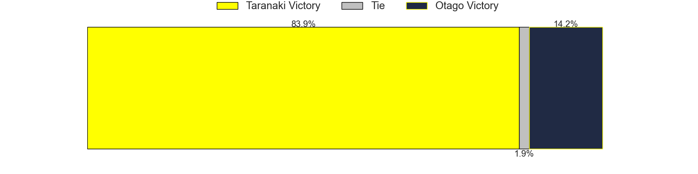
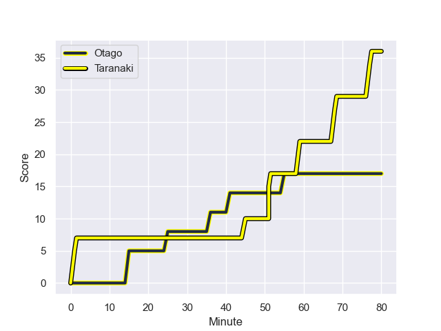
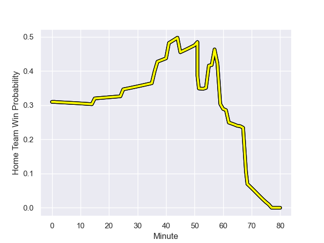

---  
layout: page  
title: Taranaki at Otago; 36.0-17.0  
date: 2023-09-16 18:00:00 -0500  
categories: match review  
---
# Taranaki at Otago; 36.0-17.0

# Club Level Predictions

The first set of predictions treats a club as the smallest object, as the club develops its members, organizes a gameplan, and deploys its players as needed for each match. This club model has a prediction of 0.493, which translates to predicting Taranaki to win by 0.3.

Each club has a rating and a rating deviation (simiar to a Glicko system), and expected performances can be generated. This allows for simulated matches and spreads like the ones below.
## Projected Performances - Club Model

## Projected Spreads - Club Model

## Projected Results - Club Model

# Player Level Predictions - Version 2

Treating teams instead as an entity made up of the currently active players, I have ratings for each player in an altogether different system. These can be combined to form team ratings once teamsheets are announced, weighting starters a bit higher than the reserves. After the match is played, players can be weighted by their minutes on the field, allowing for an accurate measure of the team's composition. With these compiled team ratings, we can make predictions, measure inaccuracy, and update the individual player ratings.
## Prediction with Player Minutes: Taranaki by 8.8

Taranaki by 12.2 on a neutral field
## Prediction without Player Minutes: Taranaki by 8.5

Taranaki by 11.9 on a neutral pitch

## Projected Performances - Player Model

## Projected Spreads - Player Model

## Projected Results - Player Model

## Scores over Time

## Win Probability over Time

There were 13 large changes in win probability in this match

|   Away Minutes | Away Player                   |   Away elo |   Number |   Home elo | Home Player          |   Home Minutes |
|---------------:|:------------------------------|-----------:|---------:|-----------:|:---------------------|---------------:|
|             60 | Jared Proffit                 |      38.58 |        1 |      40.52 | Rohan Wingham        |             51 |
|             57 | Bradley Slater                |      56.83 |        2 |      39.03 | Henry Bell           |             66 |
|             60 | Reuben O'Neill                |      39.42 |        3 |      38.85 | Saula Mau            |             51 |
|             62 | Jesse Parete                  |      24.84 |        4 |      18.58 | Will Tucker          |             80 |
|             62 | Tom Franklin                  |      89.21 |        5 |      36.61 | Josh Dickson         |             66 |
|             80 | Pita Gus Sowakula             |      83.96 |        6 |      78.34 | Tom Sanders          |             80 |
|             80 | Tom Florence                  |      63.74 |        7 |      37.7  | Sean Withy           |             80 |
|             80 | Kaylum Boshier                |      43.95 |        8 |      49.23 | Christian Lio-Willie |             58 |
|             59 | Logan Crowley                 |      38.81 |        9 |      31.86 | James Arscott        |             54 |
|             80 | Stephen Perofeta              |     105.9  |       10 |      44.97 | Ajay Faleafaga       |             80 |
|             80 | Kini Naholo                   |      85.44 |       11 |      67.08 | Jona Nareki          |             66 |
|             80 | Meihana Grindlay              |      57.87 |       12 |      42.92 | Jack Leslie          |             62 |
|             37 | Daniel Rona                   |      67.33 |       13 |      34.33 | Jake Te Hiwi         |             80 |
|             59 | Vereniki Tikoisolomone        |      68.93 |       14 |      35.56 | Josh Whaanga         |             80 |
|             80 | Jacob Ratumaitavuki-Kneepkens |     101.25 |       15 |      39.54 | Sam Gilbert          |             80 |
|             20 | Donald Brighouse              |       6.72 |       16 |      50.6  | Abraham Pole         |             29 |
|             20 | Michael Bent                  |     102.95 |       17 |      39.95 | Jermaine Ainsley     |             29 |
|             23 | Ricky Riccitelli              |      50.12 |       18 |      43.8  | Ricky Jackson        |             14 |
|             18 | Fiti Sa                       |      47.58 |       19 |      38.08 | Josh Hill            |             14 |
|             18 | Michael Loft                  |      38.58 |       20 |      61.17 | Samuel Fischli       |             22 |
|             21 | Adam Lennox                   |      40.23 |       21 |      46.01 | Kieran McClea        |             26 |
|             21 | Josh Jacomb                   |      53.36 |       22 |      37.24 | Finn Hurley          |             18 |
|             43 | Brayton Northcott-Hill        |      24.08 |       23 |      48.97 | John Tapueluelu      |             14 |

