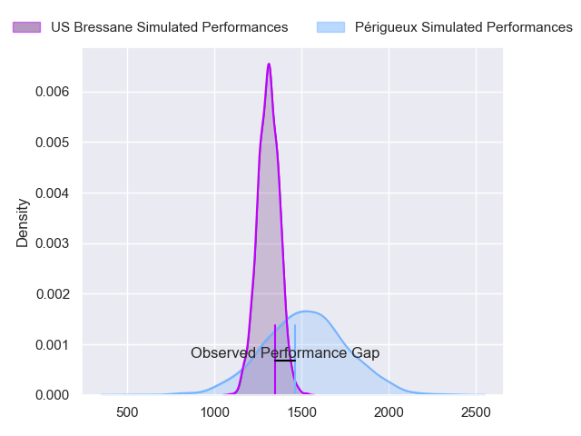
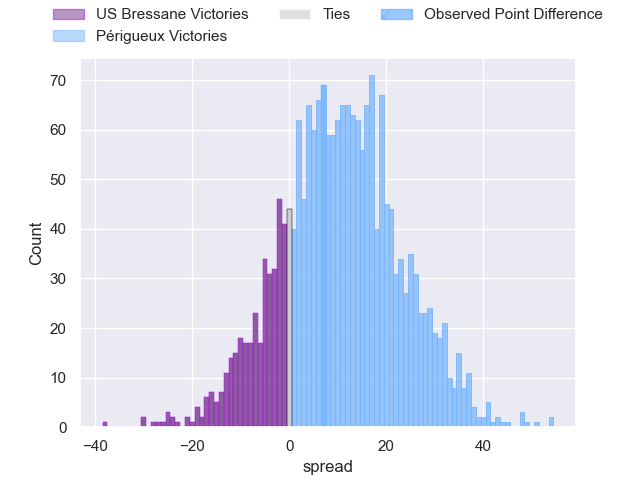
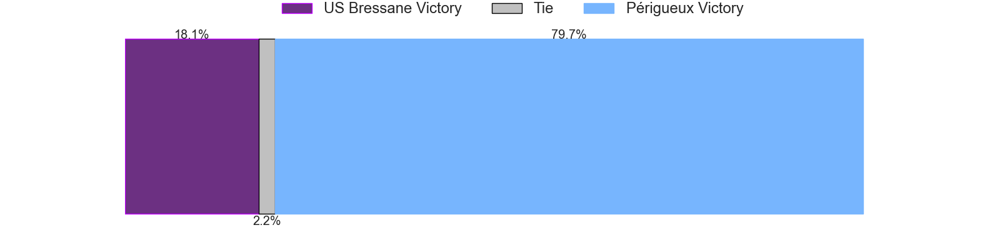
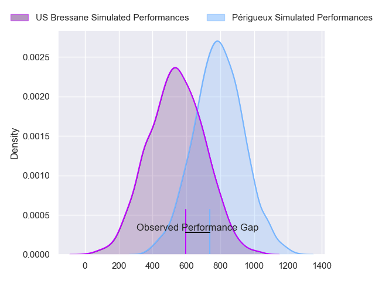
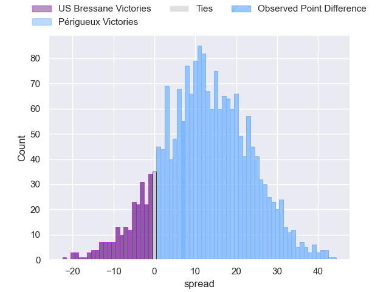
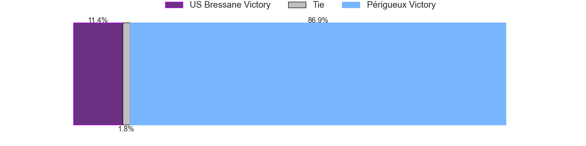
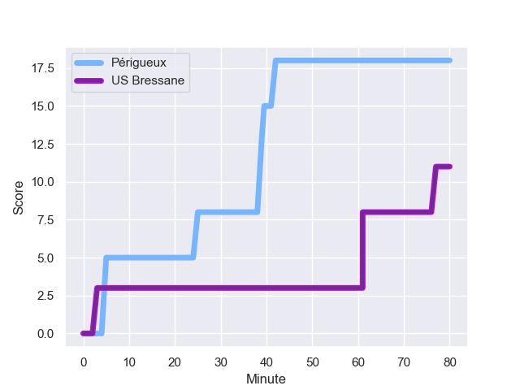
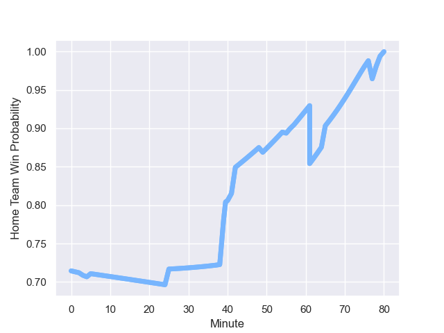

---  
layout: page  
title: US Bressane at Périgueux; 11.0-18.0  
date: 2023-09-16 18:00:00 -0500  
categories: match review  
---
# US Bressane at Périgueux; 11.0-18.0

# Club Level Predictions

The first set of predictions treats a club as the smallest object, as the club develops its members, organizes a gameplan, and deploys its players as needed for each match. This club model has a prediction of 0.757, which translates to predicting Périgueux to win by 10.1.

Each club has a rating and a rating deviation (simiar to a Glicko system), and expected performances can be generated. This allows for simulated matches and spreads like the ones below.
## Projected Performances - Club Model

## Projected Spreads - Club Model

## Projected Results - Club Model

# Player Level Predictions - Version 2

Treating teams instead as an entity made up of the currently active players, I have ratings for each player in an altogether different system. These can be combined to form team ratings once teamsheets are announced, weighting starters a bit higher than the reserves. After the match is played, players can be weighted by their minutes on the field, allowing for an accurate measure of the team's composition. With these compiled team ratings, we can make predictions, measure inaccuracy, and update the individual player ratings.
## Prediction with Player Minutes: Périgueux by 10.1

Périgueux by 7.0 on a neutral field
## Prediction without Player Minutes: Périgueux by 9.2

Périgueux by 6.0 on a neutral pitch

## Projected Performances - Player Model

## Projected Spreads - Player Model

## Projected Results - Player Model

## Scores over Time

## Win Probability over Time

There were 4 large changes in win probability in this match

|   Away Minutes | Away Player               |   Away elo |   Number |   Home elo | Home Player       |   Home Minutes |
|---------------:|:--------------------------|-----------:|---------:|-----------:|:------------------|---------------:|
|             41 | Nicolas Lemaire           |      46.4  |        1 |      49.83 | Thomas Vidal      |             49 |
|             80 | Arnaud Feltrin            |      43.14 |        2 |      48.28 | Lucas Marijon     |             49 |
|             55 | Atonio Ulutuipalelei      |      27.28 |        3 |      32.39 | Kalaveti Tawake   |             49 |
|             80 | Louis Bruinsma            |      28.24 |        4 |      23.41 | Clement Lanen     |             60 |
|             80 | Josh Peters               |      36.58 |        5 |      49.83 | Mathieu Pace      |             49 |
|             49 | Nail Ait Naceur           |      46.08 |        6 |      41.57 | Hendri Storm      |             80 |
|             80 | Pierre Reynaud            |      44.42 |        7 |      72.64 | Afaesetiti Amosa  |             80 |
|             49 | Nicolas Tachat            |      42.46 |        8 |      50.43 | Karl Lambert      |             80 |
|             63 | Robin Graulle             |      34.39 |        9 |       9.45 | Nicolas Faltrept  |             65 |
|             80 | Christian Lacombe         |      20.02 |       10 |      51.44 | Greg Hutley       |             57 |
|             80 | Élie De Fleurian          |      32.78 |       11 |      51.44 | Vincent Fouillade |             80 |
|             80 | Benjamin Doy              |      46.3  |       12 |      62.36 | Fred Hickes       |             80 |
|             80 | Parataiso Silafai-Lea'ana |       4.84 |       13 |      51.44 | Cyril Couturier   |             55 |
|             80 | Thibaut Perrette          |      33.8  |       14 |      58.6  | Axel Muller       |             80 |
|             38 | François Grange           |      46.65 |       15 |      53.46 | Rory Scholes      |             80 |
|             39 | Quentin Drancourt         |      32.73 |       16 |      46.66 | Damien Lavergne   |             31 |
|             25 | Ma'afu Fia                |      55.53 |       17 |      48.28 | Baptiste Arvouet  |             31 |
|             31 | Thomas Déliance           |      50.7  |       18 |      50.41 | Anthony Pelmard   |             31 |
|             31 | Joseph Penitito           |      60.38 |       19 |      39.65 | Richard Fourcade  |             20 |
|             17 | Jeremy Valencot           |      43.42 |       20 |      39.73 | Jaco Willemse     |             31 |
|             42 | Noé Brune                 |      46.43 |       21 |      48.24 | Enzo Hardy        |             15 |
|            nan | nan                       |     nan    |       22 |      43.44 | Yann Caillat      |             23 |
|            nan | nan                       |     nan    |       23 |      46.65 | Benjamin Yarde    |             25 |

