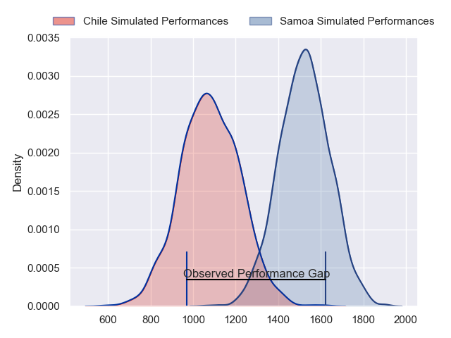
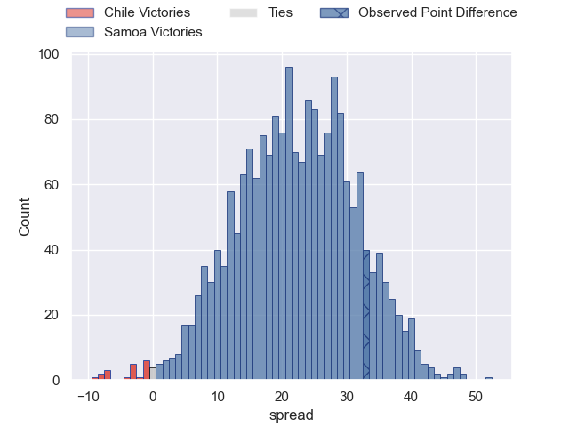
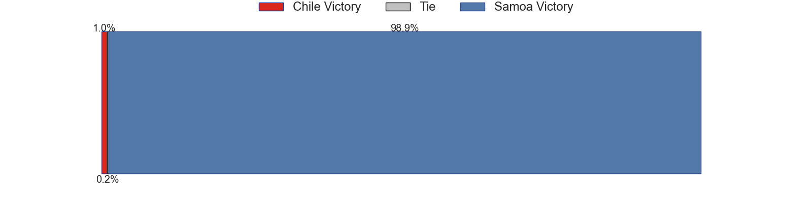
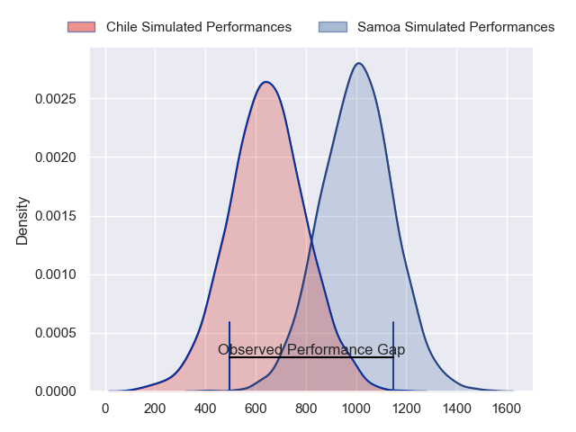
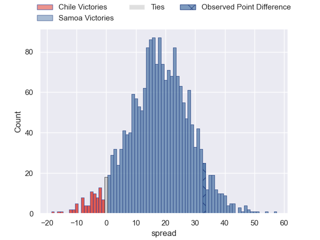
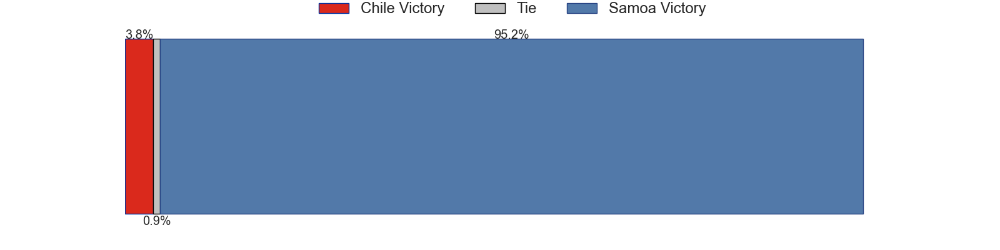
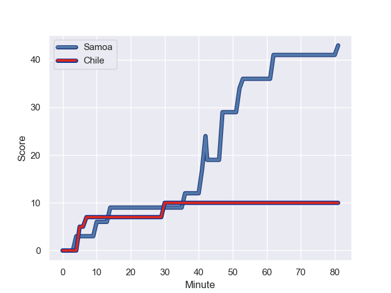
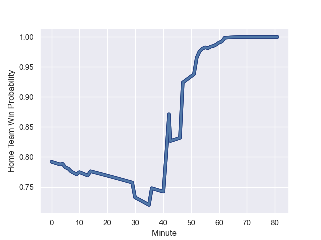

---  
layout: page  
title: Chile at Samoa; 10.0-43.0  
date: 2023-09-16 18:00:00 -0500  
categories: match review  
---
# Chile at Samoa; 10.0-43.0

# Club Level Predictions

The first set of predictions treats a club as the smallest object, as the club develops its members, organizes a gameplan, and deploys its players as needed for each match. This club model has a prediction of 0.914, which translates to predicting Samoa to win by 22.4.

Each club has a rating and a rating deviation (simiar to a Glicko system), and expected performances can be generated. This allows for simulated matches and spreads like the ones below.
## Projected Performances - Club Model

## Projected Spreads - Club Model

## Projected Results - Club Model

# Player Level Predictions - Version 2

Treating teams instead as an entity made up of the currently active players, I have ratings for each player in an altogether different system. These can be combined to form team ratings once teamsheets are announced, weighting starters a bit higher than the reserves. After the match is played, players can be weighted by their minutes on the field, allowing for an accurate measure of the team's composition. With these compiled team ratings, we can make predictions, measure inaccuracy, and update the individual player ratings.
## Prediction with Player Minutes: Samoa by 14.7

Samoa by 14.7 on a neutral field
## Prediction without Player Minutes: Samoa by 14.6

Samoa by 14.6 on a neutral pitch

## Projected Performances - Player Model

## Projected Spreads - Player Model

## Projected Results - Player Model

## Scores over Time

## Win Probability over Time

There were 6 large changes in win probability in this match

|   Away Minutes | Away Player          |   Away elo |   Number |   Home elo | Home Player           |   Home Minutes |
|---------------:|:---------------------|-----------:|---------:|-----------:|:----------------------|---------------:|
|             41 | Javier Carrasco      |      39.08 |        1 |      51.88 | James Lay             |             52 |
|             58 | Tomas Dussaillant    |      46.65 |        2 |      63.85 | Seilala Lam           |             41 |
|             77 | Matias Dittus        |      36.09 |        3 |      70.14 | Michael Ala'alatoa    |             52 |
|             41 | Pablo Huete          |      46.65 |        4 |      58.84 | Chris Vui             |             60 |
|             54 | Santiago Pedrero     |      46.65 |        5 |      68    | Theo McFarland        |             81 |
|             81 | Martin Sigren        |      46.65 |        6 |      65.59 | Taleni Seu            |             81 |
|             74 | Clemente Saavedra    |      46.65 |        7 |      89.22 | Fritz Lee             |             81 |
|             41 | Raimundo Martinez    |      46.65 |        8 |     101.74 | Steven Luatua         |             58 |
|             62 | Marcelo Torrealba    |      22.46 |        9 |      48.35 | Jonathan Taumateine   |             54 |
|             81 | Rodrigo Fernandez    |      46.65 |       10 |      73.26 | Christian Leali'ifano |             81 |
|             81 | Jose Ignacio Larenas |      46.65 |       11 |      84.72 | Nigel Ah Wong         |             81 |
|             81 | Matias Garafulic     |      46.65 |       12 |      92.53 | Tumua Manu            |             56 |
|             81 | Domingo Saavedra     |      46.65 |       13 |      55.07 | Ulupano Seuteni       |             81 |
|             22 | Santiago Videla      |      46.65 |       14 |      40.94 | Danny Toala           |             64 |
|             81 | Inaki Ayarza         |      46.65 |       15 |      72.31 | Duncan Paia'aua       |             81 |
|             23 | Diego Escobar        |      46.65 |       16 |      46.3  | Sama Malolo           |             40 |
|             40 | Salvador Lues        |      46.65 |       17 |      32.99 | Jordan Lay            |             29 |
|             11 | Esteban Inostroza    |      46.65 |       18 |      77.48 | Paul Alo-Emile        |             29 |
|             40 | Javier Eissmann      |       4.9  |       19 |      46.65 | Samuel Slade          |             21 |
|             40 | Alfonso Escobar      |      46.65 |       20 |     102.66 | Jordan Taufua         |             23 |
|             27 | Ignacio Silva        |      46.65 |       21 |      23.51 | Ere Enari             |             27 |
|             19 | Benjamin Videla      |      46.65 |       22 |      76.52 | Lima Sopoaga          |             25 |
|             59 | Pablo Casas          |      46.65 |       23 |      14.38 | Ed Fidow              |             17 |

