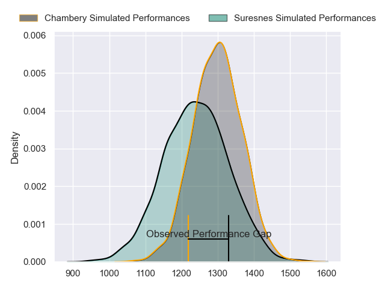
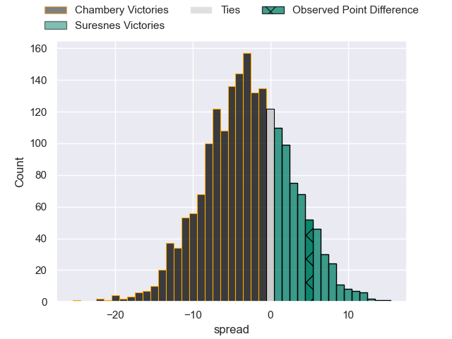
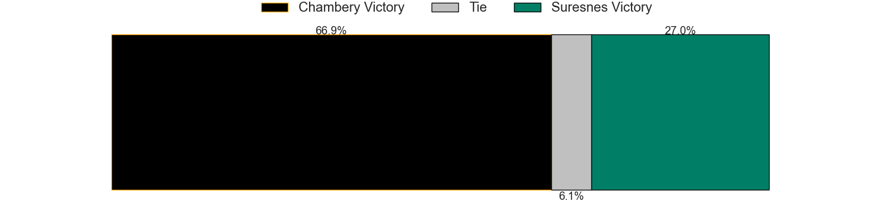
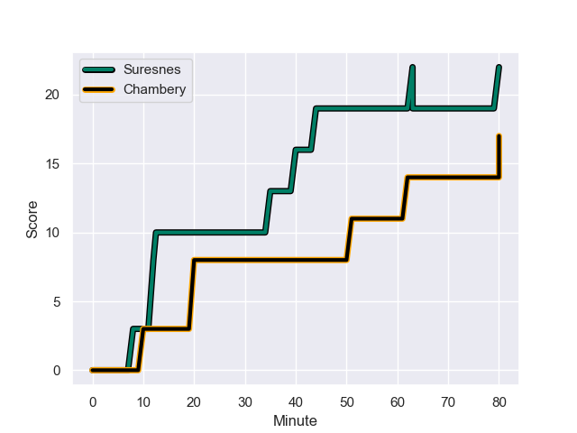
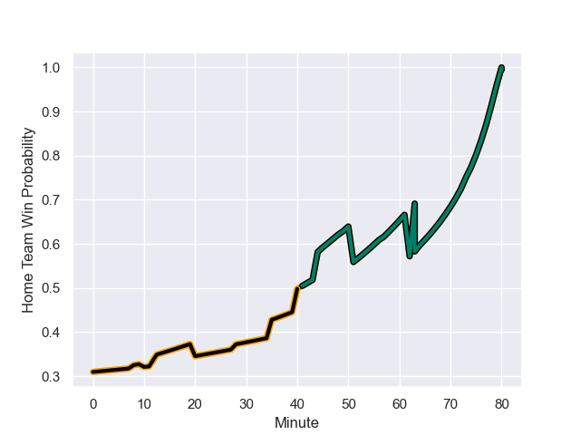

---  
layout: page  
title: Chambery at Suresnes; 17.0-22.0  
date: 2023-09-16 18:00:00 -0500  
categories: match review  
---
# Chambery at Suresnes; 17.0-22.0

# Club Level Predictions

The first set of predictions treats a club as the smallest object, as the club develops its members, organizes a gameplan, and deploys its players as needed for each match. This club model has a prediction of 0.416, which translates to predicting Chambery to win by 3.0.

Each club has a rating and a rating deviation (simiar to a Glicko system), and expected performances can be generated. This allows for simulated matches and spreads like the ones below.
## Projected Performances

## Projected Spreads

## Projected Results

# Player Level Predictions - Version 2

Treating teams instead as an entity made up of the currently active players, I have ratings for each player in an altogether different system. These can be combined to form team ratings once teamsheets are announced, weighting starters a bit higher than the reserves. After the match is played, players can be weighted by their minutes on the field, allowing for an accurate measure of the team's composition. With these compiled team ratings, we can make predictions, measure inaccuracy, and update the individual player ratings.
## Prediction with Player Minutes: Chambery by 8.8

Chambery by 12.1 on a neutral field
## Prediction without Player Minutes: Chambery by 8.3

Chambery by 11.5 on a neutral pitch

## Scores over Time

## Win Probability over Time

There were 15 large changes in win probability in this match

|   Away Minutes | Away Player              |   Away elo |   Number |   Home elo | Home Player            |   Home Minutes |
|---------------:|:-------------------------|-----------:|---------:|-----------:|:-----------------------|---------------:|
|             45 | Géraud Clermont          |      53.64 |        1 |      46.48 | Sébastien Lafrancesca  |             49 |
|             45 | Luka Begic               |      41.08 |        2 |      22.74 | Hayam El Bibouji       |             74 |
|             75 | Giorgi Pertaia           |      50.75 |        3 |      24.05 | Victor Damian Arias    |             80 |
|             57 | Fabien Witz              |      42.18 |        4 |      12.8  | Florian Desbordes      |             80 |
|             80 | Taniela Matakaiongo      |      46.65 |        5 |      27.99 | Sacha Yahi             |             73 |
|             80 | Jean-Baptiste Grenod     |      73.99 |        6 |      45.44 | Jean-Baptiste Lachaise |             80 |
|             74 | Colin Lebian             |      35.88 |        7 |       9.19 | Wian Vosloo            |             28 |
|             80 | Tui Uru                  |      56.81 |        8 |      36.58 | Lakisipone Lee         |             80 |
|             62 | Thibault Dufau           |      31.88 |        9 |      20.22 | Thomas Lacroix         |             80 |
|             51 | Victor Pisano            |      34.87 |       10 |      50.75 | Jean Chezeau           |             80 |
|             80 | Arthur Nennig            |      52.35 |       11 |      51.81 | Faraj Fartass          |             74 |
|             51 | Mickael Blanc            |      28.44 |       12 |      30.25 | Petero Tuwai           |             64 |
|             80 | Emmanuel Vaitulukina     |      46.06 |       13 |     -16.62 | JJ Taulagi             |             80 |
|             80 | Va'aufauese Apelu Maliko |      43.51 |       14 |      -3.75 | Ervin Muric            |             80 |
|             80 | Thomas Hecquet           |      45.35 |       15 |      42.96 | Victor Barnier         |             80 |
|             35 | Gauthier Brute de Remur  |      46.82 |       16 |      43.13 | Elias Coulibaly        |             31 |
|             35 | Enzo Segui               |      45.22 |       17 |      36.89 | Lilan Savioz Fouillet  |             16 |
|             29 | Thibault Moreno          |      47.69 |       18 |      42.39 | Damien Bozic           |              7 |
|             29 | Bastien Reymond          |      52.59 |       19 |      -0.06 | Alexis Clement         |              6 |
|             23 | Corentin Astier          |      48.48 |       20 |      32.1  | Anthony Bajart         |              6 |
|             18 | Samuel Boissinot         |      37.65 |       21 |      22.51 | Louis-Mathieu Jazeix   |             52 |
|              6 | Ahmed Tidiane Kane       |      45.39 |       22 |     nan    | nan                    |            nan |
|              5 | Enzo Bailly              |      49.34 |       23 |     nan    | nan                    |            nan |

