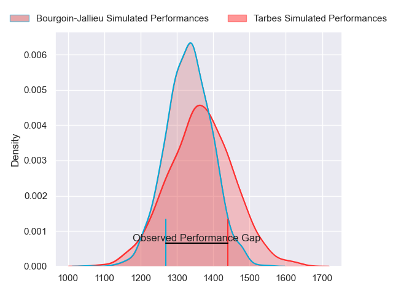
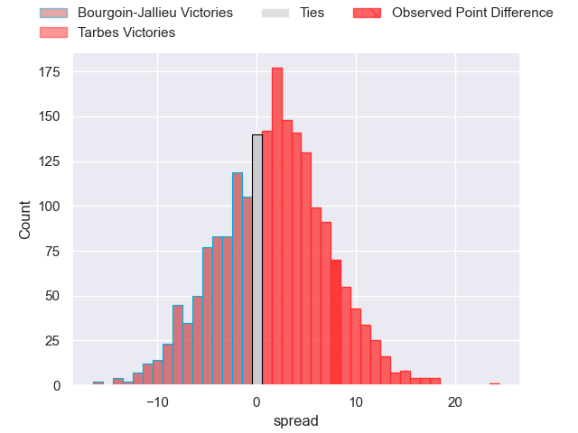
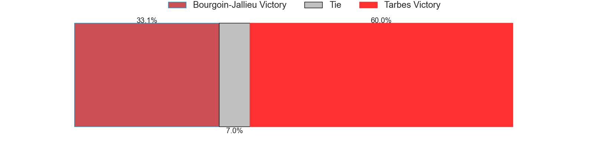
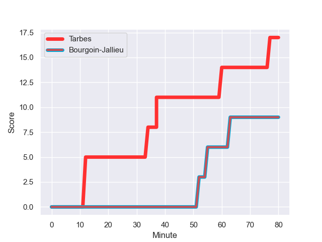
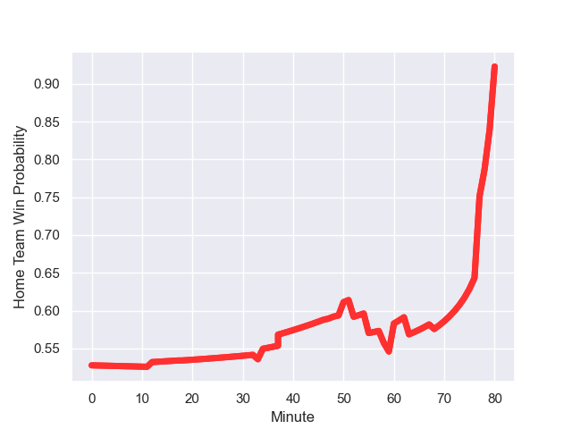

---  
layout: page  
title: Bourgoin-Jallieu at Tarbes; 9.0-17.0  
date: 2023-09-16 18:00:00 -0500  
categories: match review  
---
# Bourgoin-Jallieu at Tarbes; 9.0-17.0

# Club Level Predictions

The first set of predictions treats a club as the smallest object, as the club develops its members, organizes a gameplan, and deploys its players as needed for each match. This club model has a prediction of 0.543, which translates to predicting Tarbes to win by 1.5.

Each club has a rating and a rating deviation (simiar to a Glicko system), and expected performances can be generated. This allows for simulated matches and spreads like the ones below.
## Projected Performances

## Projected Spreads

## Projected Results

# Player Level Predictions - Version 2

Treating teams instead as an entity made up of the currently active players, I have ratings for each player in an altogether different system. These can be combined to form team ratings once teamsheets are announced, weighting starters a bit higher than the reserves. After the match is played, players can be weighted by their minutes on the field, allowing for an accurate measure of the team's composition. With these compiled team ratings, we can make predictions, measure inaccuracy, and update the individual player ratings.
## Prediction with Player Minutes: Tarbes by 1.2

Bourgoin-Jallieu by 3.0 on a neutral field
## Prediction without Player Minutes: Tarbes by 2.6

Bourgoin-Jallieu by 1.7 on a neutral pitch

## Scores over Time

## Win Probability over Time

There were 6 large changes in win probability in this match

|   Away Minutes | Away Player              |   Away elo |   Number |   Home elo | Home Player            |   Home Minutes |
|---------------:|:-------------------------|-----------:|---------:|-----------:|:-----------------------|---------------:|
|             54 | Romain Favaretto         |      46.33 |        1 |      41.84 | Antoine Palisse        |             47 |
|             33 | Mohamed Khribache        |      31.57 |        2 |      40.42 | Florian Lamothe        |             61 |
|             47 | Oktay Yilmaz             |      49.25 |        3 |      43.58 | Toma Taufa             |             49 |
|             58 | Léandre Cotte            |       5.53 |        4 |      45.6  | Francis Rolland        |             49 |
|             58 | Morgan Eames             |      -5.54 |        5 |      34.2  | Jone Trevor Seuvou     |             59 |
|             80 | Kevin Rivoire            |      66.12 |        6 |      55.55 | Alexis Armary          |             80 |
|             80 | Theophile Cotte          |      41.53 |        7 |      41.22 | Léo Saint-Guilhem      |             80 |
|             63 | Kemueli Lavetanakoroi    |      38.36 |        8 |      33.29 | Len Massyn             |             80 |
|             80 | Tomas Munilla lo Duca    |      61.58 |        9 |      32.21 | Thibaut Dulucq         |             79 |
|             80 | Nicolas Cachet           |      44.47 |       10 |      19.75 | Anthony Fuertes        |             80 |
|             80 | Paul-Hugo Champ          |      46.15 |       11 |      40.95 | Clement Latorre        |             80 |
|             18 | Pieter Morton            |      54.86 |       12 |      24.72 | Johan Paulet           |             80 |
|             80 | Brieuc Plessis-Couillaud |      37.3  |       13 |      33    | William Pees           |             68 |
|             80 | Christopher Bosch        |      41.4  |       14 |      36.23 | Thibaut Trotta         |             80 |
|             50 | Remi Bouet               |      29.22 |       15 |      46.38 | Yon Camou              |             80 |
|             26 | Zhorzhi (Jorji) Saldadze |      40.84 |       16 |      36.69 | Johan Mees Erasmus     |             33 |
|             47 | Killian Tripier          |      56.87 |       17 |      49.86 | Vincent Dolier         |             19 |
|             33 | Osman Dimen              |      49.13 |       18 |      39.7  | Aleksi Tchitchiashvili |             31 |
|             22 | Jonathan Kpoku           |      45.45 |       19 |      45.23 | Baptiste Peytavi       |             31 |
|             22 | Robin Gascou             |      44.19 |       20 |      28.55 | Dorian Bonnin          |             18 |
|             17 | Matteo Broeders          |      44.82 |       21 |      43.88 | Léo Estaque            |              3 |
|             30 | Nicolas Vuillemin        |      60.33 |       22 |      19.92 | Anthony Meric          |              1 |
|             62 | Isaiah Leota             |      56.06 |       23 |      35.01 | Julien Cantan          |             12 |

