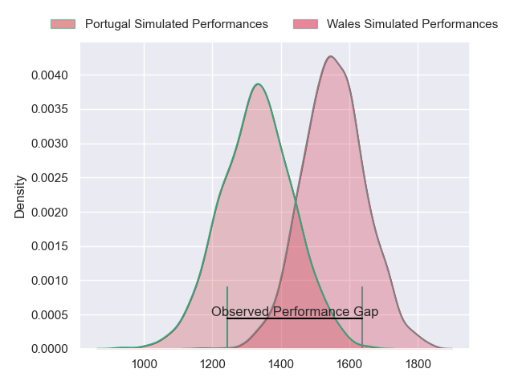
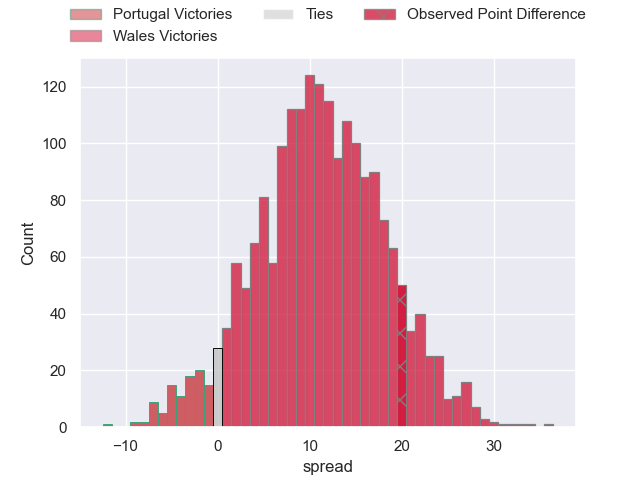
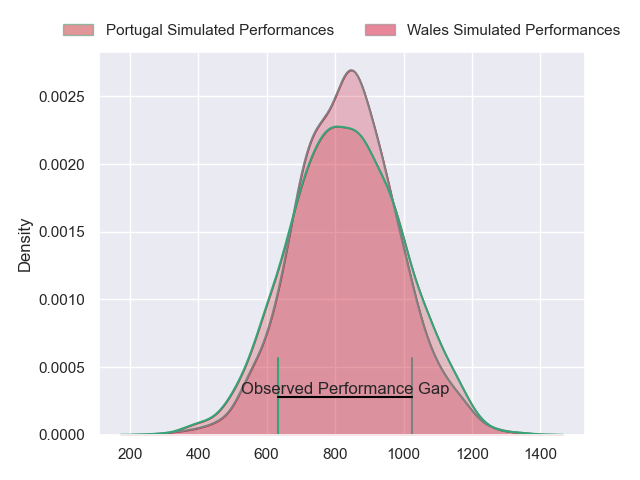
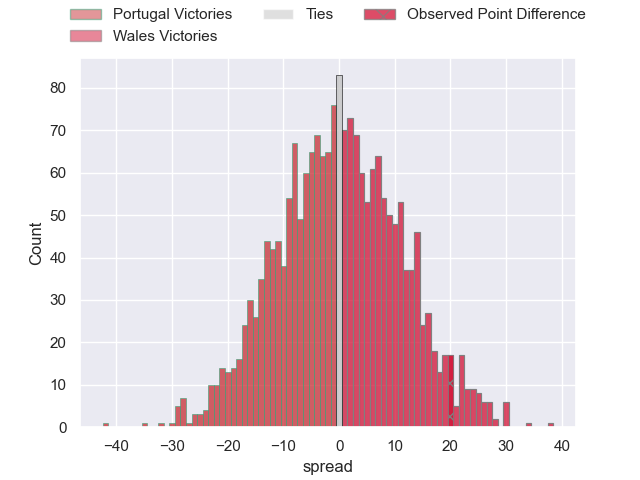
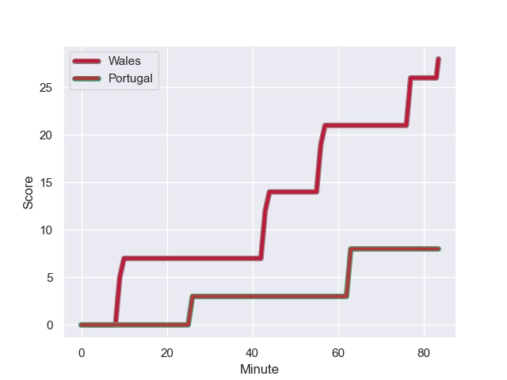
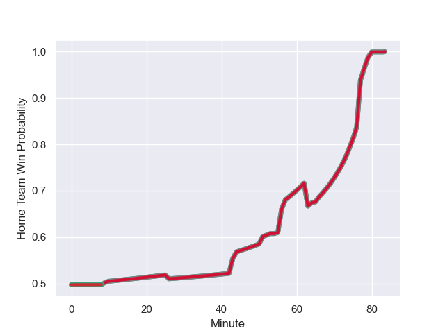

---  
layout: page  
title: Portugal at Wales; 8.0-28.0  
date: 2023-09-16 18:00:00 -0500  
categories: match review  
---
# Portugal at Wales; 8.0-28.0

# Club Level Predictions

The first set of predictions treats a club as the smallest object, as the club develops its members, organizes a gameplan, and deploys its players as needed for each match. This club model has a prediction of 0.773, which translates to predicting Wales to win by 11.3.

Each club has a rating and a rating deviation (simiar to a Glicko system), and expected performances can be generated. This allows for simulated matches and spreads like the ones below.
## Projected Performances - Club Model

## Projected Spreads - Club Model

## Projected Results - Club Model

# Player Level Predictions - Version 2

Treating teams instead as an entity made up of the currently active players, I have ratings for each player in an altogether different system. These can be combined to form team ratings once teamsheets are announced, weighting starters a bit higher than the reserves. After the match is played, players can be weighted by their minutes on the field, allowing for an accurate measure of the team's composition. With these compiled team ratings, we can make predictions, measure inaccuracy, and update the individual player ratings.
## Prediction with Player Minutes: Portugal by 0.1

Wales by 0.1 on a neutral field
## Prediction without Player Minutes: Wales by 0.1

Wales by 0.1 on a neutral pitch

## Projected Performances - Player Model

## Projected Spreads - Player Model

## Projected Results - Player Model

## Scores over Time

## Win Probability over Time

There were 6 large changes in win probability in this match

|   Away Minutes | Away Player              |   Away elo |   Number |   Home elo | Home Player       |   Home Minutes |
|---------------:|:-------------------------|-----------:|---------:|-----------:|:------------------|---------------:|
|             60 | Francisco Fernandes      |      46.65 |        1 |      41.23 | Nicky Smith       |             51 |
|             78 | Mike Tadjer              |      21.08 |        2 |      32.72 | Dewi Lake         |             51 |
|             55 | Anthony Alves            |      39.8  |        3 |      77.6  | Dillon Lewis      |             51 |
|             57 | Martim Belo              |      47.26 |        4 |      42.41 | Christ Tshiunza   |             83 |
|             83 | Steevy Cerqueira         |      43.52 |        5 |      60.16 | Dafydd Jenkins    |             51 |
|             66 | Joao Granate             |      67.23 |        6 |      50.44 | Dan Lydiate       |             54 |
|             83 | Nicolas Martins          |      56.66 |        7 |      61.6  | Jac Morgan        |             83 |
|             83 | Rafael Simoes            |      71.09 |        8 |      66.14 | Taulupe Faletau   |             83 |
|             74 | Samuel Marques           |      64.74 |        9 |      67.56 | Tomos Williams    |             65 |
|             83 | Jeronimo Portela         |      78.51 |       10 |      46.65 | Gareth Anscombe   |             65 |
|             83 | Rodrigo Marta            |      94.29 |       11 |      16.54 | Rio Dyer          |             83 |
|             83 | Tomas Appleton           |      56.15 |       12 |      67.23 | Johnny Williams   |             83 |
|             57 | Jose Lima                |      46.65 |       13 |      64.13 | Mason Grady       |             83 |
|             83 | Vincent Pinto            |      46.65 |       14 |      71.13 | Louis Rees-Zammit |             83 |
|             69 | Nuno Sousa Guedes        |      46.65 |       15 |      53.37 | Leigh Halfpenny   |             70 |
|             23 | David Costa              |      46.99 |       16 |      75.03 | Ryan Elias        |             32 |
|              5 | Lionel Campergue         |      46.65 |       17 |      55.54 | Corey Domachowski |             32 |
|             28 | Diogo Hasse Ferreira     |      46.65 |       18 |      95.68 | Tomas Francis     |             32 |
|             26 | Thibault de Freitas      |      47.56 |       19 |      51.91 | Adam Beard        |             32 |
|             17 | David Wallis de Carvalho |      46.65 |       20 |      32.46 | Taine Basham      |             29 |
|              9 | Pedro Lucas              |      46.85 |       21 |      33.64 | Gareth Davies     |             18 |
|             14 | Joris Moura              |      46.6  |       22 |      38.54 | Sam Costelow      |             18 |
|             26 | Raffaele Storti          |      71.57 |       23 |      57.57 | Josh Adams        |             13 |

