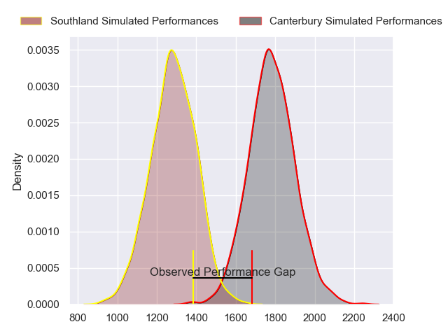
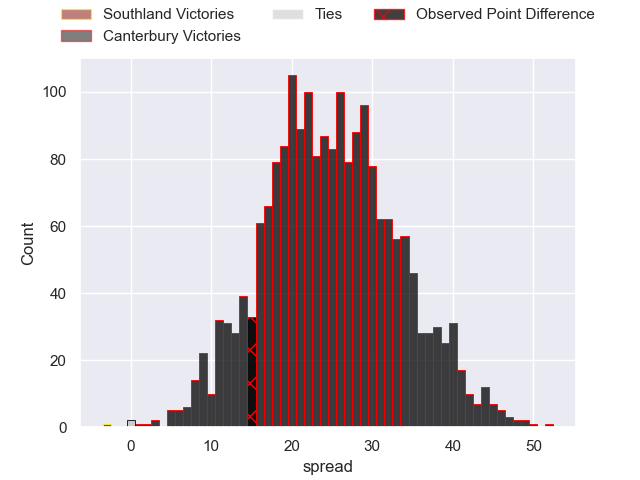
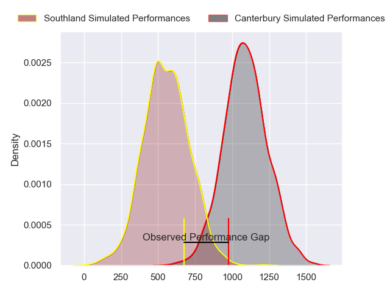
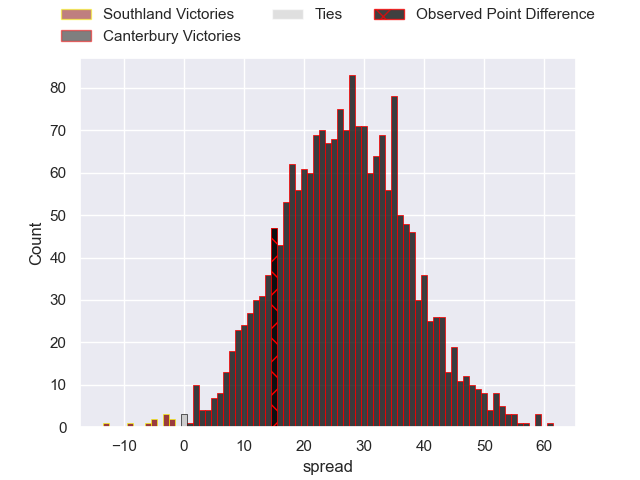
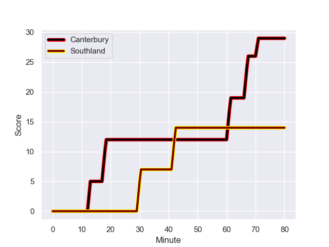
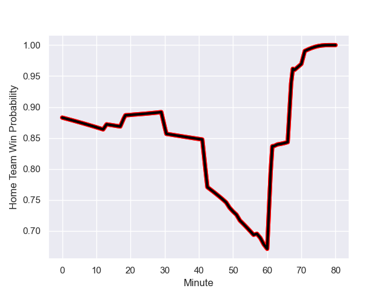

---  
layout: page  
title: Southland at Canterbury; 14.0-29.0  
date: 2023-09-17 18:00:00 -0500  
categories: match review  
---
# Southland at Canterbury; 14.0-29.0

# Club Level Predictions

The first set of predictions treats a club as the smallest object, as the club develops its members, organizes a gameplan, and deploys its players as needed for each match. This club model has a prediction of 0.937, which translates to predicting Canterbury to win by 24.9.

Each club has a rating and a rating deviation (simiar to a Glicko system), and expected performances can be generated. This allows for simulated matches and spreads like the ones below.
## Projected Performances - Club Model

## Projected Spreads - Club Model

## Projected Results - Club Model

# Player Level Predictions - Version 2

Treating teams instead as an entity made up of the currently active players, I have ratings for each player in an altogether different system. These can be combined to form team ratings once teamsheets are announced, weighting starters a bit higher than the reserves. After the match is played, players can be weighted by their minutes on the field, allowing for an accurate measure of the team's composition. With these compiled team ratings, we can make predictions, measure inaccuracy, and update the individual player ratings.
## Prediction with Player Minutes: Canterbury by 22.2

Canterbury by 18.8 on a neutral field
## Prediction without Player Minutes: Canterbury by 21.9

Canterbury by 18.5 on a neutral pitch

## Projected Performances - Player Model

## Projected Spreads - Player Model

## Projected Results - Player Model

## Scores over Time

## Win Probability over Time

There were 5 large changes in win probability in this match

|   Away Minutes | Away Player           |   Away elo |   Number |   Home elo | Home Player       |   Home Minutes |
|---------------:|:----------------------|-----------:|---------:|-----------:|:------------------|---------------:|
|             52 | Jonah Aoina           |      37.59 |        1 |      69.9  | Joe Moody         |             57 |
|             59 | Nic Souchon           |      49.93 |        2 |      46.36 | James Mullan      |             50 |
|             49 | Morgan Mitchell       |      -7.61 |        3 |      46.6  | Brook Toomalatai  |             63 |
|             80 | Mike McKee            |      -7.47 |        4 |      60.03 | Luke Romano       |             50 |
|             80 | Danny Drake           |      61.83 |        5 |      47.68 | Tahlor Cahill     |             80 |
|             57 | Shneil Singh          |      48.51 |        6 |      57.21 | Corey Kellow      |             80 |
|             80 | Leroy Ferguson        |      47.85 |        7 |      91.19 | Tom Christie      |             80 |
|             59 | Blair Ryall           |      38.07 |        8 |      47.57 | Joe Brial         |             57 |
|             68 | Connor McLeod         |      44.65 |        9 |      93.6  | Mitchell Drummond |             48 |
|             80 | Dan Hollinshead       |      22.89 |       10 |      59.03 | Fergus Burke      |             80 |
|             80 | Michael Manson        |      34.86 |       11 |      89.54 | Solomon Alaimalo  |             80 |
|             63 | Tevita Latu           |      43.58 |       12 |      70.31 | Dallas McLeod     |             80 |
|             80 | Viliami Fine          |      20.52 |       13 |     121.33 | Ryan Crotty       |             68 |
|             49 | Noah Foster           |      47.18 |       14 |      46.03 | Isaiah Punivai    |             21 |
|             80 | Gabriel Hamer-Webb    |      66.64 |       15 |      67.37 | Chay Fihaki       |             80 |
|             28 | Hunter Fahey          |      46.65 |       16 |      44.72 | Tom Heywood       |             23 |
|             31 | Hamdahn Tuipulotu     |      46.65 |       17 |      45.17 | Seb Calder        |             17 |
|             21 | Jack Taylor           |      48.96 |       18 |      60.41 | George Bell       |             30 |
|             21 | Semisi Tupou Ta’eiloa |      47.33 |       19 |      86.76 | Cullen Grace      |             23 |
|             23 | Hayden Michaels       |      43.63 |       20 |      43.68 | Zach Gallagher    |             30 |
|             12 | Jahvis Wallace        |      43.79 |       21 |      93.05 | Willi Heinz       |             32 |
|             17 | Greg Dyer             |      35.04 |       22 |      46.47 | Jone Rova         |             59 |
|             31 | Rory van Vugt         |       1.1  |       23 |      67.49 | Rameka Poihipi    |             12 |

