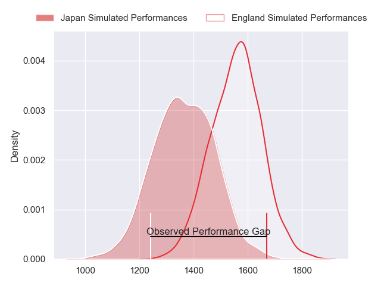
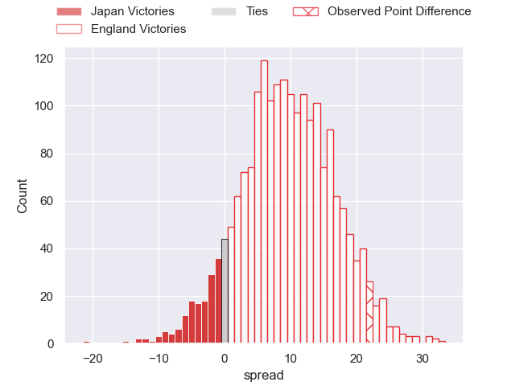
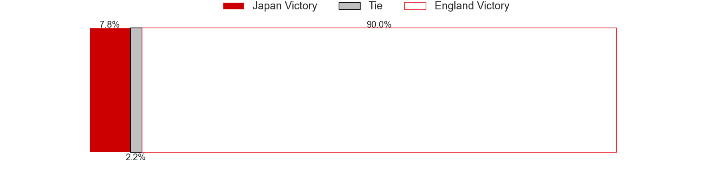
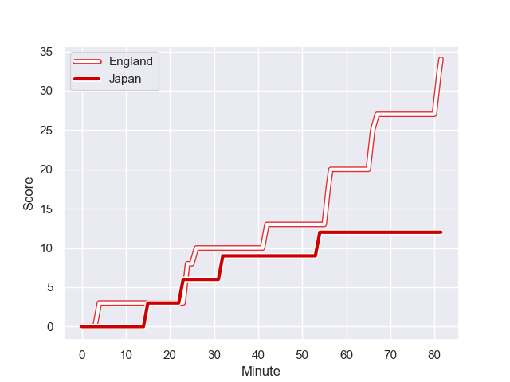
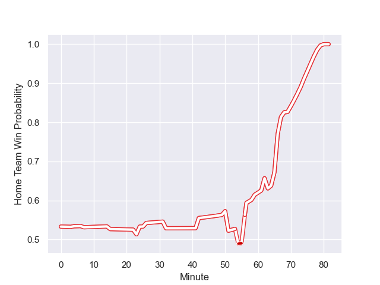

---  
layout: page  
title: Japan at England; 12.0-34.0  
date: 2023-09-17 18:00:00 -0500  
categories: match review  
---
# Japan at England; 12.0-34.0

# Club Level Predictions

The first set of predictions treats a club as the smallest object, as the club develops its members, organizes a gameplan, and deploys its players as needed for each match. This club model has a prediction of 0.742, which translates to predicting England to win by 9.7.

Each club has a rating and a rating deviation (simiar to a Glicko system), and expected performances can be generated. This allows for simulated matches and spreads like the ones below.
## Projected Performances

## Projected Spreads

## Projected Results

# Player Level Predictions - Version 2

Treating teams instead as an entity made up of the currently active players, I have ratings for each player in an altogether different system. These can be combined to form team ratings once teamsheets are announced, weighting starters a bit higher than the reserves. After the match is played, players can be weighted by their minutes on the field, allowing for an accurate measure of the team's composition. With these compiled team ratings, we can make predictions, measure inaccuracy, and update the individual player ratings.
## Prediction with Player Minutes: England by 1.5

England by 1.5 on a neutral field
## Prediction without Player Minutes: England by 2.8

England by 2.8 on a neutral pitch

## Scores over Time

## Win Probability over Time

There were 10 large changes in win probability in this match

|   Away Minutes | Away Player        |   Away elo |   Number |   Home elo | Home Player     |   Home Minutes |
|---------------:|:-------------------|-----------:|---------:|-----------:|:----------------|---------------:|
|             50 | Keita Inagaki      |      85.69 |        1 |      89.26 | Joe Marler      |             59 |
|             62 | Shota Horie        |      86.98 |        2 |     100.77 | Jamie George    |             74 |
|             41 | Koo Ji-won         |      10.19 |        3 |      56.4  | Kyle Sinckler   |             51 |
|             81 | Jack Cornelsen     |      78.71 |        4 |      96.63 | Maro Itoje      |             81 |
|             62 | Amato Fakatava     |      41.16 |        5 |      49.91 | Ollie Chessum   |             74 |
|             81 | Michael Leitch     |      75.52 |        6 |      77.7  | Courtney Lawes  |             70 |
|             74 | Pieter Labuschagne |      46.65 |        7 |      83.53 | Ben Earl        |             81 |
|             81 | Kazuki Himeno      |      53.66 |        8 |      51.58 | Lewis Ludlam    |             51 |
|             65 | Yutaka Nagare      |      74.26 |        9 |      59.97 | Alex Mitchell   |             59 |
|             81 | Rikiya Matsuda     |     104.56 |       10 |      85.39 | George Ford     |             81 |
|             50 | Jone Naikabula     |      60.94 |       11 |      51.1  | Elliot Daly     |             81 |
|             81 | Ryoto Nakamura     |     100.13 |       12 |      94.78 | Manu Tuilagi    |             69 |
|             81 | Tomoki Osada       |      35.2  |       13 |      71.44 | Joe Marchant    |             81 |
|             81 | Kotaro Matsushima  |      93.09 |       14 |      31    | Jonny May       |             81 |
|              7 | Semisi Masirewa    |      29.72 |       15 |      46.16 | Freddie Steward |             69 |
|             19 | Atsushi Sakate     |      50.69 |       16 |      40.8  | Theo Dan        |              7 |
|             31 | Craig Millar       |      39.3  |       17 |      29.83 | Ellis Genge     |             22 |
|             40 | Asaeli Ai Valu     |      79.17 |       18 |      23.27 | Will Stuart     |             30 |
|             19 | Warner Dearns      |      63.12 |       19 |      61.83 | George Martin   |             18 |
|              7 | Kanji Shimokawa    |      38.65 |       20 |     117.16 | Billy Vunipola  |             30 |
|             16 | Naoto Saito        |      29.71 |       21 |      65.16 | Ben Youngs      |             22 |
|             31 | Dylan Riley        |      92.1  |       22 |      71.04 | Marcus Smith    |             12 |
|             74 | Lomano Lemeki      |      36.91 |       23 |      50.92 | Ollie Lawrence  |             12 |

