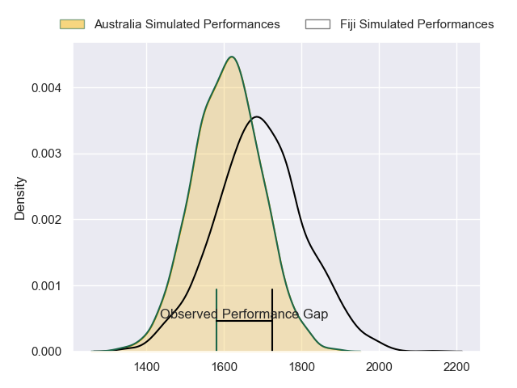
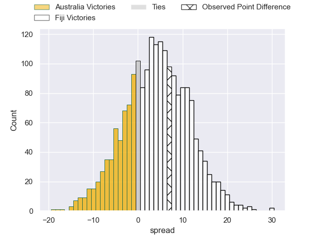
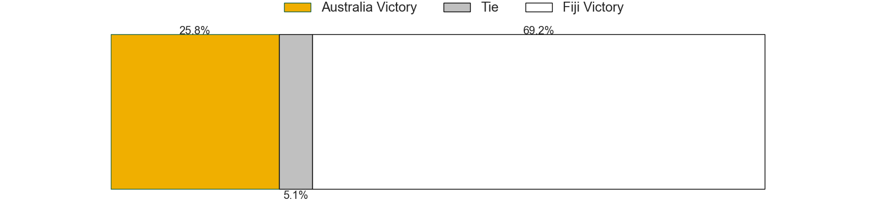

---  
layout: page  
title: Japan at England; 12.0-34.0  
date: 2023-09-17 18:00:00 -0500  
categories: match review  
---
# Japan at England; 12.0-34.0

# Club Level Predictions

The first set of predictions treats a club as the smallest object, as the club develops its members, organizes a gameplan, and deploys its players as needed for each match. This club model has a prediction of 0.61, which translates to predicting Fiji to win by 4.0.

Each club has a rating and a rating deviation (simiar to a Glicko system), and expected performances can be generated. This allows for simulated matches and spreads like the ones below.
## Projected Performances - Club Model

## Projected Spreads - Club Model

## Projected Results - Club Model

