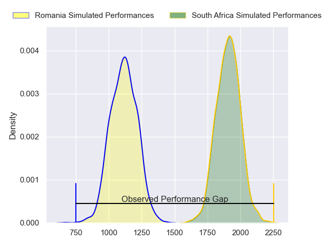
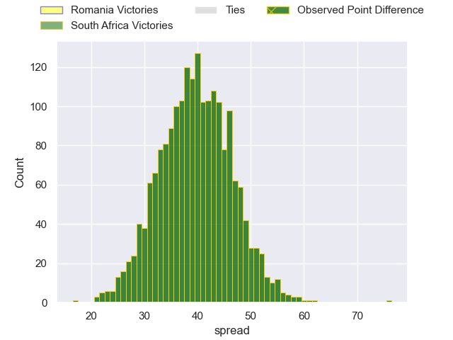
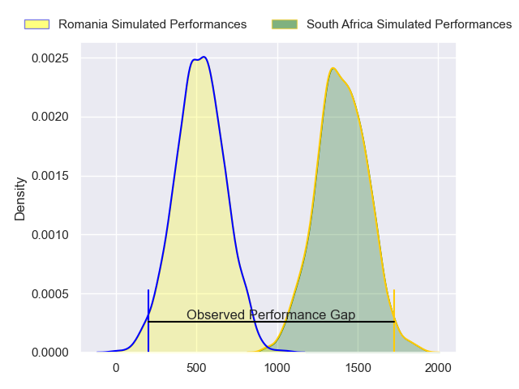
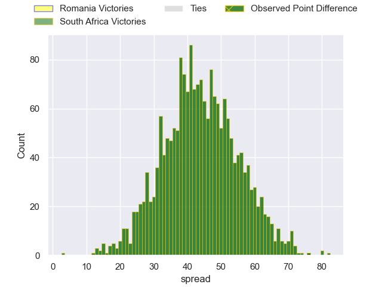
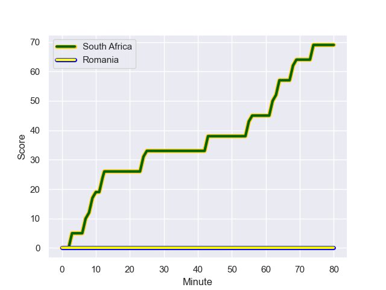
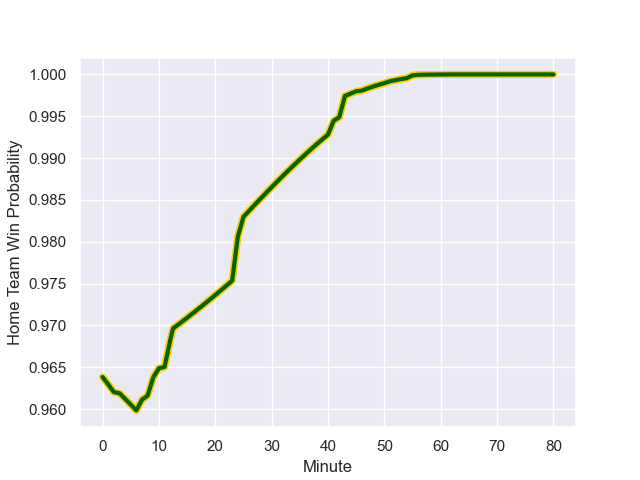

---  
layout: page  
title: Romania at South Africa; 0.0-76.0  
date: 2023-09-17 18:00:00 -0500  
categories: match review  
---
# Romania at South Africa; 0.0-76.0

# Club Level Predictions

The first set of predictions treats a club as the smallest object, as the club develops its members, organizes a gameplan, and deploys its players as needed for each match. This club model has a prediction of 0.987, which translates to predicting South Africa to win by 39.3.

Each club has a rating and a rating deviation (simiar to a Glicko system), and expected performances can be generated. This allows for simulated matches and spreads like the ones below.
## Projected Performances - Club Model

## Projected Spreads - Club Model

## Projected Results - Club Model

# Player Level Predictions - Version 2

Treating teams instead as an entity made up of the currently active players, I have ratings for each player in an altogether different system. These can be combined to form team ratings once teamsheets are announced, weighting starters a bit higher than the reserves. After the match is played, players can be weighted by their minutes on the field, allowing for an accurate measure of the team's composition. With these compiled team ratings, we can make predictions, measure inaccuracy, and update the individual player ratings.
## Prediction with Player Minutes: South Africa by 36.0

South Africa by 36.0 on a neutral field
## Prediction without Player Minutes: South Africa by 35.2

South Africa by 35.2 on a neutral pitch

## Projected Performances - Player Model

## Projected Spreads - Player Model

## Projected Results - Player Model

## Scores over Time

## Win Probability over Time

|   Away Minutes | Away Player       |   Away elo |   Number |   Home elo | Home Player       |   Home Minutes |
|---------------:|:------------------|-----------:|---------:|-----------:|:------------------|---------------:|
|             57 | Iulian Hartig     |      37.74 |        1 |     107.92 | Ox Nche           |             60 |
|             60 | Ovidiu Cojocaru   |      28.04 |        2 |     102.19 | Bongi Mbonambi    |             41 |
|             51 | Alex Gordas       |      62.05 |        3 |      56.87 | Trevor Nyakane    |             60 |
|             80 | Adrian Motoc      |       7.09 |        4 |     107.54 | Jean Kleyn        |             80 |
|             52 | Marius Iftimiciuc |      25.84 |        5 |      47.53 | Marvin Orie       |             41 |
|             55 | Andre Gorin       |      46.09 |        6 |      69.45 | Marco van Staden  |             80 |
|             41 | Vlad Neculau      |      36.85 |        7 |      68.89 | Kwagga Smith      |             80 |
|             80 | Cristian Chirica  |      26.74 |        8 |     125.58 | Duane Vermeulen   |             80 |
|             80 | Gabriel Rupanu    |      45.41 |        9 |      87.03 | Cobus Reinach     |             46 |
|             80 | Hinckley Vaovasa  |      49.05 |       10 |     113.17 | Damian Willemse   |             57 |
|             80 | Nicolas Onutu     |      45.33 |       11 |     106.81 | Makazole Mapimpi  |             80 |
|             67 | Taylor Gontineac  |      57.62 |       12 |     106.55 | Andre Esterhuizen |             80 |
|             60 | Jason Tomane      |      32.13 |       13 |     120.26 | Canan Moodie      |             80 |
|             80 | Tevita Manumua    |       9.43 |       14 |      44.09 | Grant Williams    |             80 |
|             80 | Marius Simionescu |       8.12 |       15 |     105.72 | Willie le Roux    |             80 |
|             20 | Rob Irimescu      |      46.65 |       16 |      91.34 | Deon Fourie       |             39 |
|             23 | Alexandru Savin   |      36.09 |       17 |      97.96 | Steven Kitshoff   |             20 |
|             29 | Thomas Cretu      |      46.65 |       18 |      86.16 | Frans Malherbe    |             20 |
|             28 | Stefan Iancu      |      26.71 |       19 |     117.59 | RG Snyman         |             39 |
|             25 | Damian Stratila   |      52.84 |       20 |      80.1  | Jasper Wiese      |              0 |
|             39 | Cristi Boboc      |      53.11 |       21 |      66.96 | Jaden Hendrikse   |             34 |
|             13 | Alin Conache      |      39.62 |       22 |     109.92 | Faf de Klerk      |             23 |
|             20 | Gabriel Pop       |      27.62 |       23 |     136.17 | Jesse Kriel       |              0 |

