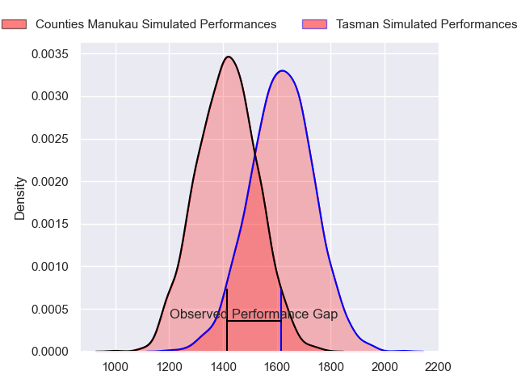
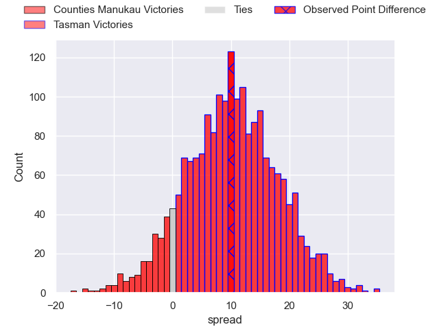
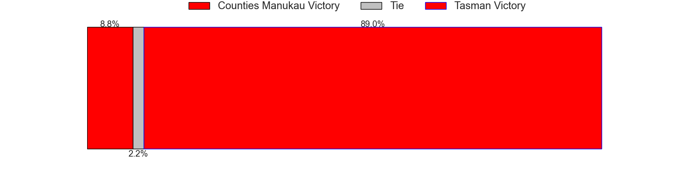
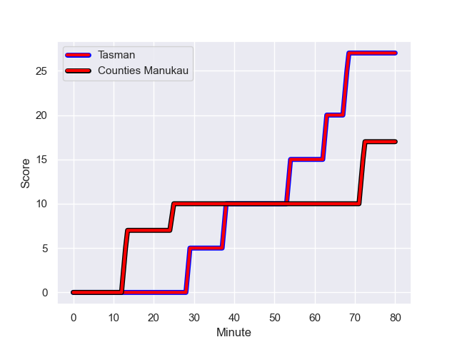
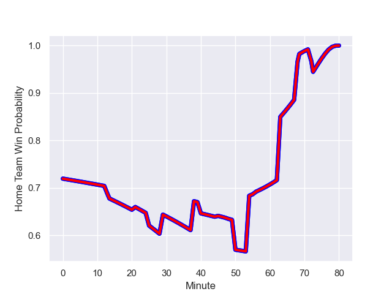

---  
layout: page  
title: Counties Manukau at Tasman; 17.0-27.0  
date: 2023-09-17 18:00:00 -0500  
categories: match review  
---
# Counties Manukau at Tasman; 17.0-27.0

# Club Level Predictions

The first set of predictions treats a club as the smallest object, as the club develops its members, organizes a gameplan, and deploys its players as needed for each match. This club model has a prediction of 0.748, which translates to predicting Tasman to win by 10.0.

Each club has a rating and a rating deviation (simiar to a Glicko system), and expected performances can be generated. This allows for simulated matches and spreads like the ones below.
## Projected Performances

## Projected Spreads

## Projected Results

# Player Level Predictions - Version 2

Treating teams instead as an entity made up of the currently active players, I have ratings for each player in an altogether different system. These can be combined to form team ratings once teamsheets are announced, weighting starters a bit higher than the reserves. After the match is played, players can be weighted by their minutes on the field, allowing for an accurate measure of the team's composition. With these compiled team ratings, we can make predictions, measure inaccuracy, and update the individual player ratings.
## Prediction with Player Minutes: Tasman by 10.4

Tasman by 7.0 on a neutral field
## Prediction without Player Minutes: Tasman by 10.8

Tasman by 7.5 on a neutral pitch

## Scores over Time

## Win Probability over Time

There were 8 large changes in win probability in this match

|   Away Minutes | Away Player           |   Away elo |   Number |   Home elo | Home Player          |   Home Minutes |
|---------------:|:----------------------|-----------:|---------:|-----------:|:---------------------|---------------:|
|             40 | Ezekiel Lindenmuth    |      12.74 |        1 |      44.9  | Ryan Coxon           |             69 |
|             45 | Ian West-Stevens      |      48.18 |        2 |      41.51 | Feleti Kaitu'u       |             56 |
|             21 | Salesi Tuifua         |      46.95 |        3 |      71.69 | Samuel Matenga       |             73 |
|             80 | Jimmy Tupou           |      32.47 |        4 |      72.16 | Quinten Strange      |             80 |
|             61 | Alex McRobbie         |      23.13 |        5 |      65.99 | Michael Curry        |             50 |
|             41 | Maama Vaipulu         |      27.01 |        6 |      50.14 | Max Hicks            |             73 |
|             80 | Sean Reidy            |      78.27 |        7 |      48.83 | Seta Baker           |             80 |
|             80 | Sam Tuifua            |      48.89 |        8 |      41.8  | Anton Segner         |             80 |
|             48 | Cohen Brady-Leathem   |      46.52 |        9 |      54.04 | Noah Hotham          |             75 |
|             80 | Ahsee Tuala           |      53.4  |       10 |      43.96 | Taine Robinson       |             77 |
|             71 | Josh Gray             |      51.81 |       11 |      47.14 | Willi Gualter        |             73 |
|             61 | Larenz Tupaea-Thomsen |      46.65 |       12 |      86.26 | Alex Nankivell       |             80 |
|             80 | Tevita Ofa            |      42.68 |       13 |      66.76 | Levi Aumua           |             80 |
|             80 | Blake Makiri          |      47.72 |       14 |      37.34 | Timoci Tavatavanawai |             80 |
|             80 | Etene Nanai-Seturo    |      38.59 |       15 |      50.46 | Macca Springer       |             80 |
|             40 | Kauvaka Kaivelata     |      49.91 |       16 |      47.03 | Matt Graham-Williams |             11 |
|             59 | Suetena Asomua        |      33.51 |       17 |      64.12 | Atu Moli             |              7 |
|             35 | Ioane Moananu         |      47.69 |       18 |      88.73 | Quentin MacDonald    |             24 |
|             19 | William Furniss       |      37.88 |       19 |      46.11 | Angus Fletcher       |              7 |
|             39 | Adam Brash            |      41.82 |       20 |      46.65 | Hunter Leppien       |             30 |
|             32 | Liam Daniela          |      47.75 |       21 |      46.65 | Graham Urquhart      |              5 |
|             19 | Riley Hohepa          |      31.28 |       22 |      46.67 | Shun Miyake          |              3 |
|              9 | Alex Eruera           |      46.65 |       23 |      56.79 | Tomasi Alosio        |              7 |

