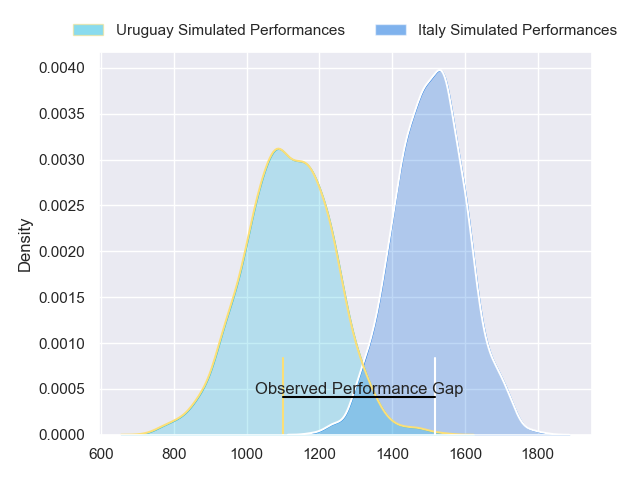
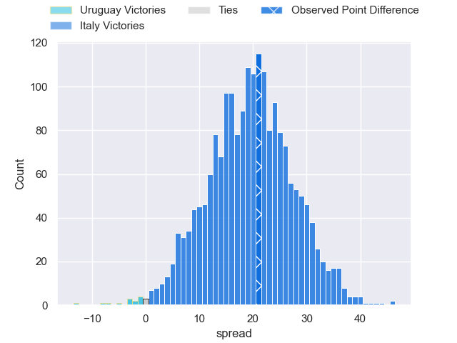
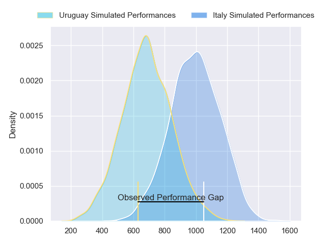
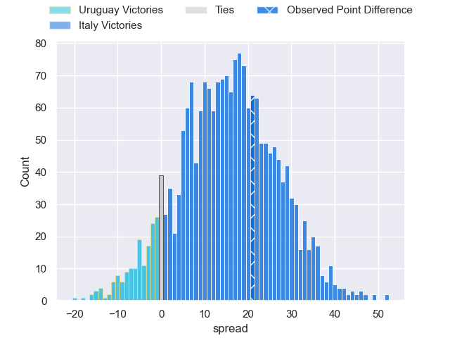
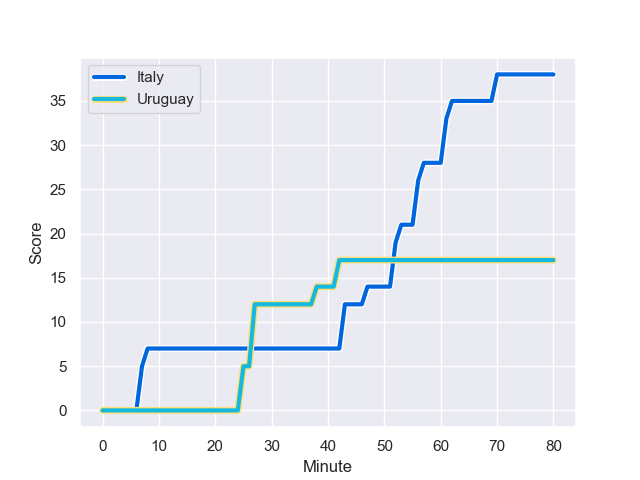
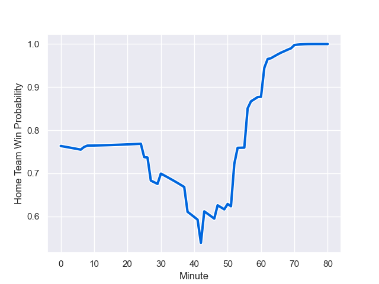

---  
layout: page  
title: Uruguay at Italy; 17.0-38.0  
date: 2023-09-20 18:00:00 -0500  
categories: match review  
---
# Uruguay at Italy; 17.0-38.0

# Club Level Predictions

The first set of predictions treats a club as the smallest object, as the club develops its members, organizes a gameplan, and deploys its players as needed for each match. This club model has a prediction of 0.886, which translates to predicting Italy to win by 19.1.

Each club has a rating and a rating deviation (simiar to a Glicko system), and expected performances can be generated. This allows for simulated matches and spreads like the ones below.
## Projected Performances - Club Model

## Projected Spreads - Club Model

## Projected Results - Club Model

# Player Level Predictions - Version 2

Treating teams instead as an entity made up of the currently active players, I have ratings for each player in an altogether different system. These can be combined to form team ratings once teamsheets are announced, weighting starters a bit higher than the reserves. After the match is played, players can be weighted by their minutes on the field, allowing for an accurate measure of the team's composition. With these compiled team ratings, we can make predictions, measure inaccuracy, and update the individual player ratings.
## Prediction with Player Minutes: Italy by 12.9

Italy by 12.9 on a neutral field
## Prediction without Player Minutes: Italy by 11.9

Italy by 11.9 on a neutral pitch

## Projected Performances - Player Model

## Projected Spreads - Player Model

## Projected Results - Player Model

## Scores over Time

## Win Probability over Time

There were 10 large changes in win probability in this match

|   Away Minutes | Away Player        |   Away elo |   Number |   Home elo | Home Player         |   Home Minutes |
|---------------:|:-------------------|-----------:|---------:|-----------:|:--------------------|---------------:|
|             57 | Mateo Sanguinetti  |      42.48 |        1 |      40.38 | Danilo Fischetti    |             68 |
|             57 | German Kessler     |      47.62 |        2 |      92.3  | Giacomo Nicotera    |             68 |
|             60 | Ignacio Peculo     |      64.13 |        3 |      43.58 | Marco Riccioni      |             50 |
|             63 | Felipe Aliaga      |      44.38 |        4 |      40.83 | Niccolo Cannone     |             50 |
|             80 | Manuel Leindekar   |      14.9  |        5 |      98.25 | Federico Ruzza      |             80 |
|             80 | Manuel Ardao       |      64.26 |        6 |      60.14 | Sebastian Negri     |             60 |
|             80 | Santiago Civetta   |      70.48 |        7 |      90.68 | Michele Lamaro      |             80 |
|             57 | Manuel Diana       |      46.65 |        8 |      79.32 | Lorenzo Cannone     |             63 |
|             67 | Santiago Arata     |      51.44 |        9 |      55.79 | Alessandro Garbisi  |             60 |
|             80 | Felipe Etcheverry  |      63.89 |       10 |      49.34 | Tommaso Allan       |             68 |
|             67 | Nicolas Freitas    |      17.11 |       11 |      98.34 | Monty Ioane         |             80 |
|             80 | Andres Vilaseca    |      16.16 |       12 |      58.77 | Paolo Garbisi       |             80 |
|             80 | Tomas Inciarte     |      46.65 |       13 |      88.89 | Juan Ignacio Brex   |             80 |
|             80 | Gaston Mieres      |      39.54 |       14 |      18.54 | Lorenzo Pani        |             72 |
|             63 | Baltazar Amaya     |      46.65 |       15 |      85.12 | Ange Capuozzo       |             80 |
|             23 | Guillermo Pujadas  |      87.64 |       16 |      37.2  | Federico Zani       |             12 |
|             23 | Facundo Gattas     |      46.68 |       17 |      63.01 | Ivan Nemer          |             20 |
|             20 | Diego Arbelo       |      46.65 |       18 |      47.18 | Pietro Ceccarelli   |             30 |
|             17 | Ignacio Dotti Uria |       4.75 |       19 |      70.38 | Dino Lamb           |             30 |
|             23 | Carlos Deus        |      68.81 |       20 |      50.85 | Manuel Zuliani      |             20 |
|             13 | Agustin Ormaechea  |      33.63 |       21 |      46.48 | Giovanni Pettinelli |             17 |
|             17 | Felipe Berchesi    |      46.65 |       22 |      27.23 | Alessandro Fusco    |             20 |
|             13 | Bautista Basso     |      54.7  |       23 |      67.11 | Paolo Odogwu        |             12 |

