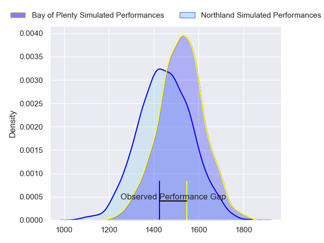
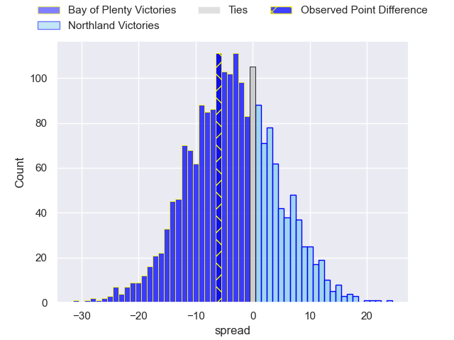
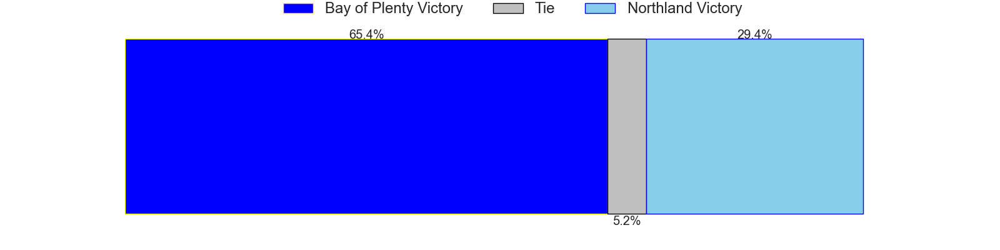
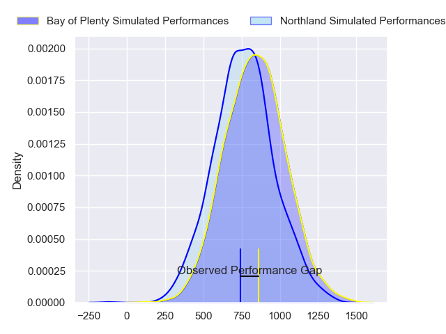
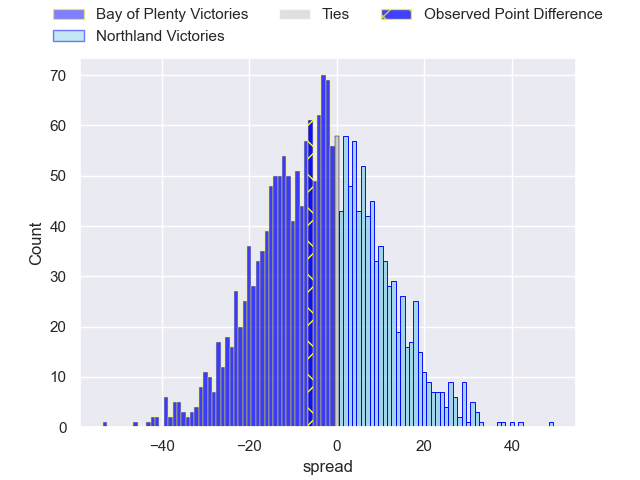
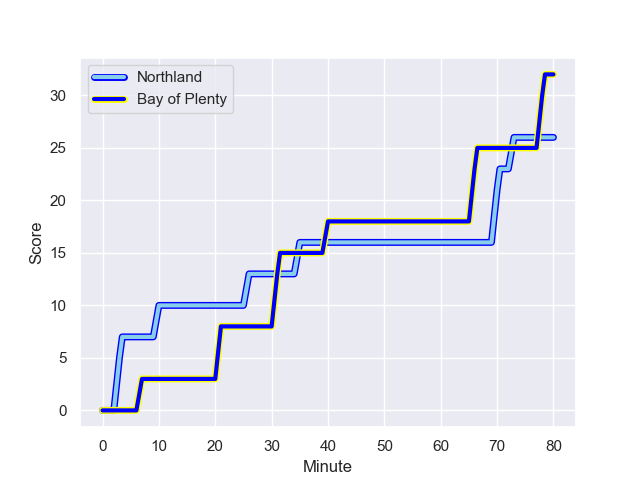
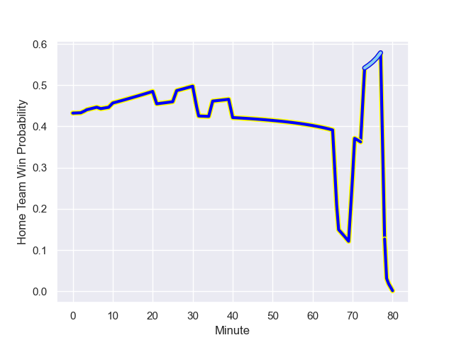

---  
layout: page  
title: Bay of Plenty at Northland; 32.0-26.0  
date: 2023-09-22 18:00:00 -0500  
categories: match review  
---
# Bay of Plenty at Northland; 32.0-26.0

# Club Level Predictions

The first set of predictions treats a club as the smallest object, as the club develops its members, organizes a gameplan, and deploys its players as needed for each match. This club model has a prediction of 0.406, which translates to predicting Bay of Plenty to win by 3.5.

Each club has a rating and a rating deviation (simiar to a Glicko system), and expected performances can be generated. This allows for simulated matches and spreads like the ones below.
## Projected Performances - Club Model

## Projected Spreads - Club Model

## Projected Results - Club Model

# Player Level Predictions - Version 2

Treating teams instead as an entity made up of the currently active players, I have ratings for each player in an altogether different system. These can be combined to form team ratings once teamsheets are announced, weighting starters a bit higher than the reserves. After the match is played, players can be weighted by their minutes on the field, allowing for an accurate measure of the team's composition. With these compiled team ratings, we can make predictions, measure inaccuracy, and update the individual player ratings.
## Prediction with Player Minutes: Bay of Plenty by 3.1

Bay of Plenty by 6.4 on a neutral field
## Prediction without Player Minutes: Bay of Plenty by 3.1

Bay of Plenty by 6.4 on a neutral pitch

## Projected Performances - Player Model

## Projected Spreads - Player Model

## Projected Results - Player Model

## Scores over Time

## Win Probability over Time

There were 12 large changes in win probability in this match

|   Away Minutes | Away Player          |   Away elo |   Number |   Home elo | Home Player         |   Home Minutes |
|---------------:|:---------------------|-----------:|---------:|-----------:|:--------------------|---------------:|
|             80 | Aidan Ross           |      89.73 |        1 |      47.15 | Rob Cobb            |             80 |
|             80 | Kurt Eklund          |      82.4  |        2 |      41.6  | Matt Moulds         |             80 |
|             80 | Pasilio Tosi         |      46.65 |        3 |      54.19 | Nelson Rebolo       |             80 |
|             80 | Justin Sangster      |      49.55 |        4 |      -5.08 | Sam Caird           |             80 |
|             80 | Manaaki Selby-Rickit |      24.17 |        5 |       5.26 | Liam Hallam-Eames   |             80 |
|             80 | Naitoa Ah Kuoi       |      84.16 |        6 |      34.2  | Rob Rush            |             80 |
|             80 | Veveni Lasaqa        |      42.66 |        7 |      54.99 | Matt Polwart-Matich |             80 |
|             80 | Jacob Norris         |      86.44 |        8 |      50.5  | Jonah Mau'u         |             80 |
|             80 | Richard Judd         |      88.43 |        9 |      26.44 | Lisati Milo-Harris  |             80 |
|             80 | Lucas Cashmore       |      41.05 |       10 |      44.68 | Rivez Reihana       |             80 |
|             80 | Fehi Fineanganofo    |      46.65 |       11 |      43.37 | Heremaia Murray     |             80 |
|             80 | Seamus Bardoul       |      44.3  |       12 |     104.2  | Jack Goodhue        |             80 |
|             80 | Melani Nanai         |      61.25 |       13 |      46.17 | Tamati Tua          |             80 |
|             80 | Lalomilo Lalomilo    |      35.14 |       14 |      74.26 | Jordan Trainor      |             80 |
|             80 | Wharenui Hawera      |      14.78 |       15 |      59.57 | Joshua Moorby       |             80 |

