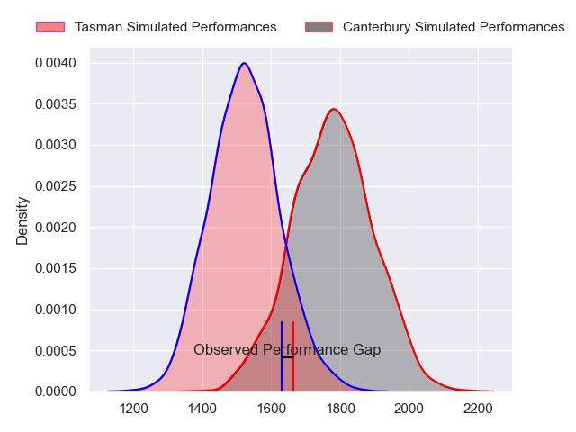
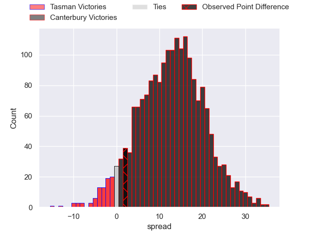
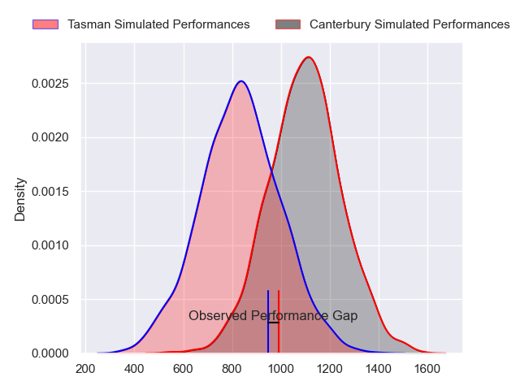
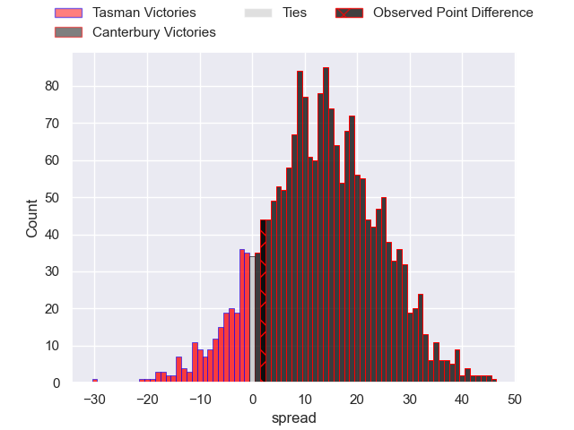
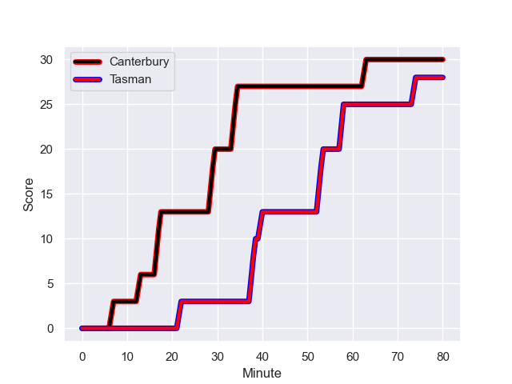
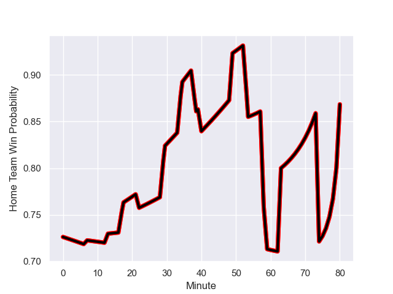

---  
layout: page  
title: Tasman at Canterbury; 28.0-30.0  
date: 2023-09-23 18:00:00 -0500  
categories: match review  
---
# Tasman at Canterbury; 28.0-30.0

# Club Level Predictions

The first set of predictions treats a club as the smallest object, as the club develops its members, organizes a gameplan, and deploys its players as needed for each match. This club model has a prediction of 0.801, which translates to predicting Canterbury to win by 12.7.

Each club has a rating and a rating deviation (simiar to a Glicko system), and expected performances can be generated. This allows for simulated matches and spreads like the ones below.
## Projected Performances - Club Model

## Projected Spreads - Club Model

## Projected Results - Club Model

# Player Level Predictions - Version 2

Treating teams instead as an entity made up of the currently active players, I have ratings for each player in an altogether different system. These can be combined to form team ratings once teamsheets are announced, weighting starters a bit higher than the reserves. After the match is played, players can be weighted by their minutes on the field, allowing for an accurate measure of the team's composition. With these compiled team ratings, we can make predictions, measure inaccuracy, and update the individual player ratings.
## Prediction with Player Minutes: Canterbury by 10.8

Canterbury by 7.4 on a neutral field
## Prediction without Player Minutes: Canterbury by 10.2

Canterbury by 6.7 on a neutral pitch

## Projected Performances - Player Model

## Projected Spreads - Player Model

## Projected Results - Player Model

## Scores over Time

## Win Probability over Time

There were 12 large changes in win probability in this match

|   Away Minutes | Away Player           |   Away elo |   Number |   Home elo | Home Player       |   Home Minutes |
|---------------:|:----------------------|-----------:|---------:|-----------:|:------------------|---------------:|
|             71 | Kershawl Sykes-Martin |      55.24 |        1 |      69.9  | Joe Moody         |             59 |
|             33 | Feleti Kaitu'u        |      41.51 |        2 |      60.41 | George Bell       |             59 |
|             59 | Samuel Matenga        |      71.69 |        3 |      46.6  | Brook Toomalatai  |             54 |
|             80 | Quinten Strange       |      72.16 |        4 |      71.86 | Mitchell Dunshea  |             68 |
|             49 | Pari Pari Parkinson   |     101.76 |        5 |      54.9  | Sam Darry         |             80 |
|             80 | Max Hicks             |      50.14 |        6 |      63.63 | Dom Gardiner      |             49 |
|             74 | Seta Baker            |      48.83 |        7 |      91.19 | Tom Christie      |             80 |
|             80 | Anton Segner          |      41.8  |        8 |      77.03 | Billy Harmon      |             80 |
|             74 | Noah Hotham           |      54.04 |        9 |      93.6  | Mitchell Drummond |             49 |
|             80 | Taine Robinson        |      43.96 |       10 |      59.03 | Fergus Burke      |             80 |
|             80 | Willi Gualter         |      47.14 |       11 |      53.92 | Manasa Mataele    |             41 |
|             33 | Alex Nankivell        |      86.26 |       12 |      67.49 | Rameka Poihipi    |             80 |
|             80 | Levi Aumua            |      66.76 |       13 |      70.31 | Dallas McLeod     |             80 |
|             80 | Timoci Tavatavanawai  |      37.34 |       14 |      89.54 | Solomon Alaimalo  |             80 |
|             80 | Macca Springer        |      50.46 |       15 |      67.37 | Chay Fihaki       |             65 |
|              9 | Ryan Coxon            |      44.9  |       16 |      46.35 | Dan Lienert-Brown |             21 |
|             21 | Luca Inch             |      35.89 |       17 |      45.17 | Seb Calder        |             26 |
|             47 | Quentin MacDonald     |      88.73 |       18 |      84.71 | Ben Funnell       |             21 |
|              6 | Angus Fletcher        |      46.11 |       19 |      47.68 | Tahlor Cahill     |             12 |
|             31 | Antonio Shalfoon      |      34.41 |       20 |      47.57 | Joe Brial         |             31 |
|              6 | Louie Chapman         |      37.12 |       21 |      93.05 | Willi Heinz       |             31 |
|             47 | Tomasi Alosio         |      56.79 |       22 |      52.86 | Alex Harford      |             15 |
|            nan | nan                   |     nan    |       23 |      46.47 | Jone Rova         |             39 |

