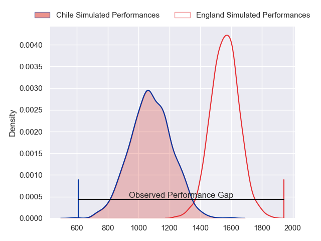
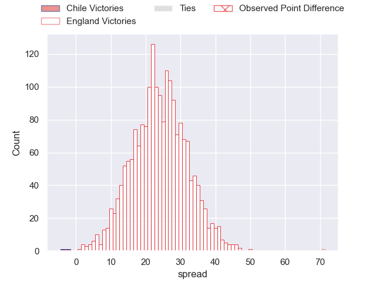
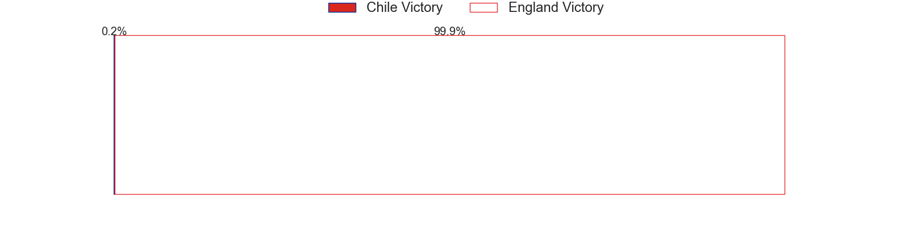
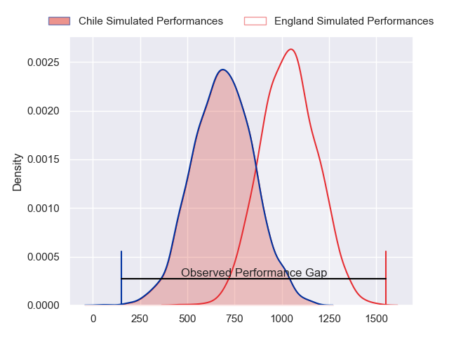
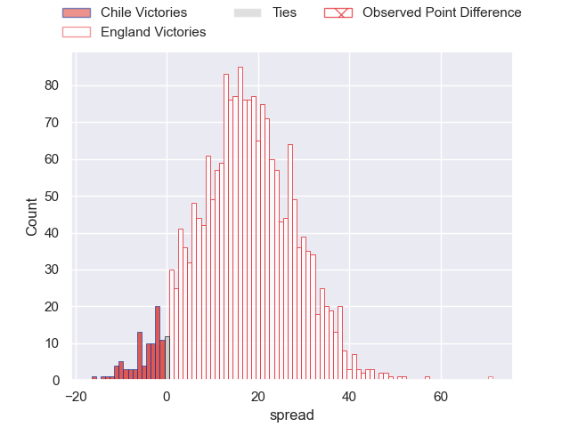
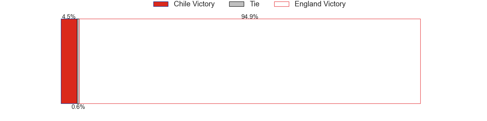
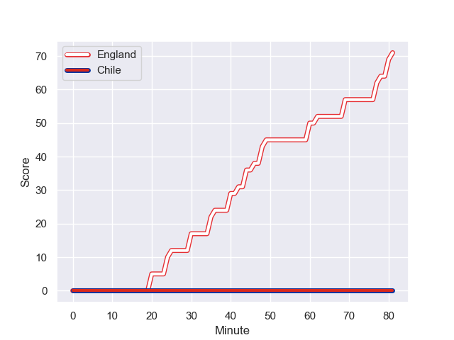
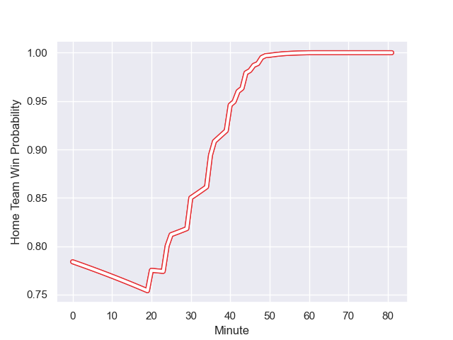

---  
layout: page  
title: Chile at England; 0.0-71.0  
date: 2023-09-23 18:00:00 -0500  
categories: match review  
---
# Chile at England; 0.0-71.0

# Club Level Predictions

The first set of predictions treats a club as the smallest object, as the club develops its members, organizes a gameplan, and deploys its players as needed for each match. This club model has a prediction of 0.927, which translates to predicting England to win by 24.0.

Each club has a rating and a rating deviation (simiar to a Glicko system), and expected performances can be generated. This allows for simulated matches and spreads like the ones below.
## Projected Performances - Club Model

## Projected Spreads - Club Model

## Projected Results - Club Model

# Player Level Predictions - Version 2

Treating teams instead as an entity made up of the currently active players, I have ratings for each player in an altogether different system. These can be combined to form team ratings once teamsheets are announced, weighting starters a bit higher than the reserves. After the match is played, players can be weighted by their minutes on the field, allowing for an accurate measure of the team's composition. With these compiled team ratings, we can make predictions, measure inaccuracy, and update the individual player ratings.
## Prediction with Player Minutes: England by 14.2

England by 14.2 on a neutral field
## Prediction without Player Minutes: England by 14.5

England by 14.5 on a neutral pitch

## Projected Performances - Player Model

## Projected Spreads - Player Model

## Projected Results - Player Model

## Scores over Time

## Win Probability over Time

There were 4 large changes in win probability in this match

|   Away Minutes | Away Player                 |   Away elo |   Number |   Home elo | Home Player    |   Home Minutes |
|---------------:|:----------------------------|-----------:|---------:|-----------:|:---------------|---------------:|
|             57 | Salvador Lues               |      46.65 |        1 |      60.62 | Bevan Rodd     |             55 |
|             57 | Augusto Bohme               |      46.65 |        2 |      40.8  | Theo Dan       |             55 |
|             66 | Matias Dittus               |      36.09 |        3 |      56.4  | Kyle Sinckler  |             55 |
|             81 | Clemente Saavedra           |      46.65 |        4 |      62.73 | David Ribbans  |             81 |
|             62 | Javier Eissmann Pena        |      46.65 |        5 |      61.83 | George Martin  |             81 |
|             81 | Martin Sigren               |      46.65 |        6 |      51.58 | Lewis Ludlam   |             55 |
|             41 | Ignacio Silva               |      46.65 |        7 |      78.2  | Jack Willis    |             81 |
|             63 | Alfonso Escobar             |      46.65 |        8 |     117.16 | Billy Vunipola |             67 |
|             81 | Benjamin Videla             |      46.65 |        9 |     131.68 | Danny Care     |             50 |
|             81 | Rodrigo Fernandez           |      46.65 |       10 |     128.38 | Owen Farrell   |             81 |
|             63 | Franco Velarde              |      46.65 |       11 |      48.69 | Max Malins     |             71 |
|             78 | Matias Garafulic            |      46.65 |       12 |      50.92 | Ollie Lawrence |             81 |
|             81 | Domingo Saavedra Cartajena  |      46.65 |       13 |      51.1  | Elliot Daly    |             50 |
|             81 | Cristobal Game              |      46.65 |       14 |      43.34 | Henry Arundell |             81 |
|             81 | Francisco Urroz             |      46.65 |       15 |      71.04 | Marcus Smith   |             81 |
|             24 | Tomas Dussaillant           |      46.65 |       16 |      33.91 | Jack Walker    |             26 |
|             24 | Vittorio Lastra             |      46.65 |       17 |      89.26 | Joe Marler     |             26 |
|             15 | Inaki Gurruchaga            |      46.65 |       18 |      23.27 | Will Stuart    |             26 |
|             19 | Pablo Huete Cibrario        |      47.35 |       19 |      49.91 | Ollie Chessum  |             26 |
|             18 | Tomas Orchard Meyer-Rachner |      46.65 |       20 |      83.53 | Ben Earl       |             14 |
|             40 | Raimundo Martinez           |      46.65 |       21 |      65.16 | Ben Youngs     |             31 |
|              3 | Lukas Carvallo              |      46.65 |       22 |      85.39 | George Ford    |             31 |
|             18 | Inaki Ayarza Saporta        |      43.39 |       23 |      71.44 | Joe Marchant   |             10 |

