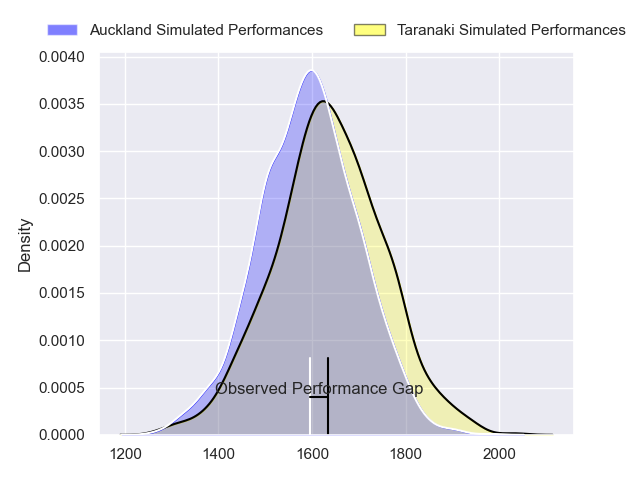
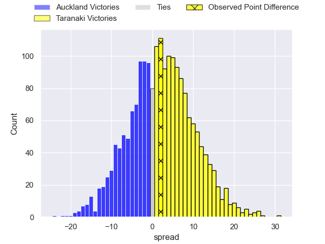
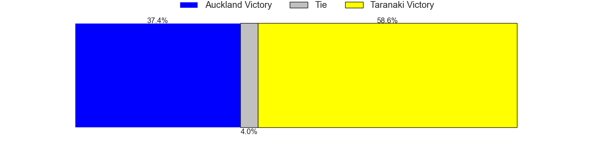
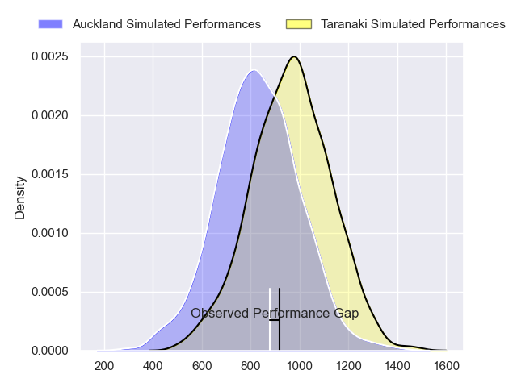
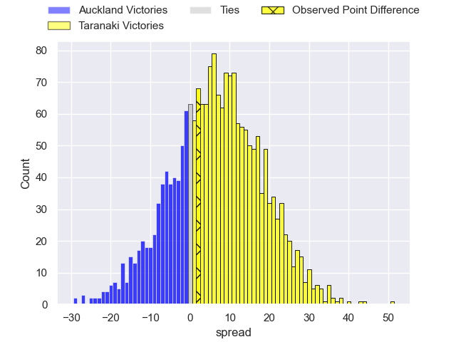
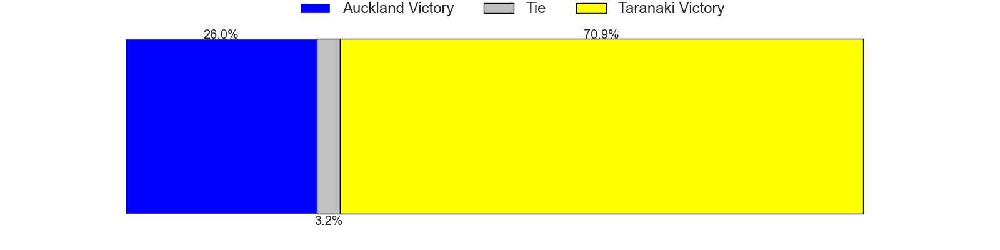
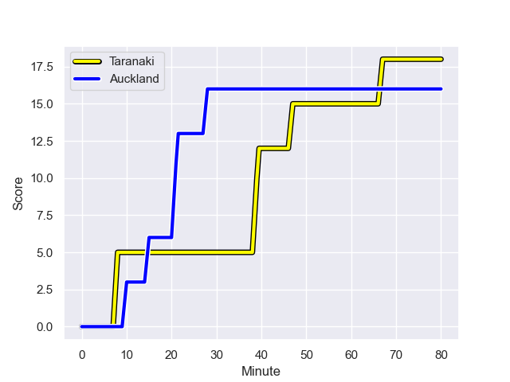
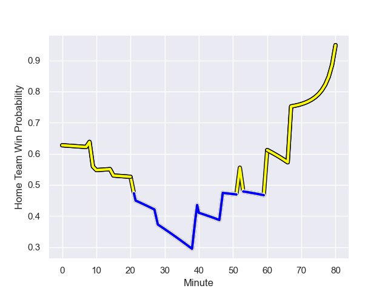

---  
layout: page  
title: Auckland at Taranaki; 16.0-18.0  
date: 2023-09-23 18:00:00 -0500  
categories: match review  
---
# Auckland at Taranaki; 16.0-18.0

# Club Level Predictions

The first set of predictions treats a club as the smallest object, as the club develops its members, organizes a gameplan, and deploys its players as needed for each match. This club model has a prediction of 0.56, which translates to predicting Taranaki to win by 2.2.

Each club has a rating and a rating deviation (simiar to a Glicko system), and expected performances can be generated. This allows for simulated matches and spreads like the ones below.
## Projected Performances - Club Model

## Projected Spreads - Club Model

## Projected Results - Club Model

# Player Level Predictions - Version 2

Treating teams instead as an entity made up of the currently active players, I have ratings for each player in an altogether different system. These can be combined to form team ratings once teamsheets are announced, weighting starters a bit higher than the reserves. After the match is played, players can be weighted by their minutes on the field, allowing for an accurate measure of the team's composition. With these compiled team ratings, we can make predictions, measure inaccuracy, and update the individual player ratings.
## Prediction with Player Minutes: Taranaki by 5.8

Taranaki by 2.4 on a neutral field
## Prediction without Player Minutes: Taranaki by 4.6

Taranaki by 1.2 on a neutral pitch

## Projected Performances - Player Model

## Projected Spreads - Player Model

## Projected Results - Player Model

## Scores over Time

## Win Probability over Time

There were 14 large changes in win probability in this match

|   Away Minutes | Away Player         |   Away elo |   Number |   Home elo | Home Player                   |   Home Minutes |
|---------------:|:--------------------|-----------:|---------:|-----------:|:------------------------------|---------------:|
|             80 | Josh Fusitua        |      50.98 |        1 |      38.58 | Jared Proffit                 |             68 |
|             58 | Soane Vikena        |      48.47 |        2 |      50.12 | Ricky Riccitelli              |             65 |
|             52 | Sione Ahio          |      46.62 |        3 |      39.42 | Reuben O'Neill                |             40 |
|             65 | Edward Annandale    |      37.33 |        4 |      38.58 | Michael Loft                  |             80 |
|             80 | Josh Beehre         |      51.23 |        5 |      30.04 | Heiden Bedwell-Curtis         |             71 |
|              4 | Adrian Choat        |      48.74 |        6 |      56.83 | Bradley Slater                |             80 |
|             80 | Blake Gibson        |      71.66 |        7 |      63.74 | Tom Florence                  |             80 |
|             80 | Che Clark           |      44.87 |        8 |      83.96 | Pita Gus Sowakula             |             80 |
|             60 | Kalani Thomas       |      49.53 |        9 |      38.81 | Logan Crowley                 |             53 |
|             80 | Zarn Sullivan       |      64.47 |       10 |     100.67 | Jayson Potroz                 |             52 |
|             80 | Salesi Rayasi       |      78.86 |       11 |      85.44 | Kini Naholo                   |             80 |
|             80 | Harry Plummer       |      81.21 |       12 |      24.08 | Brayton Northcott-Hill        |              9 |
|             60 | Bryce Heem          |     113.59 |       13 |      57.87 | Meihana Grindlay              |             80 |
|             80 | AJ Lam              |      49.22 |       14 |      68.93 | Vereniki Tikoisolomone        |             80 |
|             80 | Roger Tuivasa-Sheck |      33.68 |       15 |     101.25 | Jacob Ratumaitavuki-Kneepkens |             80 |
|             22 | Leni Apisai         |      17.34 |       16 |     102.95 | Michael Bent                  |             40 |
|             28 | Marcel Renata       |      48.62 |       17 |       6.72 | Donald Brighouse              |             12 |
|             76 | Vaiolini Ekuasi     |      37.54 |       18 |      47.58 | Fiti Sa                       |              9 |
|             20 | Taufa Funaki        |      30.36 |       19 |      54.97 | Millennium Sanerivi           |             15 |
|             15 | Hamish Dalzell      |      39.61 |       20 |      40.23 | Adam Lennox                   |             27 |
|             20 | Tanielu Teleʻa      |      34.98 |       21 |      53.36 | Josh Jacomb                   |             28 |
|            nan | nan                 |     nan    |       22 |      16.29 | Teihorangi Walden             |             71 |

