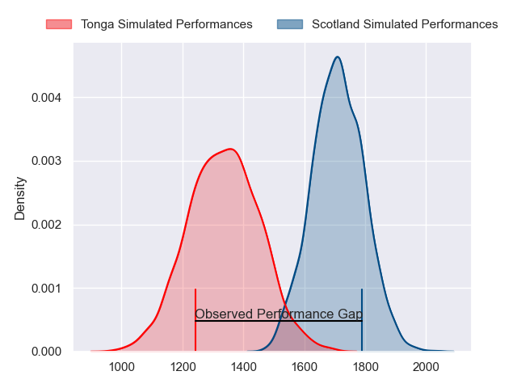
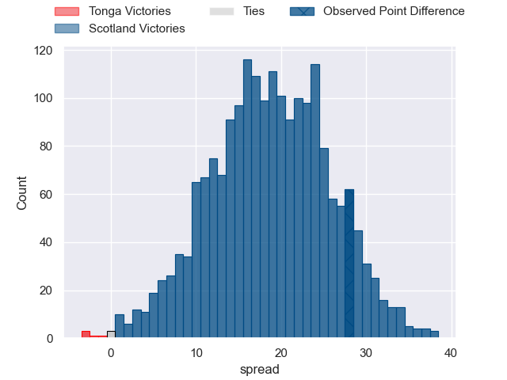
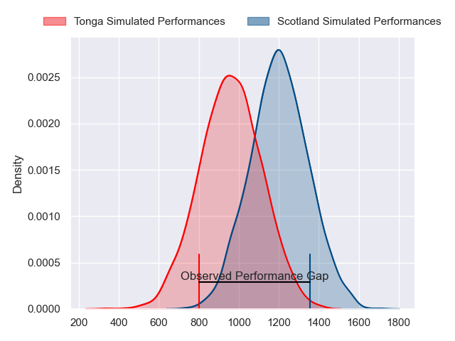
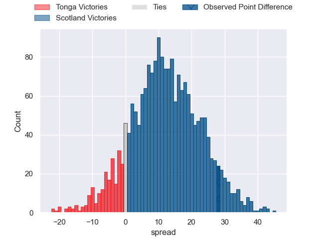
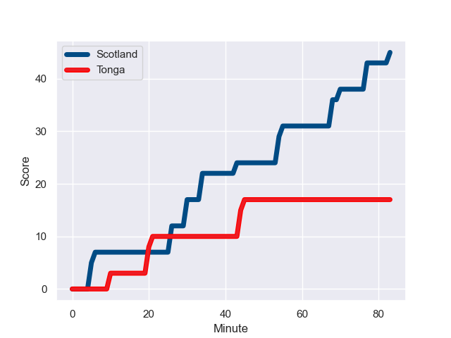
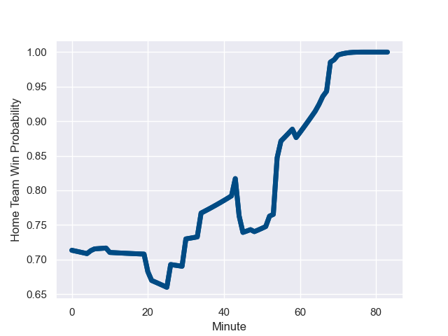

---  
layout: page  
title: Tonga at Scotland; 17.0-45.0  
date: 2023-09-24 18:00:00 -0500  
categories: match review  
---
# Tonga at Scotland; 17.0-45.0

# Club Level Predictions

The first set of predictions treats a club as the smallest object, as the club develops its members, organizes a gameplan, and deploys its players as needed for each match. This club model has a prediction of 0.882, which translates to predicting Scotland to win by 18.7.

Each club has a rating and a rating deviation (simiar to a Glicko system), and expected performances can be generated. This allows for simulated matches and spreads like the ones below.
## Projected Performances - Club Model

## Projected Spreads - Club Model

## Projected Results - Club Model

# Player Level Predictions - Version 2

Treating teams instead as an entity made up of the currently active players, I have ratings for each player in an altogether different system. These can be combined to form team ratings once teamsheets are announced, weighting starters a bit higher than the reserves. After the match is played, players can be weighted by their minutes on the field, allowing for an accurate measure of the team's composition. With these compiled team ratings, we can make predictions, measure inaccuracy, and update the individual player ratings.
## Prediction with Player Minutes: Scotland by 10.0

Scotland by 10.0 on a neutral field
## Prediction without Player Minutes: Scotland by 10.8

Scotland by 10.8 on a neutral pitch

## Projected Performances - Player Model

## Projected Spreads - Player Model

## Projected Results - Player Model

## Scores over Time

## Win Probability over Time

There were 8 large changes in win probability in this match

|   Away Minutes | Away Player          |   Away elo |   Number |   Home elo | Home Player         |   Home Minutes |
|---------------:|:---------------------|-----------:|---------:|-----------:|:--------------------|---------------:|
|             70 | Siegfried Fisi'ihoi  |      47.5  |        1 |      48.61 | Rory Sutherland     |             48 |
|             52 | Paula Ngauamo        |      64.87 |        2 |     111.12 | George Turner       |             59 |
|             66 | Ben Tameifuna        |      88.69 |        3 |     108.14 | Zander Fagerson     |             59 |
|             83 | Leva Fifita          |      20.13 |        4 |      60.62 | Richie Gray         |             65 |
|             55 | Sam Lousi            |      76.17 |        5 |     104.55 | Scott Cummings      |             83 |
|             55 | Tanginoa Halaifonua  |      27.01 |        6 |     121.23 | Jamie Ritchie       |             34 |
|             70 | Sione Havili Talitui |     100.38 |        7 |      59.98 | Rory Darge          |             83 |
|             83 | Vaea Fifita          |     116.29 |        8 |      28.46 | Jack Dempsey        |             83 |
|             55 | Augustine Pulu       |      49.72 |        9 |      59.91 | Ben White           |             48 |
|             78 | William Havili       |      56.67 |       10 |     124.91 | Finn Russell        |             83 |
|             83 | Afusipa Taumoepeau   |      74.03 |       11 |      70.05 | Duhan van der Merwe |             83 |
|             83 | Pita Ahki            |      43.89 |       12 |      43.82 | Sione Tuipulotu     |             83 |
|             83 | Malakai Fekitoa      |      77.33 |       13 |      69.14 | Chris Harris        |             48 |
|             83 | Solomone Kata        |      51.63 |       14 |     100.17 | Kyle Steyn          |             48 |
|             83 | Charles Piutau       |      76.35 |       15 |     129.34 | Blair Kinghorn      |             83 |
|             31 | Samiuela Moli        |      33.34 |       16 |      39.08 | Ewan Ashman         |             24 |
|             13 | Tau Koloamatangi     |      64.15 |       17 |      48.68 | Pierre Schoeman     |             35 |
|             17 | Joe Apikotoa         |      55.71 |       18 |      93.97 | WP Nel              |             24 |
|             28 | Adam Coleman         |     120.67 |       19 |      74.55 | Sam Skinner         |             18 |
|             13 | Semisi Paea          |      46.65 |       20 |      99.93 | Matt Fagerson       |             49 |
|             28 | Sione Vailanu        |      46.5  |       21 |     126.32 | George Horne        |             35 |
|             28 | Sonatane Takulua     |      14.1  |       22 |      41.22 | Huw Jones           |             35 |
|              5 | Patrick Pellegrini   |      86.65 |       23 |      49.95 | Darcy Graham        |             35 |

