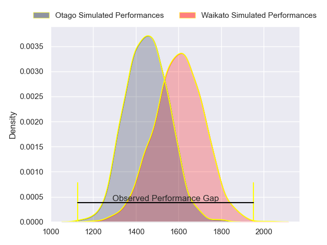
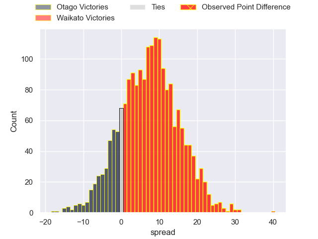
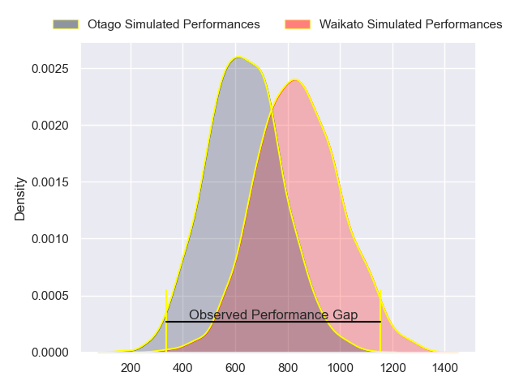
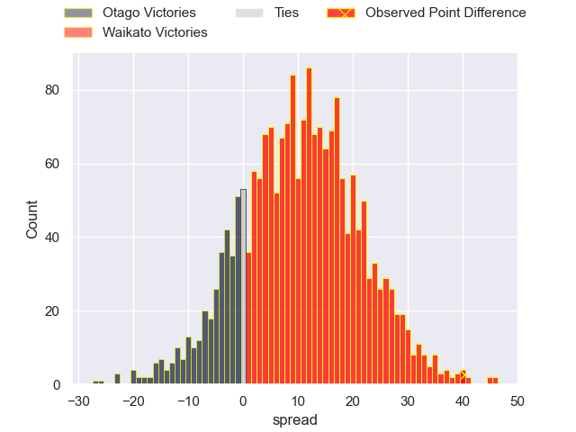
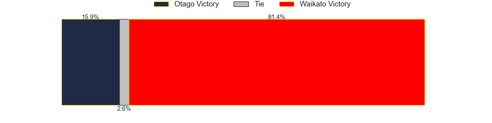
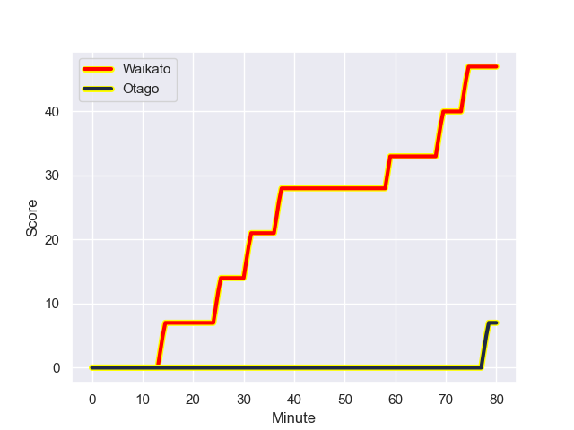
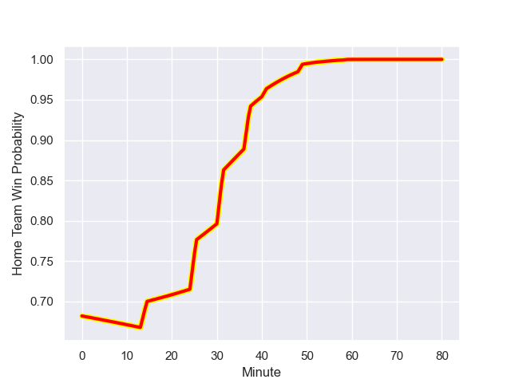

---  
layout: page  
title: Otago at Waikato; 7.0-47.0  
date: 2023-09-24 18:00:00 -0500  
categories: match review  
---
# Otago at Waikato; 7.0-47.0

# Club Level Predictions

The first set of predictions treats a club as the smallest object, as the club develops its members, organizes a gameplan, and deploys its players as needed for each match. This club model has a prediction of 0.693, which translates to predicting Waikato to win by 7.4.

Each club has a rating and a rating deviation (simiar to a Glicko system), and expected performances can be generated. This allows for simulated matches and spreads like the ones below.
## Projected Performances - Club Model

## Projected Spreads - Club Model

## Projected Results - Club Model

# Player Level Predictions - Version 2

Treating teams instead as an entity made up of the currently active players, I have ratings for each player in an altogether different system. These can be combined to form team ratings once teamsheets are announced, weighting starters a bit higher than the reserves. After the match is played, players can be weighted by their minutes on the field, allowing for an accurate measure of the team's composition. With these compiled team ratings, we can make predictions, measure inaccuracy, and update the individual player ratings.
## Prediction with Player Minutes: Waikato by 8.4

Waikato by 5.0 on a neutral field
## Prediction without Player Minutes: Waikato by 7.5

Waikato by 4.1 on a neutral pitch

## Projected Performances - Player Model

## Projected Spreads - Player Model

## Projected Results - Player Model

## Scores over Time

## Win Probability over Time

There were 3 large changes in win probability in this match

|   Away Minutes | Away Player          |   Away elo |   Number |   Home elo | Home Player        |   Home Minutes |
|---------------:|:---------------------|-----------:|---------:|-----------:|:-------------------|---------------:|
|             49 | Abraham Pole         |      50.6  |        1 |      80.16 | Ayden Johnstone    |             49 |
|             53 | Henry Bell           |      39.03 |        2 |      56.21 | Pita Anae Ah-Sue   |             49 |
|             49 | Jermaine Ainsley     |      39.95 |        3 |      55.47 | George Dyer        |             57 |
|             53 | Will Tucker          |      18.58 |        4 |      62.1  | James Tucker       |             80 |
|             49 | Fabian Holland       |      52.75 |        5 |      41.36 | Hamilton Burr      |             49 |
|             41 | Tom Sanders          |      78.34 |        6 |      64.03 | Samipeni Finau     |             80 |
|             80 | Harry Taylor         |      40.29 |        7 |      26.97 | Joe Johnston       |             57 |
|             80 | Christian Lio-Willie |      49.23 |        8 |      33.95 | Simon Parker       |             80 |
|             53 | Nathan Hastie        |      46.11 |        9 |      29.76 | Xavier Roe         |             66 |
|             80 | Sam Gilbert          |      39.54 |       10 |      77.44 | Aaron Cruden       |             80 |
|             80 | Jeremiah Asi         |      46.09 |       11 |      38.9  | Tepaea Cook-Savage |             80 |
|             61 | Jake Te Hiwi         |      34.33 |       12 |      42.79 | Austin Anderson    |             80 |
|             80 | Josh Whaanga         |      35.56 |       13 |      47.24 | Tana Tuhakaraina   |             68 |
|             80 | John Tapueluelu      |      48.97 |       14 |      34.95 | Bailyn Sullivan    |             71 |
|             80 | Finn Hurley          |      37.24 |       15 |      48.39 | Daniel Sinkinson   |             80 |
|             31 | Rohan Wingham        |      40.52 |       16 |      60.84 | Ollie Norris       |             31 |
|             31 | Saula Mau            |      38.85 |       17 |      54.76 | Solomone Tukuafu   |             23 |
|             27 | Ricky Jackson        |      43.8  |       18 |      45.37 | Caleb Ralph        |             31 |
|             27 | James Arscott        |      31.86 |       19 |      46.65 | Quintony Ngatai    |             14 |
|             39 | Will Stodart         |      46.65 |       20 |      46.65 | Aki Tuivailala     |             12 |
|             31 | Josh Dickson         |      36.61 |       21 |      45.32 | Cody Nordstrom     |              9 |
|             27 | Josh Hill            |      38.08 |       22 |      52.25 | Gideon Wrampling   |             23 |
|             19 | Ajay Faleafaga       |      44.97 |       23 |      86.18 | Laghlan McWhannell |             31 |

