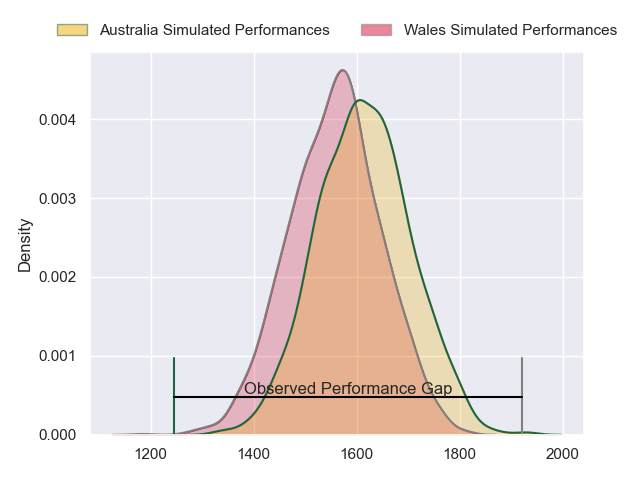
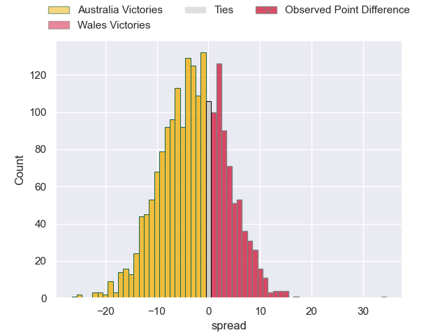
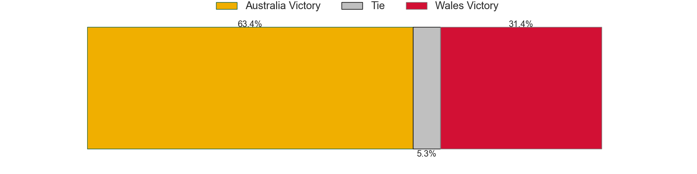
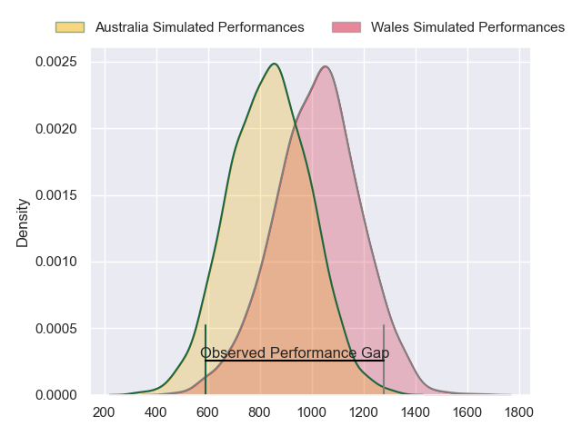
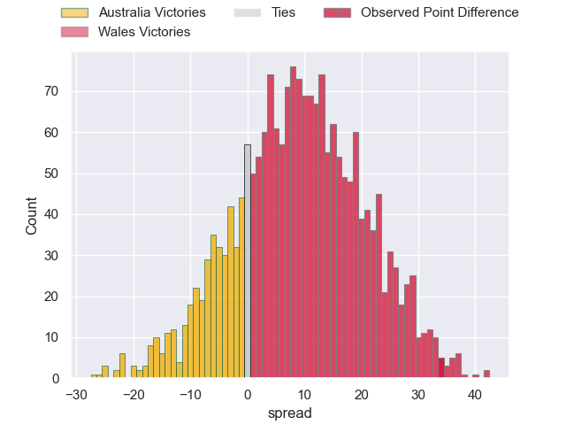
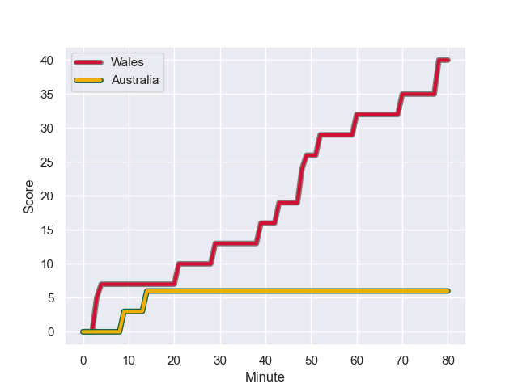
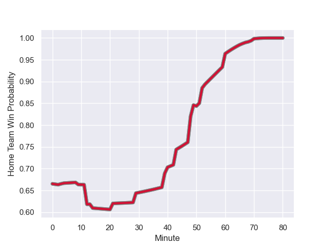

---  
layout: page  
title: Australia at Wales; 6.0-40.0  
date: 2023-09-24 18:00:00 -0500  
categories: match review  
---
# Australia at Wales; 6.0-40.0

# Club Level Predictions

The first set of predictions treats a club as the smallest object, as the club develops its members, organizes a gameplan, and deploys its players as needed for each match. This club model has a prediction of 0.426, which translates to predicting Australia to win by 2.7.

Each club has a rating and a rating deviation (simiar to a Glicko system), and expected performances can be generated. This allows for simulated matches and spreads like the ones below.
## Projected Performances - Club Model

## Projected Spreads - Club Model

## Projected Results - Club Model

# Player Level Predictions - Version 2

Treating teams instead as an entity made up of the currently active players, I have ratings for each player in an altogether different system. These can be combined to form team ratings once teamsheets are announced, weighting starters a bit higher than the reserves. After the match is played, players can be weighted by their minutes on the field, allowing for an accurate measure of the team's composition. With these compiled team ratings, we can make predictions, measure inaccuracy, and update the individual player ratings.
## Prediction with Player Minutes: Wales by 7.5

Wales by 7.5 on a neutral field
## Prediction without Player Minutes: Wales by 8.5

Wales by 8.5 on a neutral pitch

## Projected Performances - Player Model

## Projected Spreads - Player Model

## Projected Results - Player Model

## Scores over Time

## Win Probability over Time

There were 7 large changes in win probability in this match

|   Away Minutes | Away Player         |   Away elo |   Number |   Home elo | Home Player       |   Home Minutes |
|---------------:|:--------------------|-----------:|---------:|-----------:|:------------------|---------------:|
|             68 | Angus Bell          |      59.15 |        1 |      29.57 | Gareth Thomas     |             67 |
|             60 | Dave Porecki        |      46.72 |        2 |      75.03 | Ryan Elias        |             67 |
|             40 | James Slipper       |      73.57 |        3 |      95.68 | Tomas Francis     |             67 |
|             80 | Nick Frost          |      42.2  |        4 |      32.88 | Will Rowlands     |             71 |
|             66 | Richie Arnold       |      29.36 |        5 |      51.91 | Adam Beard        |             80 |
|             50 | Rob Leota           |      28.82 |        6 |      63.71 | Aaron Wainwright  |             71 |
|             80 | Tom Hooper          |      42.83 |        7 |      61.6  | Jac Morgan        |             80 |
|             80 | Rob Valetini        |      91.12 |        8 |      66.14 | Taulupe Faletau   |             80 |
|             68 | Tate McDermott      |      51.43 |        9 |      33.64 | Gareth Davies     |             60 |
|             53 | Ben Donaldson       |      50.63 |       10 |     126.1  | Dan Biggar        |             12 |
|             80 | Marika Koroibete    |      57.97 |       11 |      57.57 | Josh Adams        |             80 |
|             80 | Samu Kerevi         |      88.65 |       12 |      98.2  | Nick Tompkins     |             80 |
|             80 | Jordan Petaia       |      75.88 |       13 |     110.42 | George North      |             80 |
|             80 | Mark Nawaqanitawase |      29.13 |       14 |      71.13 | Louis Rees-Zammit |             71 |
|             60 | Andrew Kellaway     |      68.89 |       15 |     110.02 | Liam Williams     |             80 |
|             20 | Matt Faessler       |      42.71 |       16 |      68.53 | Elliot Dee        |             13 |
|             12 | Blake Schoupp       |      43.91 |       17 |      55.54 | Corey Domachowski |             13 |
|             40 | Pone Fa'amausili    |      47.04 |       18 |      51.89 | Henry Thomas      |             13 |
|             14 | Matt Philip         |      43.88 |       19 |      60.16 | Dafydd Jenkins    |              9 |
|             30 | Fraser McReight     |      61.99 |       20 |      32.46 | Taine Basham      |              9 |
|             12 | Nic White           |     136.29 |       21 |      67.56 | Tomos Williams    |             20 |
|             27 | Carter Gordon       |      40.52 |       22 |      50.87 | Gareth Anscombe   |             68 |
|             20 | Suliasi Vunivalu    |      32.99 |       23 |      16.54 | Rio Dyer          |              9 |

