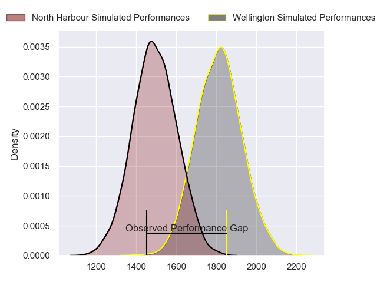
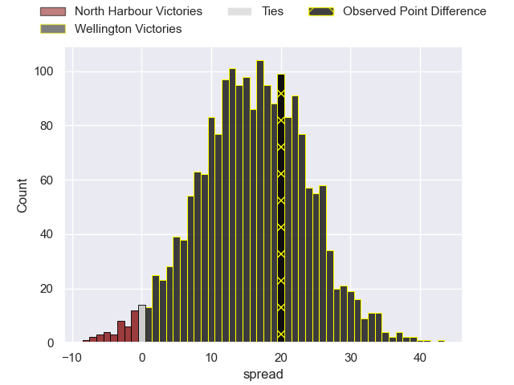
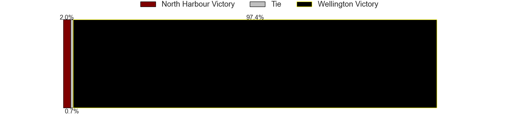
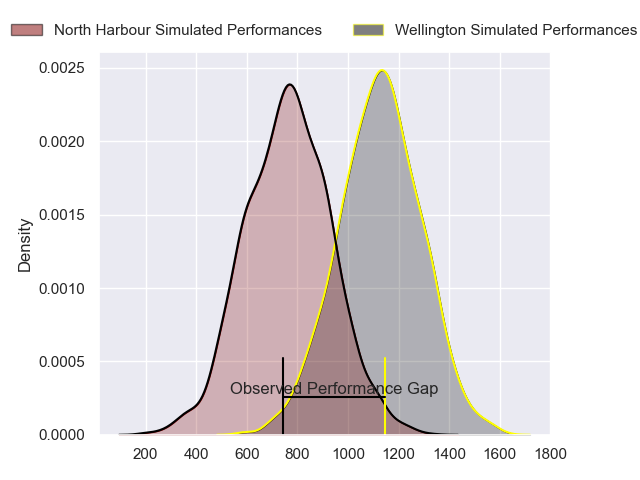
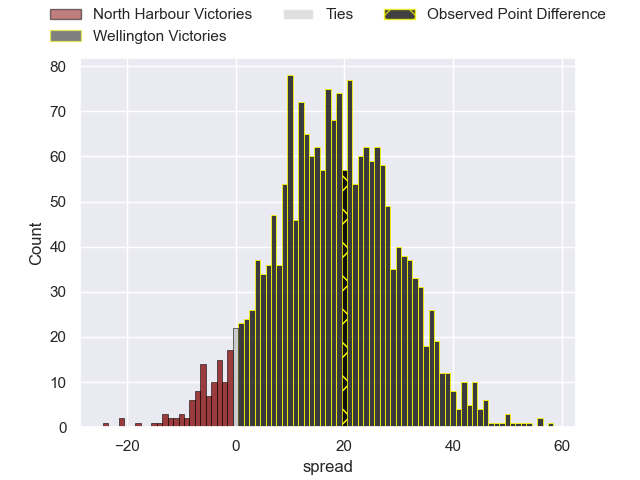
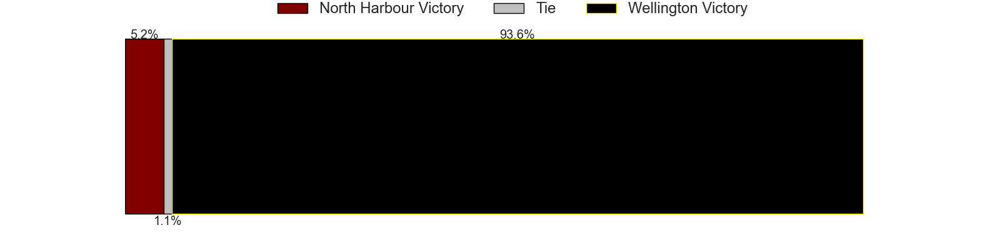
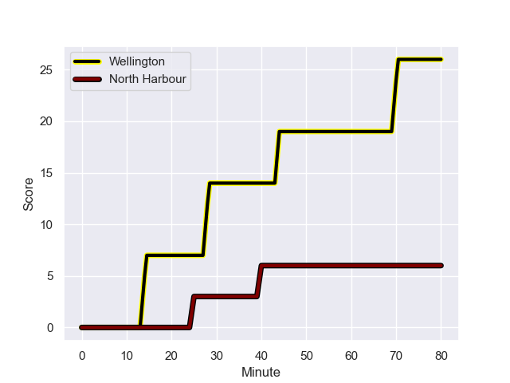
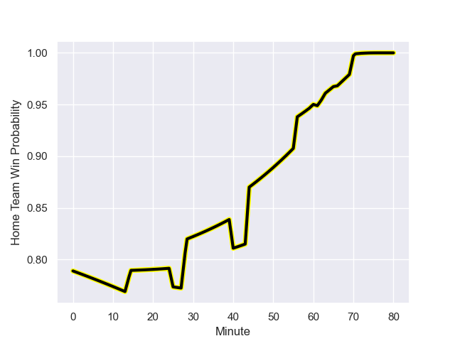

---  
layout: page  
title: North Harbour at Wellington; 6.0-26.0  
date: 2023-09-24 18:00:00 -0500  
categories: match review  
---
# North Harbour at Wellington; 6.0-26.0

# Club Level Predictions

The first set of predictions treats a club as the smallest object, as the club develops its members, organizes a gameplan, and deploys its players as needed for each match. This club model has a prediction of 0.849, which translates to predicting Wellington to win by 15.8.

Each club has a rating and a rating deviation (simiar to a Glicko system), and expected performances can be generated. This allows for simulated matches and spreads like the ones below.
## Projected Performances - Club Model

## Projected Spreads - Club Model

## Projected Results - Club Model

# Player Level Predictions - Version 2

Treating teams instead as an entity made up of the currently active players, I have ratings for each player in an altogether different system. These can be combined to form team ratings once teamsheets are announced, weighting starters a bit higher than the reserves. After the match is played, players can be weighted by their minutes on the field, allowing for an accurate measure of the team's composition. With these compiled team ratings, we can make predictions, measure inaccuracy, and update the individual player ratings.
## Prediction with Player Minutes: Wellington by 14.6

Wellington by 11.2 on a neutral field
## Prediction without Player Minutes: Wellington by 13.8

Wellington by 10.4 on a neutral pitch

## Projected Performances - Player Model

## Projected Spreads - Player Model

## Projected Results - Player Model

## Scores over Time

## Win Probability over Time

There were 4 large changes in win probability in this match

|   Away Minutes | Away Player       |   Away elo |   Number |   Home elo | Home Player            |   Home Minutes |
|---------------:|:------------------|-----------:|---------:|-----------:|:-----------------------|---------------:|
|             63 | Nic Mayhew        |      75.65 |        1 |      87.39 | Xavier Numia           |             61 |
|             77 | Shilo Klein       |      45.65 |        2 |      42.53 | James O'Reilly         |             73 |
|             66 | Tevita Mafileo    |      60.03 |        3 |      48.88 | Siale Lauaki           |             62 |
|             80 | Ben Grant         |      82.58 |        4 |      90.77 | Dominic Bird           |             80 |
|             80 | Mahroni Ngakuru   |      12.69 |        5 |      57.38 | Hugo Plummer           |             53 |
|             51 | Tamarau McGahan   |      52.05 |        6 |      86.6  | Brad Shields           |             73 |
|             66 | Jed Melvin        |      55.08 |        7 |      85.27 | Du'Plessis Kirifi      |             80 |
|             80 | Cameron Suafoa    |      46.73 |        8 |      72.72 | Peter Lakai            |             80 |
|             66 | Jamie Booth       |      12.54 |        9 |      72.01 | Kemara Hauiti-Parapara |             71 |
|             80 | Bryn Gatland      |      77.73 |       10 |      62.66 | Aidan Morgan           |             80 |
|             80 | Moses Leo         |      50.06 |       11 |      50.37 | Tjay Clarke            |             60 |
|             73 | Henry Taefu       |      25.81 |       12 |      49.65 | Peter Umaga-Jensen     |             56 |
|             80 | Tom Barham        |      41.11 |       13 |      79.98 | Billy Proctor          |             80 |
|             80 | Kade Banks        |      45.13 |       14 |      56.82 | Losi Filipo            |             80 |
|             80 | Shaun Stevenson   |      82.97 |       15 |      87.52 | Ruben Love             |             80 |
|              3 | Bryn Gordon       |      46.56 |       16 |      51.5  | Cameron Orr            |             19 |
|             17 | Tevita Langi      |      41.5  |       17 |      67.43 | PJ Sheck               |             18 |
|             14 | Sione Mafileo     |      72.95 |       18 |      49.79 | Penieli Poasa          |              7 |
|             29 | Lotu Inisi        |      49.76 |       19 |      69.64 | Caleb Delany           |             27 |
|             14 | Karl Ruzich       |      43.03 |       20 |      50.67 | Dominic Ropeti         |              7 |
|             14 | Siaosi Nginingini |      48.03 |       21 |      54.49 | Kyle Preston           |              9 |
|              7 | Alapati Leiua     |      43.97 |       22 |      56.16 | Connor Garden-Bachop   |             20 |
|            nan | nan               |     nan    |       23 |      82.79 | Riley Higgins          |             24 |

