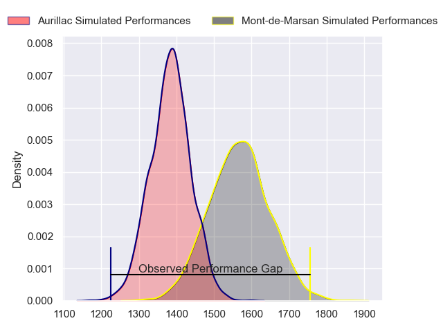
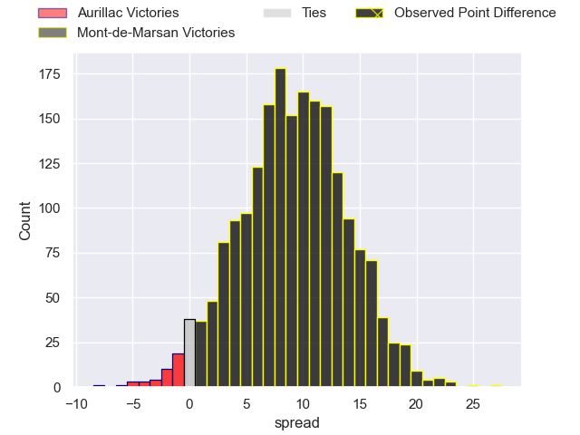
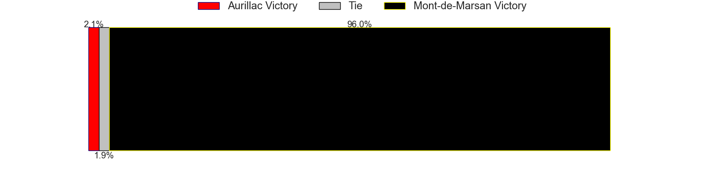
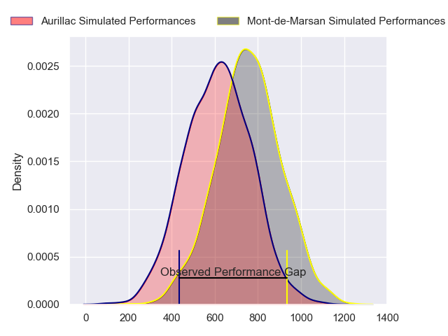
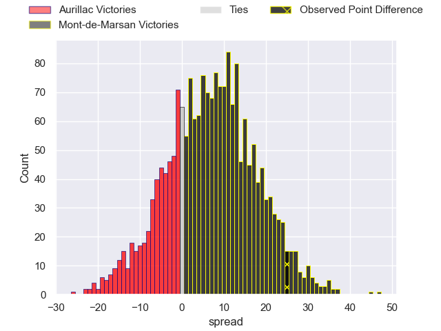
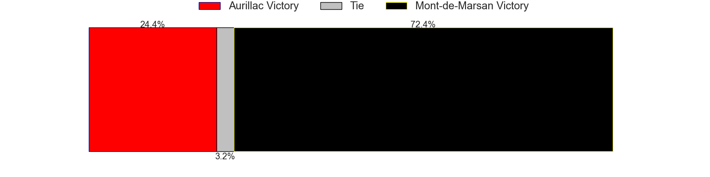
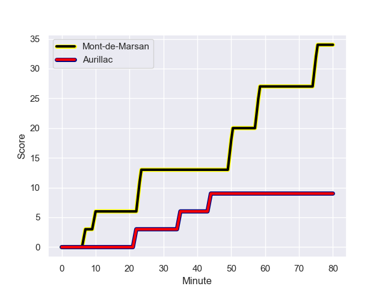
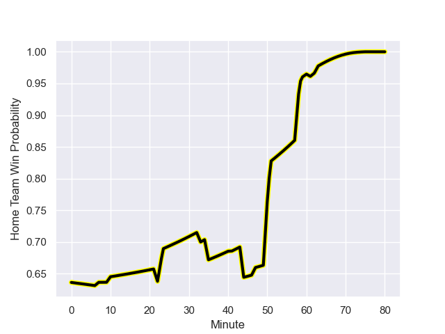

---  
layout: page  
title: Aurillac at Mont-de-Marsan; 9.0-34.0  
date: 2023-09-26 18:00:00 -0500  
categories: match review  
---
# Aurillac at Mont-de-Marsan; 9.0-34.0

# Club Level Predictions

The first set of predictions treats a club as the smallest object, as the club develops its members, organizes a gameplan, and deploys its players as needed for each match. This club model has a prediction of 0.74, which translates to predicting Mont-de-Marsan to win by 9.2.

Each club has a rating and a rating deviation (simiar to a Glicko system), and expected performances can be generated. This allows for simulated matches and spreads like the ones below.
## Projected Performances - Club Model

## Projected Spreads - Club Model

## Projected Results - Club Model

# Player Level Predictions - Version 2

Treating teams instead as an entity made up of the currently active players, I have ratings for each player in an altogether different system. These can be combined to form team ratings once teamsheets are announced, weighting starters a bit higher than the reserves. After the match is played, players can be weighted by their minutes on the field, allowing for an accurate measure of the team's composition. With these compiled team ratings, we can make predictions, measure inaccuracy, and update the individual player ratings.
## Prediction with Player Minutes: Mont-de-Marsan by 6.1

Mont-de-Marsan by 1.3 on a neutral field
## Prediction without Player Minutes: Mont-de-Marsan by 6.3

Mont-de-Marsan by 1.5 on a neutral pitch

## Projected Performances - Player Model

## Projected Spreads - Player Model

## Projected Results - Player Model

## Scores over Time

## Win Probability over Time

There were 7 large changes in win probability in this match

|   Away Minutes | Away Player           |   Away elo |   Number |   Home elo | Home Player               |   Home Minutes |
|---------------:|:----------------------|-----------:|---------:|-----------:|:--------------------------|---------------:|
|             51 | Robert Rodgers        |      27.55 |        1 |      45.72 | Paul Tailhades            |             35 |
|             63 | Basa Khonelidze       |      47.48 |        2 |      36    | Simon Labouyrie           |             35 |
|             33 | Tim Daniel-Meissen    |      33.98 |        3 |      32.78 | Chris Talakai             |             35 |
|             51 | Eoghan Masterson      |      66.18 |        4 |      34.61 | Aston Fortuin             |             80 |
|             33 | Martial Rolland       |      31.13 |        5 |      21.7  | Myles Edwards             |             61 |
|             80 | Heath Backhouse       |      62.03 |        6 |      50.84 | Raphaël Robic             |             41 |
|             63 | Hugo Huurman          |      47.82 |        7 |      40.22 | Nicolas Garrault          |             80 |
|             80 | Beka Shvangiradze     |      61.54 |        8 |      55.28 | Veresa Tuqovu Ramototabua |             80 |
|             51 | Mikheil Alania        |      36.23 |        9 |      31.3  | Christophe Loustalot      |             61 |
|             80 | Antoine Aucagne       |      30.88 |       10 |      72.64 | Willie du Plessis         |             61 |
|             80 | Simeli Yabaki         |      25.46 |       11 |      45.47 | Eroni Sau                 |             80 |
|             59 | Christa Powell        |      20.46 |       12 |      44.09 | Patricio Fernandez        |             80 |
|             80 | Elijah Niko           |      37.33 |       13 |      42.92 | Gatien Masse              |             80 |
|             80 | Juun Pieters          |      43.04 |       14 |      49.72 | Harrison Obatoyinbo       |             47 |
|             80 | Marc Palmier          |      38.37 |       15 |      34.51 | Yoann Laousse Azpiazu     |             80 |
|             47 | Mehdi Slamani         |      46.23 |       16 |      38.4  | Thomas Bultel             |             45 |
|             47 | Giorgi Kartvelishvili |      47.28 |       17 |      44.13 | Sacha Idoumi              |             45 |
|             29 | Alexandre Plantier    |      48.87 |       18 |      45.88 | Mathis Bats               |             45 |
|             29 | Latuka Maituku        |      -8.23 |       19 |      67.57 | Léo Banos                 |             39 |
|             29 | David Delarue         |      37.71 |       20 |      25.38 | Simon Desaubies           |             33 |
|             21 | Anderson Neisen       |      46.98 |       21 |      43.78 | Andrei Ostrikov           |             19 |
|             17 | Théo Cambon           |      33.67 |       22 |      44.94 | Baptiste Canut            |             19 |
|             17 | Lilian Djomboue       |      45.01 |       23 |      35.03 | Joris Pialot              |             19 |

